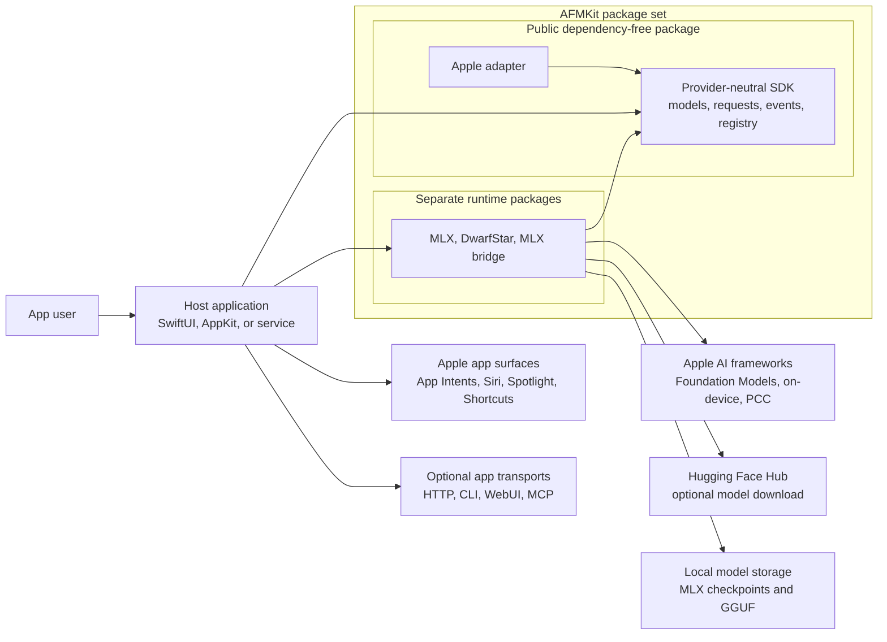
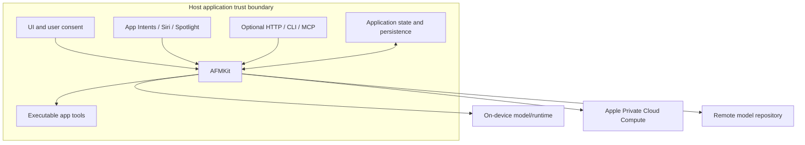

# System Context

## Purpose

AFMKit lets a macOS application select and use language-model providers through
one Swift contract while preserving provider capabilities, lifecycle, privacy,
and structured streaming semantics.

**Figure 1 — C4 system context.** AFMKit is an in-process three-package SDK. The host app is
the security and product boundary: it owns user interaction, network endpoints,
credentials, signed capabilities, persistence, and app-specific actions.

## Actors and responsibilities

| Actor/system | Responsibility | AFMKit relationship |
| --- | --- | --- |
| App user | Supplies prompts, files, images, consent, and action confirmations. | Indirect through the host. |
| Host app/service | Chooses providers, registers tools, owns UI/state, signs entitlements, and maps failures to UX. | Direct Swift consumer. |
| AFMKit package set | Normalizes provider discovery, lifecycle, requests, events, errors, and optional telemetry. | Three Swift package boundaries selected by the host. |
| Apple Foundation Models | Executes Apple on-device/PCC sessions and defines macOS 27 provider protocols. | Framework dependency of Apple products only. |
| Hugging Face Hub | Supplies optional remote model repositories. | Provider implementation dependency, not core. |
| Local model storage | Holds downloaded or user-selected checkpoints. | Read by local providers. |
| App Intents/Siri/Spotlight | Expose app-specific capabilities to system experiences. | Host-owned extension point; no direct AFMKit implementation today. |
| HTTP/CLI/WebUI/MCP | External application interfaces such as maclocal-api. | Out of AFMKit package scope. |

## External interfaces of a designed app

An app built with AFMKit can expose any combination of these external surfaces:

1. **Human UI:** SwiftUI/AppKit chat, settings, model manager, progress,
   cancellation, permission prompts, and result rendering.
2. **System integration:** App Intents consumed by Siri, Spotlight, Shortcuts,
   widgets, and other Apple surfaces. The app defines intent schemas and actions.
3. **Service API:** HTTP/OpenAI-compatible endpoints, WebSocket/SSE streaming,
   MCP tools, or a CLI. `AFMOpenAICompat` provides DTOs but not transport code.
4. **Documents/media:** `AFMContentPart` carries neutral content; each provider
   advertises whether it supports text, vision, structured generation, or tools.
5. **Persistence:** The app stores conversation history, app entities, tool
   results, and settings. AFMKit model objects are runtime services, not a data
   store.

**Figure 2 — Trust and authority boundaries.** Calls leaving the host boundary
must be visible through provider descriptors (`privacyBoundary` and
`requiresNetwork`). AFMKit does not grant tools authority; the host supplies and
authorizes executable tools.

## Scope exclusions

- No built-in HTTP server or OpenAI routing.
- No conversation database or cross-device synchronization.
- No general credential vault or account system.
- No automatic App Intent, Siri, or Spotlight publication.
- No promise that every provider supports every content or tool capability.
- No hidden fallback across privacy boundaries; a host must choose or approve it.
