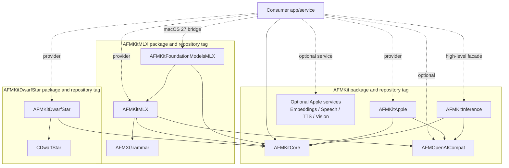
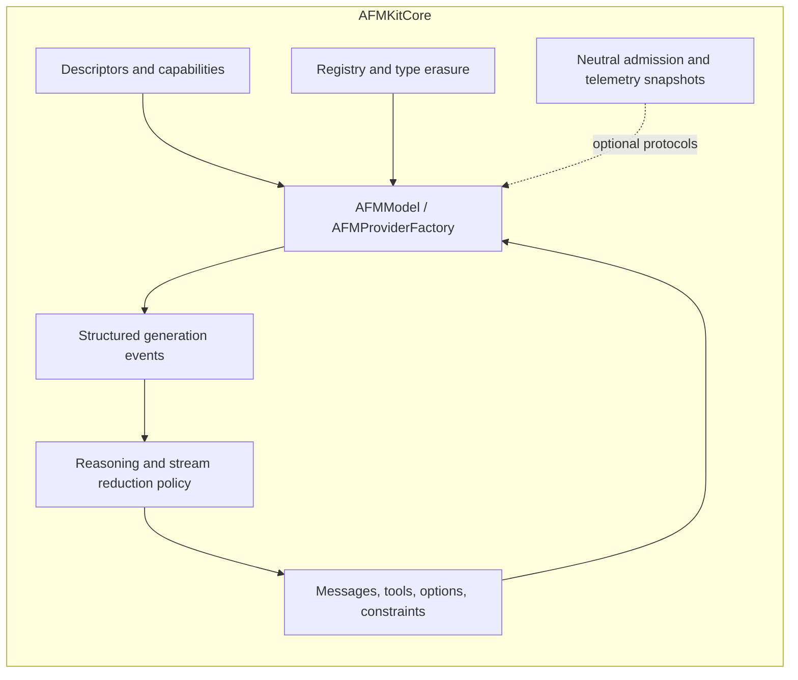
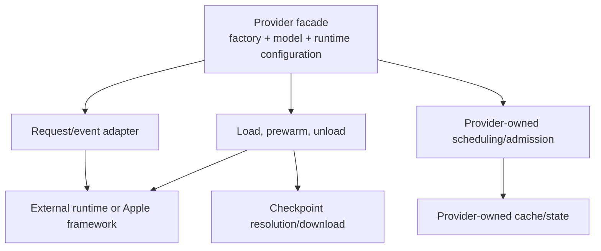

# Containers and Modules

## Swift package boundary view

**Figure 1 — Package and target dependencies.** The root `AFMKit` package has no
SwiftPM dependencies, so resolving any of its products cannot contact or
authenticate to the MLX graph. Runtime providers are separate packages that pin
the exact same-version AFMKit release. Product and module names remain unchanged.

## Package catalog

| Published package | Source manifest | Products | Authentication |
| --- | --- | --- | --- |
| `AFMKit` | `Package.swift` | Core, OpenAI compatibility, inference, Apple provider, four optional Apple services, and the `AFMKitServices` umbrella | None; the manifest has no package dependencies. |
| `AFMKitDwarfStar` | `Packages/AFMKitDwarfStar/Package.swift` | `AFMKitDwarfStar` | None for AFMKit; public Hub/Xet dependencies are exact-pinned. |
| `AFMKitMLX` | `Packages/AFMKitMLX/Package.swift` | `AFMKitMLX`, `AFMKitFoundationModelsMLX` | Required for the private AFM-compatible MLX dependencies. |

The monorepo layout is a development and qualification convenience. Release
automation materializes the two provider directories as self-contained Git
repositories, rewrites their local AFMKit development dependency to the exact
production AFMKit tag, and tests those exact manifests from fresh no-lock graphs.

## Product and target catalog

| Product/target | Package | Role | Stable/recommended entry points |
| --- | --- | --- | --- |
| `AFMKitCore` | `AFMKit` | Provider-neutral domain and lifecycle. | `AFMModel`, `AFMProviderFactory`, `AFMProviderRegistry`, request/event/descriptor types. |
| `AFMOpenAICompat` | `AFMKit` | OpenAI-compatible wire DTOs independent of HTTP. | Chat, stream, tool, response-format, file, batch, embedding, error, timing DTOs. |
| `AFMKitInference` | `AFMKit` | Provider-neutral high-level inference facade. | `AFMEngine`, `AFMLanguageModel`, generation configuration, OpenAI request conversion. |
| `AFMKitApple` | `AFMKit` | Apple on-device and PCC provider. | `AFMFoundationProviderFactory`, `AFMFoundationModel`, capability probes. |
| `AFMKitEmbeddings` | `AFMKit` | Apple NaturalLanguage contextual embeddings. | Registry, resolver, backend protocol, normalization and encoding helpers. |
| `AFMKitSpeech` | `AFMKit` | On-device Apple speech recognition. | `SpeechService`, request options, transcription results. |
| `AFMKitSpeechSynthesis` | `AFMKit` | Apple text-to-speech. | `SpeechSynthesisService`, voices, audio options. |
| `AFMKitVision` | `AFMKit` | Apple Vision/PDF document analysis. | OCR, tables, barcodes, classification and saliency. |
| `AFMKitServices` | `AFMKit` | Compatibility umbrella for all four service modules. | Re-exports the independently selectable products. |
| `AFMKitMLX` | `AFMKitMLX` | Native local MLX provider and advanced serving surface. | `AFMMLXProviderFactory`, `AFMMLXModel`, `AFMMLXRuntimeConfiguration`. |
| `AFMKitFoundationModelsMLX` | `AFMKitMLX` | macOS 27 custom `LanguageModel` bridge backed by MLX. | `MLXLanguageModel`, `MLXLanguageModelExecutor`, projection plan. |
| `AFMKitDwarfStar` | `AFMKitDwarfStar` | DwarfStar/DS4 local provider. | `AFMDwarfStarProviderFactory`, `AFMDwarfStarModel`, runtime configuration. |
| `AFMXGrammar` | `AFMKitMLX` | Swift/C++ bridge to xgrammar. | Internal support target used by MLX guided generation. |
| `CDwarfStar` | `AFMKitDwarfStar` | C/Objective-C/Metal bridge and engine integration. | Internal support target; not an app integration surface. |

## Internal component view

**Figure 2 — Neutral core components.** The core describes behavior and data,
not an execution engine. Optional protocols avoid forcing Apple providers to
expose tokenizer or scheduler concepts they do not own.

**Figure 3 — Provider adapter pattern.** MLX, DwarfStar, and Apple differ below
the facade, but expose the same neutral lifecycle and event model above it.

## Dependency rules

1. `AFMKitCore` imports only the Swift standard library/Foundation facilities
   required by its value types and concurrency contracts.
2. Provider targets may import core and provider dependencies; they must not add
   provider types to the core.
3. `AFMOpenAICompat` contains serializable DTOs only. HTTP handlers, status codes,
   SSE framing, Prometheus, and route policy remain outside AFMKit.
4. `AFMKitInference` may depend only on Core and OpenAI-compatible DTOs. Provider
   factories construct its `AnyAFMModel`; the facade never imports a provider package.
5. `AFMKitFoundationModelsMLX` depends on the MLX provider; the MLX provider does
   not depend on Apple Foundation Models.
6. C/C++/Metal symbols are wrapped by Swift provider targets before reaching a
   consumer.
7. New providers implement `AFMProviderFactory`/`AFMModel` and emit structured
   `AFMGenerationEvent` values. They do not require registry changes.
8. A dependency-free public product must remain in the root `AFMKit` package.
   Target-only isolation is insufficient because SwiftPM resolves dependencies
   at package scope.

## Deployment and availability

- Package deployment target: **macOS 26.0**.
- Foundation Models integration: compiled under `canImport(FoundationModels)` and
  runtime annotated `@available(macOS 27.0, *)`.
- Consumers must use availability checks before constructing macOS 27 types.
- macOS 26 apps may use `AFMKitCore`, `AFMOpenAICompat`, `AFMKitInference`, MLX, and DwarfStar without
  exposing macOS 27-only UI.
