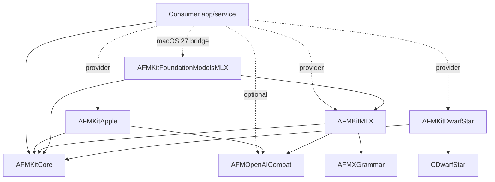
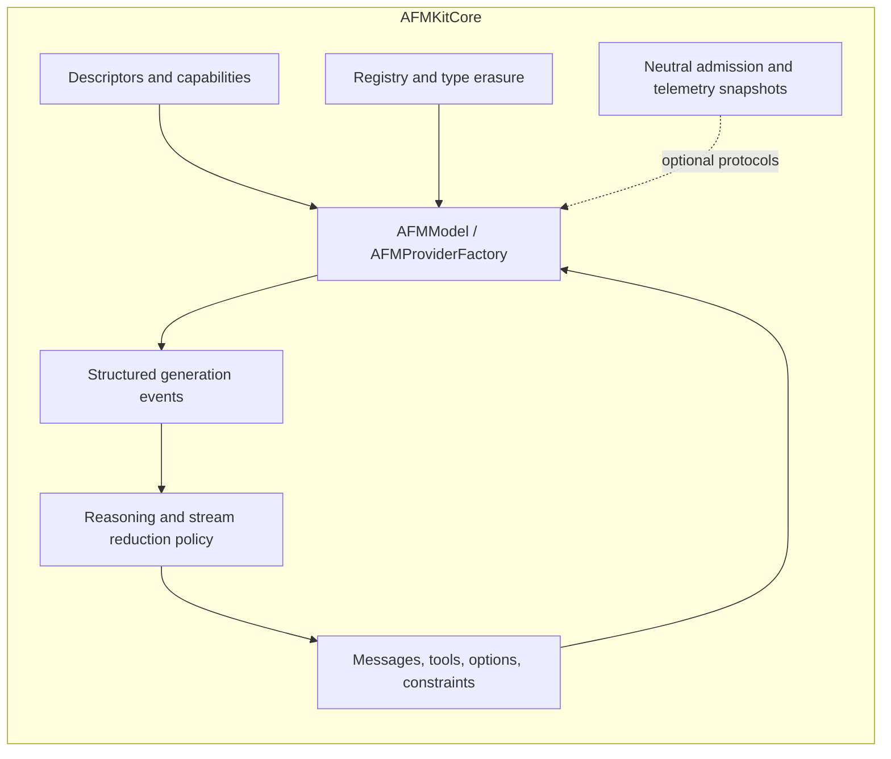
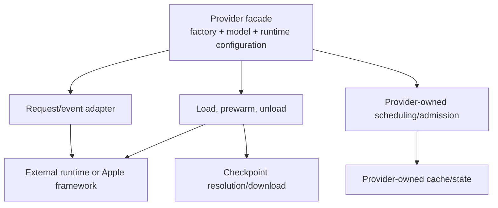

# Containers and Modules

## Swift package view

**Figure 1 — Swift products and target dependencies.** Solid arrows are direct
package-target dependencies. The consumer chooses products explicitly; importing
`AFMKitCore` does not link MLX, DwarfStar, or Apple Foundation Models.

## Product and target catalog

| Product/target | Role | Stable/recommended entry points | Implementation ownership |
| --- | --- | --- | --- |
| `AFMKitCore` | Provider-neutral domain and lifecycle. | `AFMModel`, `AFMProviderFactory`, `AFMProviderRegistry`, request/event/descriptor types. | AFMKit. |
| `AFMOpenAICompat` | OpenAI-compatible wire DTOs independent of HTTP. | Chat, stream, tool, response-format, file, batch, embedding, error, timing DTOs. | AFMKit; transport remains host-owned. |
| `AFMKitApple` | Apple on-device and PCC provider. | `AFMFoundationProviderFactory`, `AFMFoundationModel`, capability probes. | AFMKit over Apple frameworks. |
| `AFMKitMLX` | Native local MLX provider and advanced serving surface. | `AFMMLXProviderFactory`, `AFMMLXModel`, `AFMMLXRuntimeConfiguration`. | AFMKit plus pinned MLX forks. |
| `AFMKitFoundationModelsMLX` | macOS 27 custom `LanguageModel` bridge backed by MLX. | `MLXLanguageModel`, `MLXLanguageModelExecutor`, projection plan. | AFMKit over Apple + MLX APIs. |
| `AFMKitDwarfStar` | DwarfStar/DS4 local provider. | `AFMDwarfStarProviderFactory`, `AFMDwarfStarModel`, runtime configuration. | AFMKit adapter around vanilla ds4. |
| `AFMXGrammar` | Swift/C++ bridge to xgrammar. | Used by MLX guided generation. | Internal support target. |
| `CDwarfStar` | C/Objective-C/Metal bridge and engine integration. | Used by `AFMKitDwarfStar`; not an app integration surface. | Internal support target. |

## Internal component view

**Figure 2 — Neutral core components.** The core describes behavior and data,
not an execution engine. Optional protocols avoid forcing Apple providers to
expose tokenizer or scheduler concepts they do not own.

**Figure 3 — Provider adapter pattern.** MLX, DwarfStar, and Apple differ below
the facade, but expose the same neutral lifecycle and event model above it.

## Dependency rules

1. `AFMKitCore` imports only the Swift standard library/Foundation facilities
   required by its value types and concurrency contracts.
2. Provider targets may import core and provider dependencies; they must not add
   provider types to the core.
3. `AFMOpenAICompat` contains serializable DTOs only. HTTP handlers, status codes,
   SSE framing, Prometheus, and route policy remain outside AFMKit.
4. `AFMKitFoundationModelsMLX` depends on the MLX provider; the MLX provider does
   not depend on Apple Foundation Models.
5. C/C++/Metal symbols are wrapped by Swift provider targets before reaching a
   consumer.
6. New providers implement `AFMProviderFactory`/`AFMModel` and emit structured
   `AFMGenerationEvent` values. They do not require registry changes.

## Deployment and availability

- Package deployment target: **macOS 26.0**.
- Foundation Models integration: compiled under `canImport(FoundationModels)` and
  runtime annotated `@available(macOS 27.0, *)`.
- Consumers must use availability checks before constructing macOS 27 types.
- macOS 26 apps may use `AFMKitCore`, `AFMOpenAICompat`, MLX, and DwarfStar without
  exposing macOS 27-only UI.
