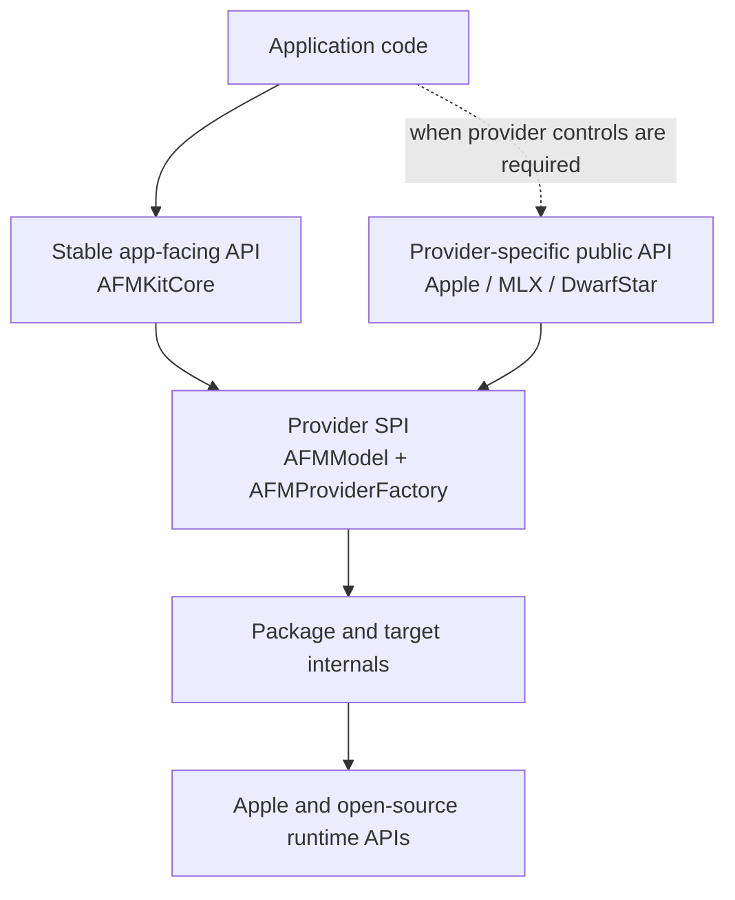

# Interface Catalog

This catalog separates the interfaces an app should build against from provider
SPIs, advanced provider controls, package internals, and external framework
interfaces. Swift access level alone is not sufficient: some advanced engine
types are public today but are not the preferred cross-provider contract.

## Interface layers



**Figure 1 — Interface layers.** Most apps use the stable neutral layer and one
factory. Provider authors implement the SPI. Engine internals and external APIs
remain behind adapters.

## A. Stable app-facing programming interface

These are the preferred interfaces for an application that wants provider
portability.

| Area | Key symbols | Contract |
| --- | --- | --- |
| Discovery | `AFMProviderDescriptor`, `AFMModelDescriptor`, `AFMModelCapabilities`, `AFMModelAvailability` | Describe identity, capabilities, context, privacy, network need, and readiness. |
| Construction | `AFMProviderRegistry`, `AFMProviderConfiguration` | Register/replace factories and construct a model without a closed provider enum. |
| Request | `AFMRequest`, `AFMMessage`, `AFMContentPart`, `AFMToolDefinition`, `AFMGenerationOptions`, `AFMResponseConstraint` | Provider-neutral input including multimodal parts, tools, options, and structured constraints. |
| Response | `AFMModelResponse`, `AFMUsage`, `AFMFinishReason`, `AFMTokenLogProbability` | Aggregated non-streaming result. |
| Streaming | `AFMGenerationEvent`, `AFMTextUpdateAction`, `AFMToolCallStage` | Typed response text, reasoning, log probabilities, tool-call lifecycle, usage, metadata, custom segments, completion. |
| Errors | `AFMError` | Stable failure categories with provider detail retained as text/metadata. |
| Optional inspection | `AnyAFMModel.supportsTokenization`, `supportsPrewarming`, `supportsAdmissionReporting`, `supportsTelemetryReporting` | Capability checks before invoking optional model protocols. |

Typical app flow:

```swift
let registry = AFMProviderRegistry()
try registry.register(AFMMLXProviderFactory())

let model = try registry.makeModel(
    providerID: AFMMLXProviderFactory.providerID,
    modelID: "mlx-community/example-model"
)
try await model.load()

for try await event in model.streamResponse(
    to: AFMRequest(messages: [.init(role: .user, content: [.text("Hello")])])
) {
    // Render each typed event according to its case.
}
await model.unload()
```

The quickstart in `Examples/AFMKitQuickstart` is the executable reference.

## B. Provider implementation SPI

| Protocol/type | Implemented by | Purpose |
| --- | --- | --- |
| `AFMModel` | Every provider model | Availability, load, respond, stream, unload. |
| `AFMProviderFactory` | Every provider factory | Provider descriptor, model discovery, model construction. |
| `AFMTextTokenizing` | Providers exposing token IDs | Optional tokenization; Apple does not expose this uniformly. |
| `AFMPrewarmableModel` | Providers with compilation/priming | Separates model load from first-inference preparation. |
| `AFMAdmissionReportingModel` | Providers with queues/schedulers | Neutral capacity/queue snapshot without exposing engine slots. |
| `AFMTelemetryReportingModel` | Providers with runtime metrics | Neutral runtime snapshot suitable for app diagnostics. |
| `AnyAFMModel`, `AnyAFMProviderFactory` | Core type erasure | Allows heterogeneous providers in a registry. |

Provider invariants:

- `descriptor` is available before load and does not silently overstate support.
- `streamResponse` terminates with `.completed` or throws.
- Cancellation must stop producing externally visible events promptly.
- Tool-call stages for one ID remain ordered.
- Privacy/network metadata is accurate before an app routes user content.
- Provider-specific metadata uses namespaced keys where collision is possible.

## C. Provider-specific public interfaces

These interfaces are useful when an app deliberately chooses a provider and
accepts reduced portability.

| Product | Recommended facade | Advanced controls |
| --- | --- | --- |
| `AFMKitApple` | `AFMFoundationProviderFactory`, `AFMFoundationModel` | Native capability probes, managed capability checks, dynamic-profile/session helpers, lower-level `FoundationModelService`. |
| `AFMKitMLX` | `AFMMLXProviderFactory`, `AFMMLXModel`, `AFMMLXRuntimeConfiguration` | OpenAI chat-serving protocols, scheduler/cache/checkpoint policies, profiling and model-service facilities. Several are `public`; apps should depend on them only when the feature is explicitly engine-specific. |
| `AFMKitFoundationModelsMLX` | `MLXLanguageModel`, `MLXLanguageModelExecutor` | Apple transcript/event adapters and model projection plan. |
| `AFMKitDwarfStar` | `AFMDwarfStarProviderFactory`, `AFMDwarfStarModel`, `AFMDwarfStarRuntimeConfiguration` | Checkpoint catalog/resolution and engine projection utilities currently exposed for specialized hosts. |

Public provider-specific types are source APIs, but the long-term compatibility
boundary is narrower than “every public declaration.” The API-baseline gates in
`docs/api-baselines` make intentional changes visible.

`AFMKitFoundationModelsMLX` has a checked-in symbol baseline. Changes to its
public API require the same intentional baseline review as the other products,
in addition to compatibility review when Apple changes the beta SDK protocols.

## D. Package-internal interfaces

These must not become cross-provider or app contracts:

- MLX model containers, schedulers, request slots, batch lifecycle, radix/KV
  cache implementation, tokenizer internals, Metal resource lookup, checkpoint
  conversion, and engine-specific sampling.
- DwarfStar C/Objective-C bridge calls, Metal command scheduling, DS4 tensor
  layout, GGUF projection, runtime coordinator, and engine cache layout.
- xgrammar C++ wrappers and grammar compiler state.
- Apple session stream processors, transcript conversion helpers, and usage
  adapters that exist solely to map Foundation Models semantics.

The preferred visibility is `package` or `internal`. Any such type currently
declared `public` is technical debt to be narrowed only through an intentional
compatibility decision.

In particular, `AFMMLXModel.service` and `AFMMLXRuntime.service` publicly expose
`MLXModelService` today. Consumers should isolate that dependency rather than
assuming all of `MLXModelService` is a stable cross-provider contract.

## E. External app interfaces

AFMKit does not define these, but a designed app commonly presents them:

| Interface | Owner | Mapping to AFMKit |
| --- | --- | --- |
| SwiftUI/AppKit views | Host app | Model selection from descriptors; events to view state; cancellation to `Task.cancel()`. |
| App Intents | Host app | Intent parameters become `AFMRequest`; result becomes dialog/entity/content. |
| Siri/Spotlight/Shortcuts | Apple system + host app | Reach the host through App Intents, not directly through AFMKit. |
| OpenAI-compatible HTTP | Host/service | Decode `AFMOpenAICompat` DTO, call model, encode response/SSE. |
| MCP/tools | Host app | Host authorizes and executes tools; AFMKit transports model tool-call events. |
| Files/media picker | Host app | Validate and transform content into provider-supported `AFMContentPart` values. |
| Keychain/App Attest | Host app/provider package | Credentials and assertions remain outside the neutral core. |

## F. External framework interfaces

| Framework interface | AFMKit implementation |
| --- | --- |
| Apple `LanguageModel` / `LanguageModelExecutor` | `MLXLanguageModel` and `MLXLanguageModelExecutor` on macOS 27. |
| Apple `LanguageModelSession` | Used by `AFMKitApple` for on-device and PCC execution. |
| Apple `FoundationModels.Tool` | Supplied by the host to `AFMFoundationProviderFactory`; AFMKit validates/transports calls. |
| Metal/MLX APIs | Encapsulated by `AFMKitMLX`; not part of neutral core. |
| DwarfStar/DS4 C and Metal APIs | Encapsulated by `CDwarfStar` and `AFMKitDwarfStar`. |
| Hugging Face Hub/Xet | Used for provider asset resolution/download; not required by core. |
