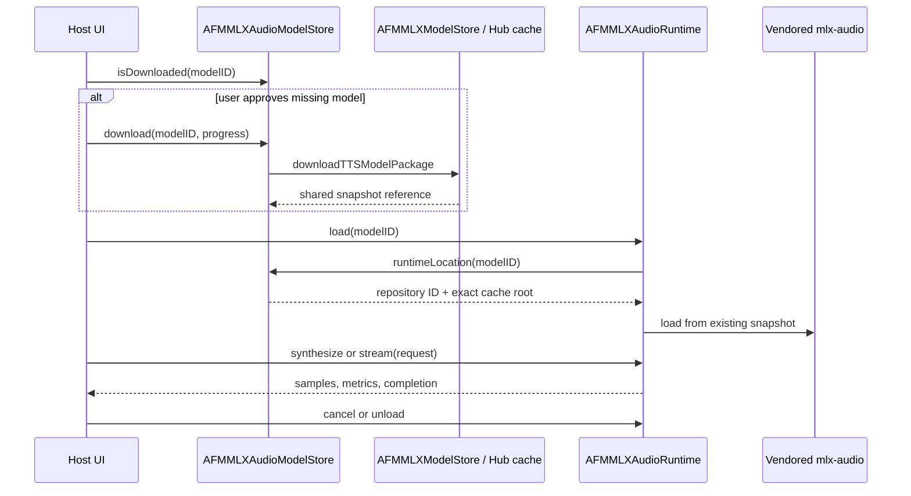
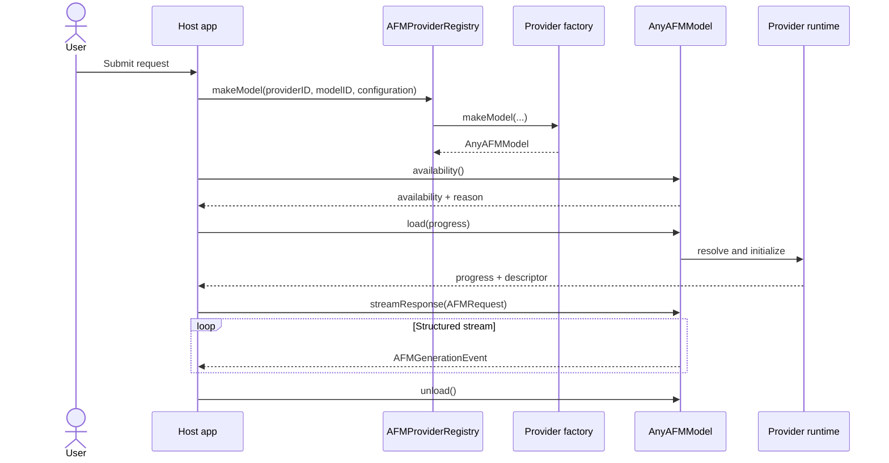
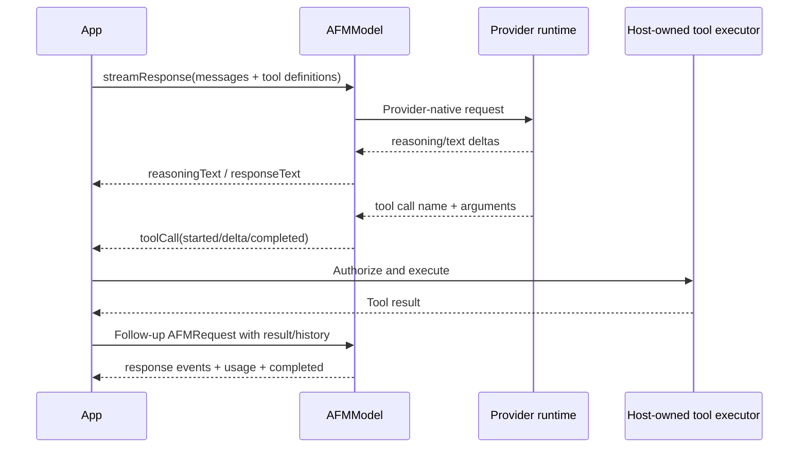
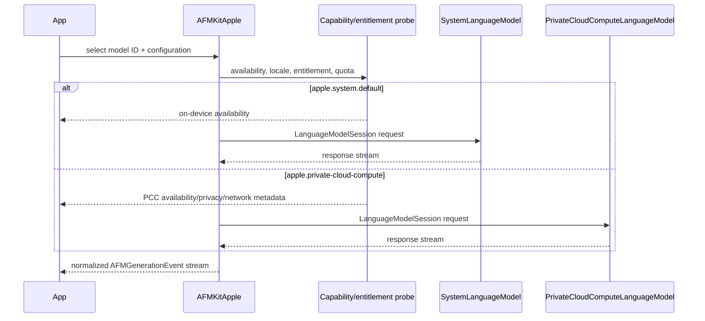
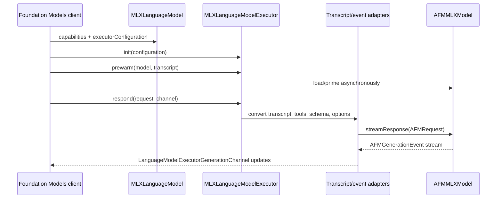

# Runtime Flows

## MLX audio model and synthesis flow

The host owns the consent prompt, selected model, and presentation state.
AFMKit owns discovery, download patterns and progress, cache resolution,
import-reference staging, deletion, model loading, generation, cancellation,
telemetry, and cache release. Loading defaults to local-only and must not perform
an unapproved second download.

## Provider-neutral generation

**Figure 1 — Provider-neutral lifecycle.** The application can render progress,
availability, and typed events without knowing the concrete engine. Model reuse
and unload policy are application lifecycle decisions.

## Structured streaming and tools

**Figure 2 — Tool calling is a host-controlled loop.** AFMKit describes tools
and emits calls; it does not grant permissions or execute arbitrary application
actions. The host validates arguments, obtains consent, executes, and records the
result.

## Apple on-device and PCC routes

**Figure 3 — Explicit Apple route selection.** On-device and PCC share an app
contract but have different privacy/network characteristics. AFMKit does not
silently send an on-device request to PCC; the app selects the model and must
possess the managed entitlement for PCC.

## macOS 27 MLX `LanguageModel` bridge

**Figure 4 — MLX as an Apple Foundation Models provider.** The bridge preserves
the Apple executor lifecycle while reusing AFMKit’s MLX model. Unsupported schema
or tool capabilities fail explicitly instead of being silently ignored.

## Cancellation and failure behavior

1. The app owns the Swift `Task` consuming the stream and cancels it in response
   to UI/service cancellation.
2. Provider adapters stop engine generation and terminate their stream promptly.
3. A thrown error ends the stream; a normal terminal state emits `.completed`.
4. Partial text/reasoning already emitted remains application-visible; the app
   decides whether to persist or annotate it.
5. Provider load failures map to `AFMError` categories while retaining useful
   provider details.
6. Tool calls not completed before cancellation must not be executed implicitly.

## State and cache ownership

| State | Owner | Lifetime |
| --- | --- | --- |
| Conversation history | Host app | User/app policy. |
| Provider registry | Host process | Usually application lifetime. |
| Loaded weights | Provider model/runtime | From load until unload/eviction. |
| KV/recurrent/prefix cache | Provider runtime | Provider policy; observable only through neutral snapshots. |
| Apple `LanguageModelSession` | Apple adapter | Session/request policy. |
| Tool side effects | Host tool implementation | Host transaction and audit policy. |
| Downloaded checkpoints | Provider asset resolver / host-selected cache | Filesystem/cache policy. |
