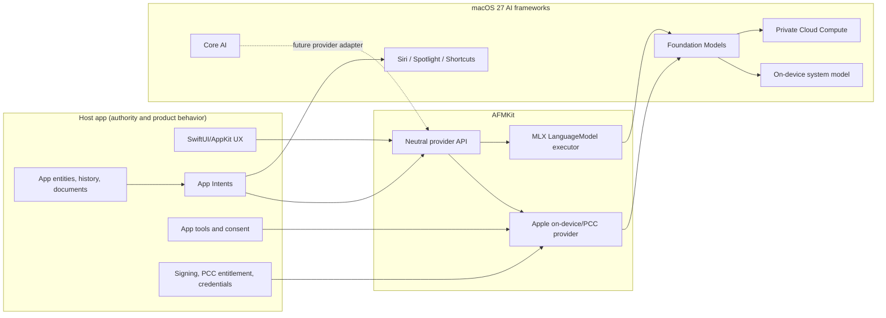
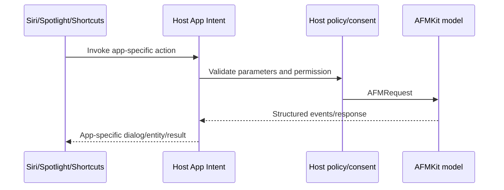

# macOS 27 AI Integration

This view maps AFMKit to Apple’s WWDC26 AI programming model. It intentionally
distinguishes current implementation from host-app composition and future work.

Primary Apple references:

- [Bring an LLM provider to the Foundation Models framework](https://developer.apple.com/videos/play/wwdc2026/339/)
- [What’s new in the Foundation Models framework](https://developer.apple.com/videos/play/wwdc2026/241/)
- [Build agentic app experiences](https://developer.apple.com/videos/play/wwdc2026/242/)
- [Integrate Core AI models](https://developer.apple.com/videos/play/wwdc2026/326/)
- [Core AI documentation](https://developer.apple.com/documentation/coreai/)
- [Private Cloud Compute with Foundation Models](https://developer.apple.com/documentation/foundationmodels/adding-server-side-intelligence-with-private-cloud-compute)
- [LanguageModelExecutor](https://developer.apple.com/documentation/foundationmodels/languagemodelexecutor)

## Integration map



**Figure 1 — macOS 27 responsibility map.** AFMKit provides model adapters and a
neutral contract. The host publishes app semantics to Siri/Spotlight through App
Intents and owns credentials, entitlements, tools, and user consent.

## Feature matrix

| WWDC26/macOS 27 feature | Status in AFMKit | Package/owner | Notes |
| --- | --- | --- | --- |
| `LanguageModel` abstraction | **Implemented** | `AFMKitFoundationModelsMLX` | `MLXLanguageModel` advertises vision, reasoning, tools, and guided generation according to configuration. |
| `LanguageModelExecutor` lifecycle | **Implemented** | `AFMKitFoundationModelsMLX` | Configuration, prewarm, transcript conversion, streamed channel output, unload. |
| Custom MLX provider | **Implemented** | `AFMKitFoundationModelsMLX` + `AFMKitMLX` | Uses Apple protocol surface while keeping MLX engine details behind AFMKit. |
| Apple on-device system model | **Implemented** | `AFMKitApple` | Runtime-gated; normal AFM provider route. |
| Private Cloud Compute model | **Implemented** | `AFMKitApple` | Explicit model ID; availability, locale, entitlement, and quota checks. |
| PCC managed entitlement | **Host-owned** | Signed host app | Host needs `com.apple.developer.private-cloud-compute` in its signed entitlements/provisioning. AFMKit can inspect current-process entitlement. |
| Reasoning levels | **Implemented where provider supports them** | Apple and provider adapters | Capability/configuration driven; no cross-provider guarantee of identical semantics. |
| Tool calling | **Implemented transport; host-owned execution** | Core + providers + host | Host supplies Apple `Tool` implementations and authorizes side effects. |
| Guided/structured generation | **Implemented where advertised** | Core constraints, MLX bridge/provider | Unsupported capability is an explicit error. |
| Vision input | **Capability-based** | Provider + host media pipeline | Host acquires/validates media; provider descriptor determines support. |
| Dynamic Profiles | **Implemented helper** | `AFMKitApple` | Session coordinator supports model/profile state; app decides profile UX and policy. |
| Custom response segments/metadata | **Implemented neutral event** | `AFMGenerationEvent.custom`/metadata | Provider adapters must map semantics deliberately. |
| App Intents | **Host-owned** | Consumer app | No AFMKit App Intent target today. Intents call AFMKit like any other app feature. |
| Siri, Spotlight, Shortcuts | **Host-owned through App Intents** | Consumer app + OS | AFMKit does not directly register system actions or searchable entities. |
| System tools (for example Vision/Spotlight tools) | **Extension point** | Host/provider integration | Must be supplied and authorized by the host; not a universal AFMKit tool bundle. |
| Core AI model provider | **Planned/extension point** | Future adapter | AFMKit currently has no `AFMKitCoreAI` product. Core AI must not be represented as implemented. |
| Dynamic adapter training/evaluation and Python SDK | **Out of runtime scope** | Developer tooling | May inform model creation/qualification but is not part of the in-app provider contract. |

## Availability strategy

```swift
if #available(macOS 27.0, *) {
    // Register AFMKitApple or construct MLXLanguageModel.
} else {
    // Register MLX/DwarfStar providers or another macOS 26-compatible route.
}
```

- The package compiles for macOS 26 because Foundation Models source is guarded
  by `canImport(FoundationModels)` and public types use `@available(macOS 27.0, *)`.
- UI must derive feature visibility from both OS availability and model/provider
  capability descriptors. OS version alone is insufficient.
- A model’s availability can change at runtime due to locale, Apple Intelligence
  readiness, download state, quota, or account/entitlement state.

## PCC security and privacy

1. The host explicitly chooses `apple.private-cloud-compute`; no transparent
   fallback should cross the device/network privacy boundary.
2. The signed app, not the Swift package, carries the managed entitlement.
3. AFMKit checks the current process entitlement before presenting PCC as ready.
4. The host communicates network use and handles user policy/consent.
5. Quota and transient availability are runtime states, not build-time facts.
6. Credentials for non-Apple providers belong in Keychain or a host-controlled
   broker, never in provider configuration committed to source.

## App Intents composition pattern



**Figure 2 — App Intent composition.** AFMKit remains a model service inside the
intent implementation. It does not own the intent schema, app entity identity,
or system-facing result contract.

## Provider-package guidance alignment

Apple’s WWDC26 guidance emphasizes a small Swift package, stable executor
configuration, prewarming, full-transcript handling, correct channel streaming,
cache lifecycle, and explicit capability errors. AFMKit follows that direction
through `AFMKitFoundationModelsMLX`; ongoing reviews should guard against:

- dependency growth in the bridge product,
- configuration fields that do not participate in executor identity/hash,
- transcript content being dropped silently,
- cache reuse across incompatible transcripts/configurations,
- unsupported tools or schemas being accepted but ignored.
