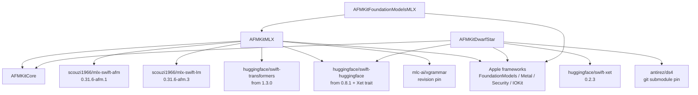

# External Git Dependencies

AFMKit deliberately keeps `AFMKitCore` dependency-free, but provider products
integrate substantial third-party runtime stacks. This ledger distinguishes
direct dependencies, the pinned DwarfStar submodule, and major transitive groups.
`Package.swift` and `Package.resolved` are authoritative for exact resolution.

## Dependency graph

**Figure 1 — Direct external dependencies by provider product.** A consumer that
imports only `AFMKitCore` does not resolve an inference engine. Local-provider
products intentionally carry their own engine and asset-resolution dependencies.

## Direct dependency ledger

| Dependency | Resolution | Used by | Purpose | Architecture impact |
| --- | --- | --- | --- | --- |
| [`scouzi1966/mlx-swift-afm`](https://github.com/scouzi1966/mlx-swift-afm) | Exact `0.31.6-afm.1` | `AFMKitMLX` | AFM-compatible Swift MLX bindings/runtime. | Fork is a compatibility dependency; updates require Metal/runtime regression tests. |
| [`scouzi1966/mlx-swift-lm`](https://github.com/scouzi1966/mlx-swift-lm) | Exact `0.31.6-afm.3` | `AFMKitMLX` | LLM/VLM model implementations and shared LM facilities. | Fork carries model/runtime compatibility; public app code must not import it directly. |
| [`huggingface/swift-transformers`](https://github.com/huggingface/swift-transformers) | `from: 1.3.0` | `AFMKitMLX` | Tokenizers and Hub facilities. | Semver range can advance transitively; lockfile and qualification are required. |
| [`huggingface/swift-huggingface`](https://github.com/huggingface/swift-huggingface) | `from: 0.8.1`, Xet trait | MLX, DwarfStar | Hub repository metadata/download. | Network/cache behavior belongs to provider layer. |
| [`huggingface/swift-xet`](https://github.com/huggingface/swift-xet) | Exact `0.2.3` | DwarfStar; also Hub trait path | High-throughput Hub transport. | Retry/resume and filesystem-space behavior need integration tests. |
| [`mlc-ai/xgrammar`](https://github.com/mlc-ai/xgrammar) | Revision `c1570cdb4f8c867a4dbd07b7ff90581f4a2a432b` | `AFMXGrammar`, MLX | Grammar-constrained generation. | C++ ABI/build risk; revision updates require grammar correctness tests. |
| [`antirez/ds4`](https://github.com/antirez/ds4) | Submodule `84cc882352757baf628a1776badf7cc54d584e28` | DwarfStar | Vanilla DwarfStar Metal source/resources. | Kept unmodified; AFM-specific behavior belongs in AFM-owned bridge/adapter. |

Local development can replace the two MLX forks through
`AFMKIT_MLX_SWIFT_PATH` and `AFMKIT_MLX_SWIFT_LM_PATH`. Release qualification
must use the tagged dependencies unless the artifact explicitly records local
overrides.

## Apple platform dependencies

| Framework/library | Product | Role |
| --- | --- | --- |
| Foundation Models | Apple provider, MLX bridge | On-device/PCC sessions and macOS 27 provider protocols. |
| Metal | MLX, DwarfStar | Local GPU execution. |
| Security | Apple, MLX | Entitlement/Keychain-related platform integration. |
| IOKit / IOReport | MLX | Hardware/runtime telemetry. |
| SQLite3 | MLX | Provider cache/metadata facilities. |
| Foundation | All | Swift data, concurrency, files, networking support. |

## Transitive dependency groups

The resolved graph currently includes the following major groups through Hub and
network packages:

- SwiftNIO, NIO HTTP/2, SSL, transport services, and async-http-client.
- Swift Crypto, Certificates, ASN.1, and HTTP structured headers/types.
- Swift Collections, Algorithms, Atomics, Numerics, System, Log, and service
  lifecycle/context/tracing packages.
- Jinja and EventSource used by model templates/streaming dependencies.
- yyjson and xgrammar implementation dependencies.

These are not AFMKit public interfaces. A transitive update can still affect
binary size, minimum OS support, TLS/network behavior, or build compatibility,
so `Package.resolved` changes require review.

## Dependency policy

1. **Pin execution engines exactly.** MLX compatibility forks, Xet, xgrammar,
   and ds4 advance through explicit PRs with model and performance qualification.
2. **Keep vanilla upstreams vanilla.** Do not push AFM changes to ds4; adapt it in
   `CDwarfStar`/`AFMKitDwarfStar`.
3. **Patch ownership is explicit.** Any compatibility fork or patch has an owner,
   upstream reference, rationale, and removal condition.
4. **No transitive API leakage.** Public neutral signatures use AFMKit or Apple
   standard types, not third-party engine types.
5. **Record provenance.** Release artifacts record commit, dependency pins,
   model/checkpoint identity, compiler, SDK, and Metal resource identity.
6. **Review licenses and notices.** Before public distribution, verify each
   dependency’s current license and attribution requirements from its pinned
   source; `vendor/ds4` is currently recorded as MIT.
7. **Automate supply-chain checks.** CI should detect uncommitted submodules,
   changed pins, unexpected local overrides, missing licenses, and package graph
   drift.

## Breaking a fork dependency

For each AFM-compatible MLX fork:

1. Maintain a machine-readable inventory of changes relative to upstream.
2. Classify changes as model architecture, performance, API, Metal compatibility,
   or bug fix.
3. Upstream generally useful fixes where feasible.
4. Keep AFM-only integration in AFMKit adapters rather than the fork.
5. Run the same compatibility/model matrix against upstream releases.
6. Replace the fork only when public API, model correctness, performance, and
   macOS 26/27 package tests meet the recorded baseline.
