# External Git Dependencies

The public `AFMKit` package has one exact SwiftPM dependency graph. Its optional
products preserve target and link isolation, but SwiftPM resolves the complete
root graph even when a consumer selects only Core. Apple services link only the
system frameworks they use. This ledger distinguishes direct dependencies, the
pinned DwarfStar submodule, and major transitive groups. The root manifest and
root `Package.resolved` are authoritative for exact resolution.

## Dependency and derivation graph

```mermaid
flowchart TB
    Core["AFMKitCore"]
    MLX["AFMKitMLX"]
    Audio["AFMKitMLXAudio"]
    DS["AFMKitDwarfStar"]
    FMMLX["AFMKitFoundationModelsMLX"]
    UpstreamMLX["ml-explore/mlx-swift\nupstream 0.31.6 lineage"]
    UpstreamLM["ml-explore/mlx-swift-lm\nupstream lineage"]
    RuntimePatches["maclocal-api patch catalog\nmlx-swift-deepseek-v4"]
    LMPatches["maclocal-api/Scripts/patches\nAFM LM source of truth"]
    MLXSwift["vendor/MLX/mlx-swift\nsource snapshot"]
    MLXLM["vendor/MLX/mlx-swift-lm\nsource snapshot"]
    MLXAudio["vendor/MLX/mlx-audio-swift\nv0.1.2 source subset"]
    Transformers["huggingface/swift-transformers\nexact 1.3.3"]
    HF["huggingface/swift-huggingface\nexact 0.9.0 + Xet trait"]
    Xet["huggingface/swift-xet\n0.2.3"]
    XGrammar["vendored xgrammar\nreviewed source snapshot"]
    Dwarf["antirez/ds4\ngit submodule pin"]
    Apple["Apple frameworks\nFoundationModels / Metal / Security / IOKit"]

    MLX --> Core
    FMMLX --> MLX
    DS --> Core
    MLX --> MLXSwift
    MLX --> MLXLM
    Audio --> MLX
    Audio --> MLXAudio
    UpstreamMLX --> MLXSwift
    RuntimePatches --> MLXSwift
    UpstreamLM --> MLXLM
    LMPatches --> MLXLM
    MLX --> Transformers
    MLX --> HF
    MLX --> XGrammar
    DS --> HF
    DS --> Xet
    DS --> Dwarf
    MLX --> Apple
    DS --> Apple
    FMMLX --> Apple
```

**Figure 1 — Runtime dependencies and their derivation.** Solid provider arrows
show what a downstream SwiftPM build resolves. The upstream-and-patch arrows show
where the AFM-compatible vendored MLX sources come from. A consumer that declares
only the `AFMKit` package receives the complete source graph from that one tag
and never contacts a compatibility or private repository.

## MLX source-of-truth model

The normal maclocal-api development workflow remains upstream-compatible source
plus the checked-in patch catalog:

1. MLX LM changes are authored and reviewed under
   `maclocal-api/Scripts/patches/`.
2. MLX runtime/C++ changes are authored under the corresponding
   `maclocal-api/Scripts/patches/mlx-swift-*` directories.
3. maclocal-api applies those patches to its pinned dependency checkout for local
   builds and qualification.
4. The resulting source snapshots are reviewed into `vendor/MLX` in AFMKit,
   together with upstream licenses and the provenance ledger.
5. AFMKit qualifies and publishes those snapshots in the same immutable tag as
   its provider code, avoiding coordinated repositories and authentication.

The vendored trees are distribution snapshots, not an independent source of
truth. A snapshot update must identify its upstream base, maclocal-api source
commit, patch set, and qualification evidence. It must not be edited ad hoc
without updating the checked-in patch catalog and focused runtime tests.

## Direct dependency ledger

| Dependency | Resolution | Used by | Purpose | Architecture impact |
| --- | --- | --- | --- | --- |
| `vendor/MLX/mlx-swift` | Repository-relative source snapshot | `AFMKitMLX` | Upstream MLX, C bridge, Swift bindings, and AFM runtime compatibility delta. | Updates require provenance, license review, Metal/runtime regression tests, and qualification in the same PR. |
| `vendor/MLX/mlx-swift-lm` | Repository-relative source snapshot | `AFMKitMLX` | Language-model sources generated from the maclocal-api MLX LM patch catalog. | Do not edit independently; public app code must not import it directly. |
| `vendor/MLX/mlx-audio-swift` | Source subset from upstream tag `v0.1.2` (`fcbd04d`) | `AFMKitMLXAudio` | Audio core, codecs, and TTS implementations sharing AFMKit's single MLX graph. | Public apps import only `AFMKitMLXAudio`; snapshot updates require provenance, license review, synthesis tests, and graph qualification. |
| [`huggingface/swift-transformers`](https://github.com/huggingface/swift-transformers) | Exact `1.3.3` | `AFMKitMLX` | Tokenizers and Hub facilities. | Provider manifest and fresh graph must agree with the qualified lock. |
| [`huggingface/swift-huggingface`](https://github.com/huggingface/swift-huggingface) | Exact `0.9.0`, Xet trait | MLX, DwarfStar | Hub repository metadata/download. | Network/cache behavior belongs to provider layer. |
| [`huggingface/swift-xet`](https://github.com/huggingface/swift-xet) | Exact `0.2.3` | DwarfStar; also Hub trait path | High-throughput Hub transport. | Retry/resume and filesystem-space behavior need integration tests. |
| [`mlc-ai/xgrammar`](https://github.com/mlc-ai/xgrammar) | Vendored source snapshot from `c1570cdb4f8c867a4dbd07b7ff90581f4a2a432b` | `AFMXGrammar`, MLX | Grammar-constrained generation without an unstable SwiftPM revision dependency. | C++ ABI/build risk; snapshot updates require provenance, license review, and grammar correctness tests. |
| [`antirez/ds4`](https://github.com/antirez/ds4) | Submodule `84cc882352757baf628a1776badf7cc54d584e28` | DwarfStar | Vanilla DwarfStar Metal source/resources. | Kept unmodified; AFM-specific behavior belongs in AFM-owned bridge/adapter. |

Repository development and publication use one root manifest. Provider sources
remain grouped under `Packages/`, while MLX dependencies live under `vendor/MLX`.
Downstream consumers select every product and its complete compatible runtime
from the same AFMKit URL and exact tag. Qualification rejects arbitrary local
dependencies and accepts only the two repository-relative vendored package paths.

## Apple platform dependencies

| Framework/library | Product | Role |
| --- | --- | --- |
| Foundation Models | Apple provider, MLX bridge | On-device/PCC sessions and macOS 27 provider protocols. |
| Metal | MLX, DwarfStar | Local GPU execution. |
| Security | Apple, MLX | Entitlement/Keychain-related platform integration. |
| IOKit / IOReport | MLX | Hardware/runtime telemetry. |
| SQLite3 | MLX | Provider cache/metadata facilities. |
| Foundation | All | Swift data, concurrency, files, networking support. |

## Transitive dependency groups

The resolved graph currently includes the following major groups through Hub and
network packages:

- SwiftNIO, NIO HTTP/2, SSL, transport services, and async-http-client.
- Swift Crypto, Certificates, ASN.1, and HTTP structured headers/types.
- Swift Collections, Algorithms, Atomics, Numerics, System, Log, and service
  lifecycle/context/tracing packages.
- Jinja and EventSource used by model templates/streaming dependencies.
- yyjson and the vendored xgrammar implementation.

These are not AFMKit public interfaces. A transitive update can still affect
binary size, minimum OS support, TLS/network behavior, or build compatibility,
so `Package.resolved` changes require review.

## Dependency policy

1. **Pin execution engines exactly.** MLX compatibility materializations, Xet,
   the xgrammar source snapshot, and ds4 advance through explicit PRs with model
   and performance qualification.
2. **Keep vanilla upstreams vanilla.** Do not push AFM changes to ds4; adapt it in
   `CDwarfStar`/`AFMKitDwarfStar`.
3. **Keep one source of truth.** AFM MLX deltas live in maclocal-api's patch
   catalog. AFMKit's vendored trees are reviewed distribution snapshots, never
   an alternate development branch.
4. **No transitive API leakage.** Public neutral signatures use AFMKit or Apple
   standard types, not third-party engine types.
5. **Record provenance.** Release artifacts record commit, dependency pins,
   model/checkpoint identity, compiler, SDK, and Metal resource identity.
6. **Review licenses and notices.** Before public distribution, verify each
   dependency’s current license and attribution requirements from its pinned
   source; `vendor/ds4` is currently recorded as MIT.
7. **Test what is published.** Every direct and qualified transitive dependency
   is constrained exactly. Fresh no-lock consumers must reproduce each provider
   lock before the materialized provider tags can be published.
8. **Automate supply-chain checks.** CI detects uncommitted submodules, changed
   pins, unexpected local overrides, missing licenses, package graph drift, and
   a tagged materialization that cannot be reproduced from provenance.

## Removing a compatibility materialization

For each AFM-compatible MLX materialization:

1. Maintain a machine-readable inventory of changes relative to upstream.
2. Classify changes as model architecture, performance, API, Metal compatibility,
   or bug fix.
3. Upstream generally useful fixes where feasible.
4. Keep AFM-only integration in AFMKit adapters or the maclocal-api patch catalog
   rather than editing the materialized repository.
5. Run the same compatibility/model matrix against upstream releases.
6. Replace the materialization with upstream packages only when public API,
   model correctness, performance, and macOS 26/27 package tests meet the
   recorded baseline.
