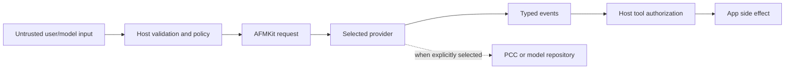
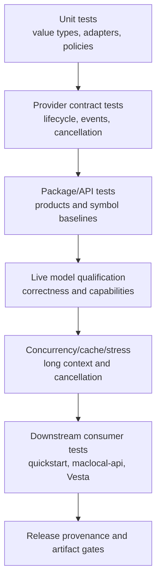

# Quality, Security, and Evolution

## Quality attribute scenarios

| Attribute | Scenario | Architectural response | Verification |
| --- | --- | --- | --- |
| Portability | A host switches Apple, MLX, and DwarfStar without rewriting chat state/rendering. | Neutral requests/events/descriptors; provider registry; capability discovery. | Cross-provider contract tests and quickstart. |
| Compatibility | A macOS 26 app imports AFMKit while macOS 27 APIs remain unavailable. | macOS 26 package floor, `canImport`, `@available`, host availability checks. | Build/test on both OS/SDK paths. |
| Performance | Local generation must avoid unnecessary copies and scheduler serialization. | Provider-owned caches/schedulers, structured incremental stream, Metal resources. | Release-mode model benchmarks; TTFT, prefill, decode, wall-clock, GPU trace. |
| Reliability | Cancellation or provider failure must not leave a hanging stream/model slot. | Structured termination, task cancellation, unload lifecycle, admission snapshots. | Stress, cancellation, batch/concurrency tests. |
| Security | A model requests a destructive tool action. | Host-owned tool execution, schema validation, user policy/consent, no authority in core. | Negative tool tests and app-level authorization tests. |
| Privacy | A device request could be routed to a network model. | Explicit provider/model selection and descriptor privacy/network metadata. | Route-selection tests; UI policy tests in consumer. |
| Extensibility | A new runtime is added without editing a closed backend enum. | `AFMProviderFactory` registration and type erasure. | Third-party provider conformance fixture. |
| Diagnosability | A host needs queue, cache, and throughput insight without engine imports. | Neutral admission/telemetry optional protocols plus provider metadata. | Snapshot and observability contract tests. |

## Security and privacy controls

**Figure 1 — Security control points.** Generated tool arguments are untrusted.
Provider selection controls privacy routing; tool authorization and side effects
remain outside AFMKit.

Required controls:

- Do not commit credentials, entitlement material, or user data.
- Use Keychain or a host-controlled broker for secrets.
- Validate tool names and JSON arguments against the exact registered schema.
- Require app policy and, for consequential actions, user confirmation.
- Treat model files and remote metadata as untrusted inputs; validate format,
  size, path containment, and hashes where available.
- Bound generation, context, concurrency, downloads, and cache storage.
- Avoid logging prompts, credentials, tool arguments, or generated private data by
  default. Diagnostics should be redacted and explicitly enabled.
- Make network use visible through descriptors before request submission.

## API compatibility

AFMKit promises **source-rebuild compatibility** within an adopted release policy;
it does not promise ABI/binary compatibility between arbitrary Swift toolchain or
package builds.

API baseline files under `docs/api-baselines` must be updated only when:

1. a public change is intentional and reviewed,
2. migration impact is documented,
3. quickstart and consumer builds are updated,
4. package and model qualification pass.

The stable compatibility center is `AFMKitCore`. Provider-specific public APIs
may evolve faster, but still require baseline review.

## Testing strategy

**Figure 2 — Verification layers.** Unit success is necessary but not sufficient:
engine adapters need real-model, release-mode, concurrency, and downstream tests.

Minimum gates for a provider release:

- Debug and Release package compilation.
- Unit and API-baseline checks for affected products.
- Availability/load/respond/stream/unload contract suite.
- Text, reasoning, tool calling, structured output, usage, cancellation, and
  error-path tests for advertised capabilities.
- Streaming and non-streaming equivalence where semantics allow it.
- Prefix cache and concurrency tests where advertised.
- Model/checkpoint matrix on supported macOS versions.
- Performance comparisons use wall-clock timings and stable workloads; Debug
  binaries are never accepted for performance conclusions.
- Downstream quickstart builds from a clean clone using tagged dependencies.

## Observability boundary

`AFMKitCore` owns engine-neutral snapshots only:

- current execution mode/capacity/queue state,
- model load and request lifecycle signals,
- token usage and timing values providers can report consistently.

HTTP route metrics, Prometheus exposition, vLLM-compatible metric names,
GuideLLM fields, request IDs, and SSE transport counters belong to a server
adapter (for example maclocal-api), not to the provider-neutral core. Provider
metadata can carry additional diagnostics without making them universal fields.

## Change process

1. Describe the problem and affected quality attributes.
2. Record a decision when changing module boundaries, public APIs, dependency
   strategy, privacy routing, or compatibility promises.
3. Implement behind the narrowest appropriate interface.
4. Update architecture diagrams/catalogs in the same change.
5. Run API, package, live-model, stress, and downstream gates proportional to
   risk.
6. Record dependency/model/compiler provenance.
7. Deprecate before removal when a reasonable migration path exists.

## Known architectural debt

- Some MLX/provider implementation types are public beyond the preferred facade.
- `AFMKitFoundationModelsMLX` is a shipping product without a checked-in public
  API symbol baseline; it remains experimental until that gate is established.
- Core capability vocabulary includes audio and embeddings without dedicated
  executable protocols for every capability; providers must not over-advertise.
- Provider discovery and pre-load availability guarantees are not uniform; apps
  must follow the provider contract documented in
  `08-provider-contracts-and-configuration.md`.
- AFMKit depends on AFM-compatible MLX forks; the delta from upstream must remain
  documented and reducible.
- DwarfStar model discovery currently requires stronger catalog semantics than an
  empty provider descriptor list.
- No first-party Core AI provider exists yet.
- No reusable App Intents package exists; this is currently a deliberate host
  boundary, but common safe intent patterns may warrant a separate optional
  product after real app evidence.
- Neutral telemetry is present, while server/vLLM/GuideLLM exposition remains a
  consumer integration concern.
- String-keyed provider configuration has aliases and accepted keys not fully
  represented by provider descriptors; a typed schema/source of truth is needed.
