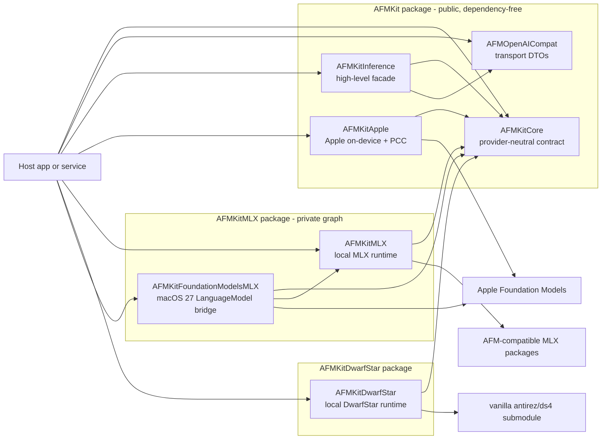

# AFMKit Architecture

This directory is the canonical architecture description for AFMKit. It uses a
lightweight combination of the C4 model, arc42 concerns, architecture decision
records (ADRs), and explicit interface/dependency catalogs. The source code and
the three manifests at `Package.swift`, `Packages/AFMKitDwarfStar/Package.swift`,
and `Packages/AFMKitMLX/Package.swift` remain authoritative when a document and
implementation differ.

## Scope and status

AFMKit is a Swift package for embedding provider-neutral language-model
capabilities in macOS applications. It is not an HTTP server, command-line
application, WebUI, model marketplace, or application state store. Those are
consumer responsibilities, including maclocal-api and Vesta.

Status labels used throughout this directory:

| Label | Meaning |
| --- | --- |
| **Implemented** | Present in the current package and covered by source/tests. |
| **Host-owned** | Deliberately supplied by an application or service using AFMKit. |
| **Extension point** | Supported by the architecture but not shipped as a concrete AFMKit implementation. |
| **Planned** | A stated direction, not a current compatibility promise. |

## Architecture principles

1. **Provider neutrality at the center.** `AFMKitCore` must not import an
   inference engine, Apple Foundation Models, HTTP framework, or persistence
   implementation.
2. **Dependency direction points inward.** Provider adapters depend on the core;
   the core never depends on adapters.
3. **Capabilities are discovered, not assumed.** Applications inspect model
   descriptors and optional protocols before exposing functionality.
4. **Structured events are the streaming contract.** Text, reasoning, tool
   calls, usage, log probabilities, custom payloads, and completion are distinct
   events rather than a string-only stream.
5. **The host owns authority.** Signing, entitlements, executable tools,
   credentials, App Intents, UI, user consent, and persistence stay with the app.
6. **macOS 27 is additive.** The package deployment floor remains macOS 26;
   macOS 27 APIs are compile- and runtime-gated.
7. **External engines are isolated.** Engine-specific schedulers, caches,
   checkpoint formats, and C bridges do not leak into the neutral model contract.
8. **Public API evolution is measured.** Symbol baselines and ADRs govern source
   compatibility; binary compatibility is not promised across arbitrary builds.

## Documentation map

| View | Purpose |
| --- | --- |
| [System context](01-system-context.md) | Actors, systems, trust boundaries, and scope. |
| [Containers and modules](02-containers-and-modules.md) | Swift products, targets, ownership, and dependency rules. |
| [Interface catalog](03-interface-catalog.md) | App-facing APIs, provider SPI, advanced APIs, internal interfaces, and Apple interfaces. |
| [Runtime flows](04-runtime-flows.md) | Loading, streaming, tools, Apple routes, and cancellation. |
| [macOS 27 integration](05-macos-27-integration.md) | WWDC26 feature mapping and implemented/host-owned/planned status. |
| [External dependencies](06-external-dependencies.md) | Git dependency ledger, pinning, transitive risk, and update policy. |
| [Quality and evolution](07-quality-and-evolution.md) | Quality attributes, security, observability, testing, and compatibility. |
| [Provider contracts and configuration](08-provider-contracts-and-configuration.md) | Stability tiers, provider guarantees, capability semantics, and configuration keys. |
| [Decisions](decisions/README.md) | Architecture decision records and their consequences. |
| [Independent review](reviews/2026-08-19-independent-review.md) | Architect findings, documentation responses, and retained follow-ups. |

Supporting implementation and transition history remains in
[`docs/TRANSITION_PLAN.md`](../docs/TRANSITION_PLAN.md) and
[`docs/APPLE_PROVIDER_CONTRACT.md`](../docs/APPLE_PROVIDER_CONTRACT.md).

## Architecture at a glance

**Figure 1 — AFMKit architecture at a glance.** Applications compose only the
products they need. Arrows indicate compile-time or call dependencies and point
toward dependencies; the neutral core does not know about provider implementations.

## Reading rules

- Diagrams are explanatory. Product definitions in the three package manifests
  and public declarations in their corresponding `Sources/` directories are
  normative.
- “Internal” means package/target implementation detail. Some provider-specific
  types are currently declared `public` for advanced integrations; the interface
  catalog calls this out rather than mislabeling their Swift access level.
- Apple feature references describe the integration contract, not a claim that
  AFMKit implements every feature shown at WWDC26.
