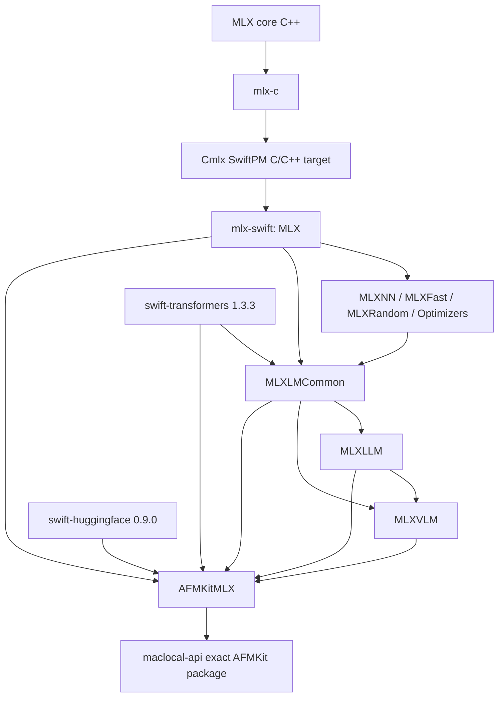
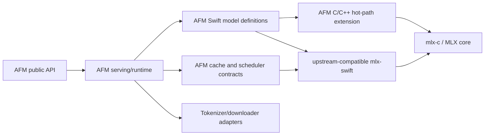
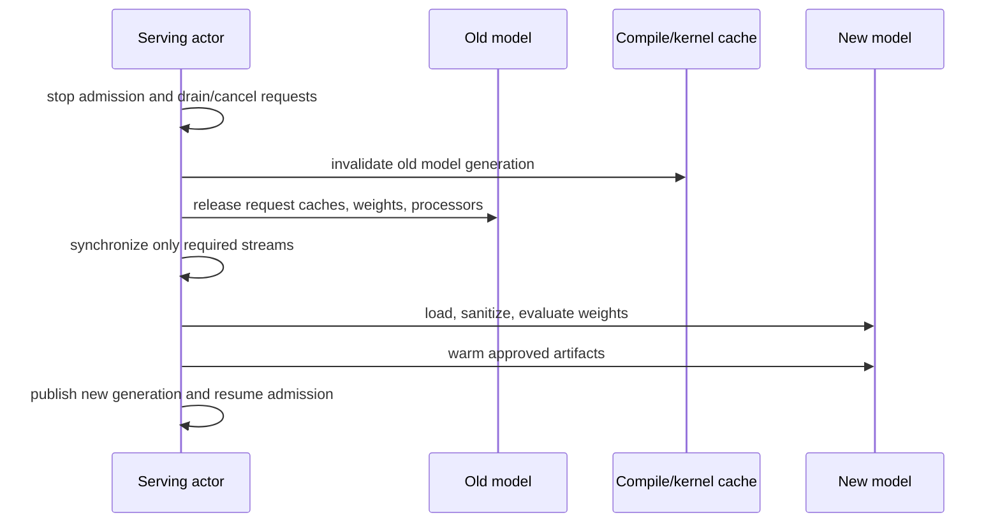
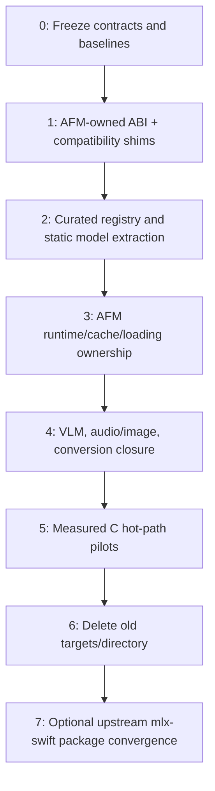

# AFMKit independence from `mlx-swift-lm`

Status: feasibility study, 2026-09-02  
Scope: analysis only; no runtime or package change is proposed by this commit.

## Executive conclusion

AFMKit can remove the `mlx-swift-lm` **module and upstream-maintenance dependency** without giving up MLX, model coverage, or AFM's serving features. It cannot safely remove the code responsibilities presently housed in `MLXLMCommon`, `MLXLLM`, and `MLXVLM`. Those targets currently supply roughly 72,000 lines of Swift: the model ABI, loading and weight sanitation, tokenizer/processor integration, generation and sampling, every cache implementation used by batching, and the model/VLM definitions themselves.

There is an important distinction in the present repository: AFMKit does not resolve `mlx-swift-lm` as an external SwiftPM package. It compiles a vendored, AFM-modified source snapshot directly. The root manifest creates local `MLXLMCommon`, `MLXLLM`, and `MLXVLM` targets from `vendor/MLX/mlx-swift-lm` ([`Package.swift:255`](../Package.swift#L255)); the only resolved remote packages at that boundary are Hugging Face tokenizer/downloader packages ([`Package.swift:470`](../Package.swift#L470)). Therefore a target deletion by itself changes neither generated MLX graphs nor GPU work and should be expected to provide **zero steady-state throughput benefit**.

The recommended destination is a staged hybrid (architecture D) converging on an AFM-owned Swift runtime and selected AFM-owned model library over `mlx-swift`, with narrowly selected C/C++ or custom Metal paths for measured hot operations. It combines architecture A's maintainable Swift model definitions with architecture C's opportunity for persistent low-overhead kernels, without attempting a risky all-at-once C rewrite. Architecture B is a useful transition mechanism, but not a good permanent end state.

The first safe milestone is behavior-preserving ownership transfer: introduce AFM-owned runtime protocols and compatibility shims, move only the required dependency closure, and prove bitwise/numerical, cache, streaming, batching, concurrency, model-switching, vision, and MTP parity. Performance work follows behind identical A/B workloads. The change should not ship unless every supported family has an explicit coverage tier and the new runtime is no slower within predefined confidence bounds.

## What “dependency” means today

### Exact source and SwiftPM graph

The MLX stack is a collection of checked-in source snapshots, not nested repositories or submodules. Its provenance file says so explicitly and records MLX 0.32.2 plus AFM compatibility revisions ([`vendor/MLX/README.md:1`](../vendor/MLX/README.md#L1), [`vendor/MLX/README.md:7`](../vendor/MLX/README.md#L7)). The stack is:

The root package builds `Cmlx` from the vendored `mlx-swift/Source/Cmlx` tree and includes both MLX core and `mlx-c`; its settings define the task-safe stream patch, bundle name, Metal library name, and MLX version ([`Package.swift:48`](../Package.swift#L48), [`Package.swift:91`](../Package.swift#L91)). It then constructs local Swift targets for `MLX`, `MLXRandom`, `MLXFast`, `MLXNN`, `MLXOptimizers`, FFT and Linalg ([`Package.swift:199`](../Package.swift#L199)). The language-model targets are also local:

| Target | Direct dependencies | Source path |
| --- | --- | --- |
| `MLXLMCommon` | `MLX`, `MLXNN`, `MLXOptimizers`, `MLXFast`, Transformers | `vendor/MLX/mlx-swift-lm/Libraries/MLXLMCommon` |
| `MLXLLM` | common plus MLX modules and Transformers | `vendor/MLX/mlx-swift-lm/Libraries/MLXLLM` |
| `MLXVLM` | common, LLM, MLX modules and Transformers | `vendor/MLX/mlx-swift-lm/Libraries/MLXVLM` |
| `MLXEmbedders` | MLX, NN, common, Transformers | `vendor/MLX/mlx-swift-lm/Libraries/Embedders` |

These definitions are at [`Package.swift:255`](../Package.swift#L255) through [`Package.swift:294`](../Package.swift#L294). `AFMKitMLX` directly imports all three LM modules plus Tokenizers, Hub, and HuggingFace, and copies the committed `default.metallib` resource ([`Package.swift:367`](../Package.swift#L367)). Tests also name the three modules directly ([`Package.swift:433`](../Package.swift#L433)).

There is collateral coupling outside text generation. `MLXAudioCodecs` depends on common; `MLXAudioTTS` depends on common and LLM ([`Package.swift:329`](../Package.swift#L329)); `AFMKitMLXAudio` and `AFMKitMLXImage` also depend on common ([`Package.swift:380`](../Package.swift#L380)). An exit plan that changes only `AFMKitMLX` will leave the old targets alive through audio/image.

The exact remote boundary is `swift-transformers` 1.3.3 (resolved revision `2fa33e1f5e7131a7fc64c28e6d161dcec0d24820`), `swift-huggingface` 0.9.0 (`b721959445b617d0bf03910b2b4aced345fd93bf`), and `swift-xet` 0.2.3 (`341bfd4172f6a57119bfd49bafa11cf5d21fab75`) in `Package.resolved`. These are independent dependencies, not transitive residue of `mlx-swift-lm`.

This layout intentionally differs from current upstream. Upstream describes MLX Swift as the Swift API over MLX and directs language-model users to a separate LM repository ([MLX Swift README](https://github.com/ml-explore/mlx-swift)). Upstream `mlx-swift-lm` describes model loading, model architectures, quantized fine-tuning, and pluggable tokenizer/downloader integrations as its responsibility ([MLX Swift LM README](https://github.com/ml-explore/mlx-swift-lm)). AFMKit has already folded and substantially adapted that responsibility.

### Three distinct layers and their recommended disposition

These names must not be treated as interchangeable:

| Layer | Supplies today | Recommended disposition |
| --- | --- | --- |
| **`mlx-c`** | C handles/functions over MLX core; it is physically compiled inside `Cmlx` from `vendor/MLX/mlx-swift/Source/Cmlx/mlx-c` | Retain as part of the exact MLX compatibility unit. Use it directly only for measured hot paths or missing Swift bindings. Do not mistake it for a complete inference engine. |
| **`mlx-swift`** | Swift array/operator/module APIs (`MLX`, `MLXNN`, `MLXFast`, etc.) and the Cmlx build envelope | Keep as the normal model-authoring/operator dependency. Initially retain the current minimal AFM snapshot because it includes task-safe streams and AFM primitive bindings. Work toward an exact upstream dependency only after those patches are upstreamed or isolated and single-runtime/Metal packaging is proven. |
| **`mlx-swift-lm`** | Model ABI, loading/generation/cache machinery, LLM/VLM definitions and processors | Remove the external/upstream package relationship and old module identity. Retain an attributed, deliberately selected AFM-owned internal source snapshot as a migration step, then refactor dynamic machinery into AFM runtime contracts. |

For clarity, the studied AFMKit manifest has **already removed the external SwiftPM package declaration for `mlx-swift-lm`**: there is no such entry in `Package.resolved`. The remaining work is to eliminate source/module dependence on its vendored snapshot. If another AFMKit release line still declares the upstream package, the minimal-snapshot option below permits deleting that declaration first without conflating it with physical source removal.

`mlx-swift` should not be bypassed wholesale. It remains the best interface for readable, rapidly changing Qwen/GLM/DeepSeek/Nemotron/VLM definitions. AFM should minimally fork it only while required for the current stream-safety and custom primitive bindings recorded in the provenance table. Hot paths may bypass Swift and call `mlx-c`/MLX C++ behind an AFM interface when an exact profile demonstrates lower graph-construction or launch overhead. This is a per-operation decision, not a second model engine.

### Concrete minimal AFM-owned LM snapshot

A practical architecture-B transition would create `Packages/AFMKitMLXRuntime/Sources`, `Packages/AFMKitMLXModels/Sources`, and `Packages/AFMKitMLXVLM/Sources`, copying the following starting dependency closure with existing copyright headers. The list is deliberately file-level; a compile-derived dependency check must finalize it before implementation.

| New owner | Indispensable starting files from `vendor/MLX/mlx-swift-lm/Libraries` | Reason |
| --- | --- | --- |
| `AFMKitMLXRuntime` ABI/config | `MLXLMCommon/LanguageModel.swift`, `BaseConfiguration.swift`, `ModelConfiguration.swift`, `JSONDecodingTypes.swift`, `GenerationConfigFile.swift`, `UserInput.swift` | Model/input/output/configuration contracts used by all selected families |
| `AFMKitMLXRuntime` loading/tokenization | `Load.swift`, `ModelFactory.swift`, `Tokenizer.swift`, `Module+Extensions.swift` | Safetensors, sanitation, quantization, tokenizer/processor creation and module updates |
| `AFMKitMLXRuntime` generation | `Evaluate.swift`, `CompiledDecodeTrace.swift`, selected declarations from `Chat.swift` | Sampling, generation events/metrics and compile tracing; replace high-level chat session rather than copy it |
| `AFMKitMLXRuntime` cache/math | `KVCache.swift`, `BatchKVCache.swift`, `AttentionUtils.swift`, `RoPEUtils.swift`, `SuScaledRoPE.swift`, `InterpolationUtils.swift` | Simple/rotating/quantized/list/batch caches and shared attention geometry |
| `AFMKitMLXModels` common layers | `SwitchLayers.swift`, `SelectiveShardedEmbedding.swift`, `VerifyWidthLinear.swift`, `DeepseekV4ActivationQuant.swift` | Selected MoE/sharded/speculative/DeepSeek implementations refer to them |
| `AFMKitMLXModels` dense/hybrid Qwen | `MLXLLM/Models/Qwen2.swift`, `Qwen3.swift`, `Qwen3MoE.swift`, `Qwen3Next.swift`, `Qwen3_5MoE.swift`, `Qwen4Exp.swift`, `Qwen4ExpGatedDeltaPrework.swift`, `Qwen4ExpMappedNGramTable.swift`, `GatedDelta.swift`, `SSM.swift` | Named dense Qwen and Qwen Next/3.5/4, recurrent state and MTP support |
| `AFMKitMLXModels` DeepSeek | `DeepseekV4.swift`, `DeepseekV4Configuration.swift`, `DeepseekV4MathHelpers.swift`, `DeepseekV4Compressor.swift`; plus common `DeepseekV4ChatEncoder.swift` | V4 0731 architecture, quantization, DSpARK/MTP and native template |
| `AFMKitMLXModels` GLM/Nemotron | `GLM5Next.swift`, `GLM5MoeDsa.swift`, `NemotronH.swift`, plus their compile-derived shared recurrent/attention helpers | GLM 5.3/5 Next text/MTP and Nemotron hybrid state |
| `AFMKitMLXVLM` | `MLXVLM/MediaProcessing.swift`, `Models/QwenVL.swift`, required Qwen VLM files (`Qwen2VL.swift`, `Qwen25VL.swift`, `Qwen3VL.swift`, `Qwen3_5MoEVL.swift`, `Qwen4ExpVL.swift`), `GLM5NextVL.swift`, `MuseGlimmer.swift`, and selected creators/processors from `VLMModelFactory.swift` | Named Qwen/GLM/Muse vision support and media preparation |
| Attribution/provenance | `vendor/MLX/mlx-swift-lm/LICENSE`, a new snapshot README/NOTICE, upstream base revision and an AFM patch ledger | MIT compliance and auditable refreshes |

There are no production binary resources under the LM library directories that must accompany this source subset. The movie files under vendored LM tests are fixtures and should be copied only if their migrated tests need them. The required production Metal resource comes from `mlx-swift`/MLX core and stays at `Packages/AFMKitMLX/Sources/AFMKitMLX/Resources/default.metallib`; it must not be relabeled as an LM resource.

Files intentionally omitted from the initial snapshot include `ChatSession.swift`, `HardwareInfo.swift` unless a live call site remains, upstream example presets, training-only code, unused LLM/VLM architectures, and the broad registry bodies. `ModelContainer.swift` should initially be adapted for API compatibility but implemented under AFM ownership rather than preserved indefinitely. Audio/TTS may require additional generic declarations after a compile-derived dependency closure; that is a separate product consumer, not justification to retain every LM model.

### Size and import inventory

At the studied revision, the three vendored targets comprise 140 Swift files and 72,359 lines:

| Target | Swift files | Swift lines | Character of code |
| --- | ---: | ---: | --- |
| `MLXLMCommon` | 55 | 15,433 | Dynamic runtime, caches, loading, tokenization, generation, utilities |
| `MLXLLM` | 65 | 37,274 | Mostly static architecture definitions plus model-specific runtime helpers |
| `MLXVLM` | 20 | 19,652 | Vision model definitions, image/video processors, VLM registry |

Across AFM package sources and the vendored audio sources, file-level imports occur 33 times for `MLXLMCommon`, 9 for `MLXLLM`, 6 for `MLXVLM`, 56 for `MLX`, 46 for `MLXNN`, 3 for `MLXFast`, 13 for Tokenizers, 4 for Hub, 19 for HuggingFace, and once for `Cmlx`. Import counts measure files, not semantic dependency weight, but they show that removing three import names does not remove MLX or Hugging Face.

AFM's model service imports MLX/LLM/VLM and the external tokenizer/downloader modules directly ([`Packages/AFMKitMLX/Sources/AFMKitMLX/Models/MLXModelService.swift:1`](../Packages/AFMKitMLX/Sources/AFMKitMLX/Models/MLXModelService.swift#L1)). It installs LLM and VLM factory trampolines ([`MLXModelService.swift:350`](../Packages/AFMKitMLX/Sources/AFMKitMLX/Models/MLXModelService.swift#L350)), selects the factory during load ([`MLXModelService.swift:2082`](../Packages/AFMKitMLX/Sources/AFMKitMLX/Models/MLXModelService.swift#L2082)), and downcasts concrete Qwen, GLM, and DeepSeek model types for specialized generation ([`MLXModelService.swift:2122`](../Packages/AFMKitMLX/Sources/AFMKitMLX/Models/MLXModelService.swift#L2122), [`MLXModelService.swift:2805`](../Packages/AFMKitMLX/Sources/AFMKitMLX/Models/MLXModelService.swift#L2805)). This is semantic coupling, not merely imports.

### Dynamic machinery versus static definitions

The following split should drive ownership and testing.

| Category | Current examples | Nature | Migration treatment |
| --- | --- | --- | --- |
| Model ABI and input/output | `LanguageModel.swift`, `ModelContext`, `UserInput` | Dynamic contract shared by every model, processor and scheduler | Replace first with stable AFM-owned protocols/value types |
| Isolation and lifecycle | `ModelContainer.swift`, `SerialAccessContainer.swift` | Runtime ownership and concurrency | Replace with AFM container; compatibility shim temporarily |
| Loading/configuration | `Load.swift`, `ModelFactory.swift`, `ModelConfiguration.swift`, `BaseConfiguration.swift` | Runtime I/O, configuration decode, quantization and weight sanitation | Internalize selected logic; split checkpoint schema from I/O |
| Generation/sampling | `Evaluate.swift`, `Generate.swift`, token iterator/tool types | Dynamic per-request machinery | Prefer AFM implementation; preserve sampling semantics exactly |
| Cache implementations | `KVCache.swift`, `BatchKVCache.swift`, attention/cache utilities | Mutable request state and batching ABI | Must internalize or rewrite before old common target can go |
| Model registries | `LLMModelFactory.swift`, `VLMModelFactory.swift` | Static mapping with some tokenizer/processor overrides | Replace with an AFM catalog containing only supported families |
| Text model files | `Models/Qwen*.swift`, `DeepseekV4*.swift`, `GLM5Next.swift`, `NemotronH.swift` | Mostly static architecture/configuration, with embedded caches and compiled helpers | Move dependency closure into AFM-owned model target; do not flatten into service |
| Vision definitions/processors | `Models/Qwen*.swift`, `GLM5NextVL.swift`, `MuseGlimmer.swift`, `MediaProcessing.swift` | Static networks plus dynamic media preparation | Move to AFM-owned VLM/model-processing targets |
| Tokenizer/downloader | Tokenizers, Hub, HuggingFace imports | External parsing, Jinja template execution, download/cache I/O | Keep initially behind AFM protocols; not necessary to rewrite |
| MLX generated/runtime resources | Cmlx generated bindings, core kernels, `default.metallib` | Core ABI/build artifact | Keep with the exact MLX compatibility stack |

The current `LanguageModel` contract includes multimodal inputs, output state, `prepare`, forward call, `newCache`, and weight sanitation ([`LanguageModel.swift:29`](../vendor/MLX/mlx-swift-lm/Libraries/MLXLMCommon/LanguageModel.swift#L29), [`LanguageModel.swift:114`](../vendor/MLX/mlx-swift-lm/Libraries/MLXLMCommon/LanguageModel.swift#L114)). Its default cache construction chooses rotating or simple caches per layer ([`LanguageModel.swift:207`](../vendor/MLX/mlx-swift-lm/Libraries/MLXLMCommon/LanguageModel.swift#L207)). These are indispensable responsibilities even when their source module changes.

`ModelContainer` serializes access to a context and explicitly allows concurrent immutable weight access after prefill ([`ModelContainer.swift:34`](../vendor/MLX/mlx-swift-lm/Libraries/MLXLMCommon/ModelContainer.swift#L34), [`ModelContainer.swift:159`](../vendor/MLX/mlx-swift-lm/Libraries/MLXLMCommon/ModelContainer.swift#L159)). AFM publicly exposes this type through `AFMMLXRuntimeAdapter.LoadedModel.container` ([`AFMMLXRuntimeAdapter.swift:29`](../Packages/AFMKitMLX/Sources/AFMKitMLX/AFMMLXRuntimeAdapter.swift#L29)). Consequently, target removal is an API migration: use deprecated type aliases/wrappers for at least one compatibility window or deliberately make the next release breaking.

## Required model and feature closure

The compiled registry currently instantiates far more architectures than the named product requirements. The LLM registry includes dense Qwen, Qwen Next/3.5/4 experimental variants, DeepSeek V4, Nemotron H, and GLM 5 Next among approximately sixty aliases ([`LLMModelFactory.swift:19`](../vendor/MLX/mlx-swift-lm/Libraries/MLXLLM/LLMModelFactory.swift#L19), [`LLMModelFactory.swift:38`](../vendor/MLX/mlx-swift-lm/Libraries/MLXLLM/LLMModelFactory.swift#L38), [`LLMModelFactory.swift:50`](../vendor/MLX/mlx-swift-lm/Libraries/MLXLLM/LLMModelFactory.swift#L50), [`LLMModelFactory.swift:55`](../vendor/MLX/mlx-swift-lm/Libraries/MLXLLM/LLMModelFactory.swift#L55), [`LLMModelFactory.swift:60`](../vendor/MLX/mlx-swift-lm/Libraries/MLXLLM/LLMModelFactory.swift#L60)). The VLM registry maps Qwen 3.5/4, Muse Glimmer, and GLM 5 Next, while a separate processor registry constructs their media processors ([`VLMModelFactory.swift:81`](../vendor/MLX/mlx-swift-lm/Libraries/MLXVLM/VLMModelFactory.swift#L81), [`VLMModelFactory.swift:114`](../vendor/MLX/mlx-swift-lm/Libraries/MLXVLM/VLMModelFactory.swift#L114)). A curated AFM registry can materially reduce compile surface, but only after support policy identifies every shipped alias.

### Family-specific invariants

| Family | Must preserve during extraction |
| --- | --- |
| Dense Qwen | Qwen 2/3 configuration aliases, GQA/RoPE behavior, tied embeddings, quantized linear loading, EOS resolution, chat-template/tool behavior. This is the lowest-risk pilot family. |
| Qwen Next / Qwen 3.5 / Qwen 4 experimental | Hybrid attention/recurrent cache topology, gated-delta layers, mapped n-gram/PLE tables where configured, quantized MoE routing/projections, MTP checkpoint/head binding, verification rollback, VLM wrapper and media processor. Exact concrete downcasts in the AFM adapter must become capabilities. |
| DeepSeek V4 0731 | `DeepseekV4.swift`, configuration/helpers/compressor, official block-scaled MXFP4/Q8 sanitation and custom MLX primitives, hybrid caches, DSpARK/MTP path, and native chat encoder. The current common loader detects official block-scaled sidecars and selects custom quantized modules ([`Load.swift:122`](../vendor/MLX/mlx-swift-lm/Libraries/MLXLMCommon/Load.swift#L122)); this cannot be replaced by generic safetensor assignment. |
| GLM 5.3 Flash / GLM 5 Next | Hyper-connection boundaries, KDA/gated recurrent layers, DSA/attention caches, MoE routing, quantized forms, embedded MTP ownership and rollback. Vision additionally needs `GLM5NextVL.swift`, its processor, media geometry, and text-model cache compatibility. |
| Nemotron | Nemotron H configuration, alternating attention/SSM topology, Mamba/recurrent state cache and normalization semantics. Treat it as hybrid-state, not a dense-transformer alias. |
| Muse | Muse Glimmer vision model and processor, media preprocessing, response-channel semantics, and the tokenizer/template configuration expected by its checkpoints. |

Conversion remains AFM responsibility. `DeepseekV4CheckpointConverter.swift` already lives under `AFMKitMLX`, but imports model configuration/helper types; stable tensor names and quantization schemas should move into a neutral `AFMMLXCheckpointSchema` layer rather than importing the execution target. GLM and other conversions should follow the same rule. Conversion tests must prove key mapping, dtype reinterpretation, scale/bias handling, shard determinism and failure on an empty or incompatible sanitized set.

Tool and chat integration also survives the module removal. Keep swift-transformers' Tokenizers/Jinja functionality initially, behind an AFM `TokenizerProtocol` and `ChatTemplateRenderer`. AFM's streaming parser/policy remains the HTTP-facing owner, while family-specific encoders such as `DeepseekV4ChatEncoder` may live in an AFM templates target. The native encoder is selected in `MLXModelService` for DeepSeek V4 ([`MLXModelService.swift:7359`](../Packages/AFMKitMLX/Sources/AFMKitMLX/Models/MLXModelService.swift#L7359)). Do not merge model inference state with tool-parser state: parser rollback and streamed partial JSON have different lifecycles than KV/MTP rollback.

## Architecture options

### A. AFM-owned Swift model/runtime layer over `mlx-swift`

Create AFM-named targets, for example `AFMMLXRuntime`, `AFMMLXModels`, `AFMMLXVisionModels`, and `AFMMLXCheckpointSchema`. Keep upstream-compatible `MLX`, `MLXNN`, `MLXFast`, and related Swift APIs as the tensor/operator layer. Port required model definitions and implement AFM-owned loading, model-container, generation, cache and factory protocols.

**Strengths**

- Best long-term ownership boundary: serving semantics and AFM-specific models live together.
- Model code remains close to Python/Swift MLX references and is easier to review than a C graph builder.
- Swift type safety, async integration, and existing AFM model adaptations are retained.
- Registries can compile only supported models rather than every upstream example.
- Tokenizers/HuggingFace can be kept or swapped independently.

**Weaknesses**

- A real port of the dynamic common layer is large; copying under new names without redesign merely creates an undisclosed fork.
- The upstream MLX Swift API remains a dependency and AFM currently carries core/C/Swift patches.
- Swift graph-construction and existential dispatch overhead remain unless hot paths are measured and optimized.
- Public types leaked from old modules require shims or a breaking release.

**Rough effort:** 6–10 engineer-months for the named text/VLM families and production validation, assuming the existing model files are reused with attribution. More if all currently registered models must remain supported.

### B. Minimal internal fork of selected `mlx-swift-lm` files

Copy only the required common/model/VLM dependency closure into AFM-named targets, make imports mechanical, prune registries, and periodically cherry-pick upstream fixes.

**Strengths**

- Lowest behavioral risk and fastest route to deleting the old target names.
- Preserves current numerical behavior and AFM modifications.
- Enables immediate compile-surface reduction if the supported-model list is explicit.

**Weaknesses**

- It is still a fork, regardless of directory name; upstream patch triage remains manual.
- File-level coupling in common can make “minimal” surprisingly large.
- It does not improve runtime performance by itself.
- Blind syncing risks overwriting AFM cache, quantization, generation, or concurrency fixes.

**Rough effort:** 2–4 engineer-months to extract and validate the named closure. Ongoing cost is roughly 0.25–0.75 engineer-month per upstream refresh, with spikes for MLX API or model schema changes.

This is acceptable as phase-one mechanics, not as the architectural stopping point.

### C. C-first engine over `mlx-c` with a thin Swift boundary

Represent models, weights, graph fragments, caches and compiled handles in C/C++; expose opaque request/model handles to Swift. Tokenization and HTTP streaming may remain Swift.

**Strengths**

- Maximum control over allocation, graph building, dispatch and persistent kernel/config lifetimes.
- A stable C ABI can isolate Swift compiler/module changes.
- Best theoretical route to match a direct MLX-C engine when host overhead is material.
- Model/request state can be explicit and compact.

**Weaknesses**

- `mlx-c` is an operator API, not a ready LLM engine. AFM would rebuild module traversal, safetensor loading policy, quantization, dozens of layer types, every cache form, VLM preprocessing interfaces, batching and MTP.
- Ownership/error/lifetime bugs become materially harder, especially across Swift concurrency.
- Translating rapidly changing Qwen/GLM/DeepSeek definitions into C has high maintenance cost and slows model onboarding.
- C-first does not automatically make GPU kernels faster; both paths reach the same MLX core. It only helps where graph/dispatch/lifetime overhead is demonstrated.

The official `mlx-c` project describes itself as the C API for MLX, not a model-serving engine ([mlx-c repository](https://github.com/ml-explore/mlx-c)).

**Rough effort:** 12–24 engineer-months for named-family parity, plus a substantial stabilization tail. This is unjustified without profiles showing that Swift-layer graph construction is a dominant, irreducible cost.

### D. Staged hybrid: AFM Swift ownership plus measured C hot paths

Use B to establish a behavior-preserving AFM-owned source boundary, refactor toward A, then introduce C/C++/Metal only for operations or persistent execution objects proven to benefit.

**Strengths:** delivers independence incrementally, preserves current functionality, permits selective build pruning, and has a credible performance path without committing every model to C. It also allows direct A/B comparison of a Swift implementation and a C hot-path implementation behind one capability protocol.

**Weaknesses:** temporarily carries old and new abstractions, requires disciplined compatibility cleanup, and can become permanent duplication if exit criteria are not enforced.

**Rough effort:** 6–12 engineer-months across staged releases for the named families, including tests and performance qualification. This is the recommendation.

### Decision matrix

Scores are relative (5 best); effort is inverted so 5 means least effort.

| Criterion | A Swift-owned | B selected fork | C C-first | D hybrid |
| --- | ---: | ---: | ---: | ---: |
| Initial correctness risk | 3 | 5 | 1 | 4 |
| Long-term maintainability | 4 | 2 | 2 | 5 |
| Model onboarding speed | 5 | 4 | 1 | 5 |
| Performance ceiling | 4 | 3 | 5 | 5 |
| Concurrency/lifecycle control | 4 | 3 | 5 | 5 |
| VLM/MTP migration feasibility | 4 | 5 | 1 | 5 |
| Upstream patch burden | 4 | 2 | 3 | 4 |
| Effort | 2 | 4 | 1 | 2 |

## Performance analysis

### Dependency removal is not an optimization

The current vendored LM Swift is compiled into the same process as AFMKit. Renaming targets, moving files, or replacing factory symbols does not change tensor operations. Any throughput claim must identify a changed graph, kernel, synchronization, cache reuse, allocation or scheduling behavior and use an exact before/after build and checkpoint.

MLX records operations lazily and executes them at evaluation. Its documentation warns both that unused graph construction still has a cost and that evaluations have fixed overhead, so the useful graph size must be balanced ([MLX lazy evaluation](https://ml-explore.github.io/mlx/build/html/usage/lazy_evaluation.html)). This means an AFM runtime must own evaluation boundaries deliberately; wrappers that call scalar accessors or inspect arrays inside scheduling decisions can introduce implicit synchronization.

### Lazy graph and compile ownership

The preferred contract is:

1. A loaded model owns immutable, evaluated weights and model-scoped persistent execution objects.
2. Each request owns mutable KV/recurrent/MTP state.
3. A batch owns only the temporary merged view and slot mapping.
4. A compiled artifact is keyed by model generation, operation, shape policy, dtype/quantization, device/stream policy, batch class, and feature flags.
5. Model unload/switch increments the generation and invalidates artifacts before weights are released.

MLX compile caches work after a first trace/compile, but compiled functions are intended to be pure and captured values otherwise become constants ([MLX compilation](https://ml-explore.github.io/mlx/build/html/usage/compile.html)). Accordingly, compiled decode/FFN/selector closures must not capture a request's mutable cache. Cache arrays/state must be explicit inputs and outputs, or be managed through a rigorously defined captured-state facility. Existing DeepSeek code already contains compiled selector/forward helpers (`DeepseekV4.swift`, around lines 1438–1610); extraction must preserve their lifetime and test cross-model invalidation rather than recreating them per request.

Persistent kernels/config objects should be model-owned when they depend only on weights/configuration, and runtime-owned when globally invariant. Request-owned construction on every token is a performance bug. Conversely, making mutable caches model-owned would corrupt concurrent requests.

### Model switching and memory

Model switching needs a transactional lifecycle:

Moving source code has negligible model-memory impact. Pruning registrations improves binary/build size, not weight residency. Persistent packed/joined projections can improve dispatch but increase resident memory; each artifact needs an accounted byte cost and an eviction policy. Weight loading must retain lazy initialization's memory advantage: sanitize and replace placeholders before evaluating the model. The current loader explicitly refuses to materialize initialized parameters if sanitation recognizes no checkpoint weights (`Load.swift`, lines 139–153).

### Prefix/radix cache

AFM's radix tree is already AFM-owned, but its entries contain `KVCache` states from common. It snapshots arrays contiguously ([`RadixTreeCache.swift:7`](../Packages/AFMKitMLX/Sources/AFMKitMLX/Models/RadixTreeCache.swift#L7)); the scheduler stores per-layer state plus metadata and distinguishes recurrent exact-boundary reuse from trimmable attention prefixes ([`BatchScheduler.swift:138`](../Packages/AFMKitMLX/Sources/AFMKitMLX/Models/BatchScheduler.swift#L138), [`BatchScheduler.swift:1192`](../Packages/AFMKitMLX/Sources/AFMKitMLX/Models/BatchScheduler.swift#L1192)).

Introduce an AFM cache protocol with explicit operations: `snapshot`, `restore`, `clone`, `truncate`, `tokenCount`, `batchMerge`, `batchExtract`, and a declaration of replay-boundary safety. Cache keys must include checkpoint identity/revision, architecture/config hash, quantization, processor/template version, runtime ABI, and model generation. Recurrent/SSM/KDA caches must never be treated as trimmable KV simply because their storage is an array. Preserve exact MTP target/draft cache pairing and rollback boundaries.

### Continuous batching and concurrency

`BatchScheduler` is already an AFM serving engine. It lazily builds one packed decode call ([`BatchScheduler.swift:788`](../Packages/AFMKitMLX/Sources/AFMKitMLX/Models/BatchScheduler.swift#L788)), performs individual or batched prefill, and translates among simple, rotating, list, Mamba and DeepSeek batch caches ([`BatchScheduler.swift:1687`](../Packages/AFMKitMLX/Sources/AFMKitMLX/Models/BatchScheduler.swift#L1687), [`BatchScheduler.swift:1950`](../Packages/AFMKitMLX/Sources/AFMKitMLX/Models/BatchScheduler.swift#L1950)). Removing common requires moving the cache implementations or replacing those branches capability-by-capability.

The new model ABI should avoid concrete downcasts in the scheduler. Model capabilities should report:

- supported cache topology and snapshot/truncation behavior;
- batched-prefill and batched-decode support by batch/sequence shape;
- multimodal batching limitations;
- speculative/MTP provider and rollback semantics;
- optional compiled execution variants.

Keep actor isolation for lifecycle mutations, but do not serialize GPU work merely to protect immutable weights. The current container explicitly makes this distinction after prefill. Retain the `MLX_SWIFT_TASK_SAFE_DEFAULT_STREAMS` compatibility behavior defined in the C target ([`Package.swift:105`](../Package.swift#L105)); a C boundary must not silently revert to thread-affine default-stream assumptions when Swift tasks resume on different threads.

### MTP and speculation

MTP must remain a separate execution capability, not a flag inside the ordinary iterator. The target model owns authoritative caches; the draft/MTP head owns its additional state; verification returns accepted length plus all replacement states; rollback is atomic. Keep non-MTP behavior in every test matrix. Today the adapter selects exact `Qwen4ExpModel` and `GLM5NextModel` concrete types ([`AFMMLXRuntimeAdapter.swift:473`](../Packages/AFMKitMLX/Sources/AFMKitMLX/AFMMLXRuntimeAdapter.swift#L473)); replace this with `SpeculativeDecodingProvider` so model module names no longer leak into serving.

### Metal packaging and ability to match C engines

Metal packaging belongs to the retained MLX core compatibility stack, not `mlx-swift-lm`. AFM copies a committed `default.metallib`; the rebuild script notes that SwiftPM copies rather than compiles it, and that dispatch/kernel mismatch can silently corrupt output ([`Scripts/rebuild-mlx-metallib.sh:2`](../Scripts/rebuild-mlx-metallib.sh#L2)). It also documents which operations JIT at runtime ([`Scripts/rebuild-mlx-metallib.sh:15`](../Scripts/rebuild-mlx-metallib.sh#L15)). Any core/kernel refresh must preserve provenance, rebuild the artifact, and verify symbol parity.

A hybrid engine can match a direct MLX-C engine if both submit equivalent MLX graphs/kernels and AFM eliminates measured host overhead through persistent C handles/configs. C syntax is not intrinsically faster than Swift once both call the same C API. Compare graph node counts, compilation count, GPU command submissions, evaluations/synchronizations, allocations and CPU time per token—not only tokens/second. A full C rewrite is warranted only if a prototype demonstrates a repeatable advantage unavailable through Swift `compile`, custom operators, or persistent wrappers.

### Build time

Compiling all registered model files is a plausible build-time cost: `MLXLLM` alone is 37,274 lines and `MLXVLM` 19,652. A curated registry/target split can improve clean and incremental build times even if runtime is unchanged. Measure with the repository's consumer build harness and report wall/user/system time, peak RSS, artifact size, and rebuilt Swift frontend jobs for: current graph, compatibility-shim graph, and pruned graph. Do not infer improvement from line count alone.

## Ownership inventory

### Must keep, internalize, or replace one-for-one

The exact filenames may change, but these responsibilities cannot disappear:

- Core ABI: `LanguageModel.swift`, `BaseConfiguration.swift`, `ModelConfiguration.swift`, model context and model capability definitions.
- Loading: `Load.swift`, `ModelFactory.swift`, safetensor enumeration, sanitation, quantization inference/application, tokenizer/processor creation, and empty/incompatible-checkpoint rejection.
- Execution: relevant parts of `Evaluate.swift`/generation iterators, sampling and logit processors, EOS/stop handling, token metrics and cancellation.
- Cache foundation: `KVCache.swift`, `BatchKVCache.swift`, attention mask/RoPE helpers, rotating/quantized/list/array/recurrent/DeepSeek/Mamba cache dependency closure.
- Model utilities: switch/quantized layers, selective sharded embedding, verification-width linear, recurrent normalization/SSM/gated-delta helpers, DeepSeek activation quantization and chat encoder.
- Required text definitions: `Qwen2.swift`, `Qwen3.swift`, `Qwen3Next.swift`, Qwen 3.5/4 files and helpers, `DeepseekV4.swift` plus configuration/helpers/compressor, `GLM5Next.swift` and required GLM/DSA/KDA helpers, `NemotronH.swift` and its SSM dependencies.
- Required VLM definitions: Qwen VLM wrapper(s), `GLM5NextVL.swift`, `MuseGlimmer.swift`, shared vision interfaces and `MediaProcessing.swift`, plus the corresponding processors.
- AFM serving code already outside the vendor tree: `MLXModelService`, `BatchScheduler`, `RadixTreeCache`, `ModelContainerGenerateTask`, streaming/tool policy, converters and tests.
- MLX core resources: generated Cmlx headers/sources needed by the build, the committed metallib, resource-bundle macros and rebuild/verification script.
- External adapters initially: Tokenizers, Transformers/Jinja, Hub and HuggingFace/Xet downloader/cache behavior.

Before moving a model file, generate its compile-time dependency closure from referenced types and verify it against actual builds. The above is a semantic seed list, not permission to omit a helper merely because it has a generic filename.

### Can replace or omit after product confirmation

- The generic upstream `ModelFactoryRegistry` and large default registries; use a typed AFM catalog and explicit aliases.
- Sample model presets and unsupported model architecture files.
- High-level `ChatSession` and example-oriented convenience APIs when no AFM public API uses them.
- Training-only optimizer/full fine-tuning utilities if AFM's supported contract is inference-only. Keep minimal LoRA/adaptor application if runtime adapters are supported.
- Upstream tool-call parsing that duplicates the AFM streaming parser, after template output and incremental/error semantics are proven equivalent.
- Generic download convenience functions, after an AFM loader adapter preserves offline/local behavior, revisions, progress and authentication.
- `MLXEmbedders` only if embedding support is independently provided and audio/image no longer depend on it indirectly.
- Every unadvertised model/VLM file, but only after catalog, CLI discovery and compatibility tests establish that removal is intentional.

“Can replace” does not mean “delete immediately.” Each item needs an API-use scan and a deprecation decision.

## Licensing, attribution and upstream maintenance

The vendored `mlx-swift-lm` and `mlx-swift` snapshots use the MIT license ([`vendor/MLX/mlx-swift-lm/LICENSE:1`](../vendor/MLX/mlx-swift-lm/LICENSE#L1), [`vendor/MLX/mlx-swift/LICENSE:1`](../vendor/MLX/mlx-swift/LICENSE#L1)). MIT permits copying and modification, but the copyright and permission notice must accompany substantial portions. Preserve licenses in distributions and source trees, add per-file upstream copyright headers, and maintain a provenance table recording upstream repository, base revision, AFM move/rewrite revision, and material changes. Preserve third-party notices embedded in MLX core and transitive code.

An AFM-owned directory must not imply clean-room authorship. Where a file begins as an upstream copy, label it as such. For heavily rewritten files, retain provenance in `NOTICE`/README even if the original body is no longer recognizable. Review model ports for additional source provenance (for example Python implementations or checkpoint-specific licenses); MIT coverage of the Swift repository does not change model-weight licenses.

Upstream update policy should be semantic rather than bulk merge:

1. Monitor pinned MLX, mlx-c, mlx-swift and mlx-swift-lm changes separately.
2. Classify each LM change as security/correctness, model schema, performance, API convenience or irrelevant architecture.
3. Reimplement/cherry-pick only applicable changes with source attribution and focused tests.
4. Record intentional divergence in a machine-readable patch ledger.
5. Refresh MLX core/C/Swift as one compatibility unit; rebuild Metal artifacts when required.

The local history already includes AFM changes to DeepSeek primitives, model architectures, parsing, generation and Qwen MTP loading, summarized in [`vendor/MLX/README.md:14`](../vendor/MLX/README.md#L14). This is evidence that a perpetual “small downstream patch” assumption is no longer realistic.

## API compatibility and test migration

### API plan

Public AFM APIs currently expose common types such as `ModelContainer` and stream chunks through `AFMMLXRuntimeAdapter`. Use a three-step compatibility plan:

1. Define AFM-owned protocols/value types in a dependency-light runtime target. New API uses these immediately.
2. In old module names, provide deprecated type aliases or wrapper adapters where Swift permits. Do not expose both mutable object graphs as independently authoritative.
3. Remove shims only in a declared major-version boundary after symbol-graph and consumer compilation checks.

Prefer capability protocols over concrete downcasts: `BatchableModel`, `PrefixCacheModel`, `SpeculativeDecodingProvider`, `VisionInputModel`, `CheckpointSanitizer`. Stable request/result types should not import concrete Qwen/GLM/DeepSeek modules.

### Required validation matrix

No phase exits on compile success alone. All direct SwiftPM invocations must use the repository wrapper. GPU/model inference requires separate scheduling and is intentionally not performed for this study.

| Layer | Required tests |
| --- | --- |
| Static/package | package graph has no old target dependency; import scan; license/provenance; API/symbol diff; clean consumer build and incremental build timings |
| Numerical | fixed tiny tensors and checkpoint slices for each attention, MoE, recurrent/SSM/KDA, normalization, quantized projection and vision block; logits/hidden-state tolerances by dtype |
| Loading/conversion | config aliases; shard order; weight sanitation; MXFP4/Q8/per-layer quantization; missing/extra keys; local/offline/revision behavior |
| Cache | append, truncate, rotate, snapshot/restore, clone, exact recurrent boundary, batch merge/extract; cache state comparison layer by layer |
| Prefix/radix | miss, partial hit, exact hit, divergent suffix, eviction, model switch, quantization mismatch, template mismatch; attention and recurrent families |
| Batching | B=1 parity, mixed lengths, admission/removal, batched prefill/decode, cancellation, logprobs, deterministic sampling seeds, multimodal fallback |
| Concurrency | simultaneous streams, model weights immutable, request cache isolation, task thread hops, cancellation during prefill/decode, load/unload race |
| Streaming/tools | byte-for-byte chunks, Unicode boundaries, EOS/stop reasons, partial/multiple tool calls, malformed JSON, native DeepSeek template and model templates |
| MTP | disabled baseline, enabled accept/reject patterns, zero/full/partial acceptance, rollback, cache parity, model switch, batch interaction |
| Vision | image/video preprocessing geometry, pixel normalization, special tokens, multi-image, text-only fallback, Qwen/GLM/Muse golden logits |
| Performance | exact checkpoint and prompt corpus; warm/cold prefill, decode median/p95, batch throughput/fairness, prefix hit/miss, MTP on/off, model switch RSS/time; compilation counts and peak memory |

For every performance A/B, use the same commit except the isolated runtime toggle, exact checkpoint bytes, prompt/token limits, temperature/seed, cache state, power mode and thermal window. Report median and dispersion over repeated samples. Correctness gates precede throughput comparison. Never present an exploratory number as qualified production evidence.

## Phased migration and exit criteria

### Phase 0 — contract and baseline

- Freeze supported model aliases, checkpoint formats, public symbols and feature combinations.
- Capture golden logits/cache states and exact performance baselines for each family.
- Add import/dependency reports and a provenance ledger.

**Exit:** every advertised model/feature maps to an owner and test; exact baseline artifacts are reproducible.

### Phase 1 — AFM-owned ABI

- Introduce AFM input/output/model/cache/capability/container interfaces.
- Adapt current common models behind them without moving implementation.
- Remove concrete model downcasts from scheduling and public APIs where possible.

**Exit:** old and new APIs have parity; no performance regression; consumer builds against compatibility shims; concurrency and model-switch tests pass.

### Phase 2 — curated models and registries

- Create AFM-owned model targets and move the dense-Qwen pilot dependency closure.
- Replace broad registries with explicit aliases and fallback errors.
- Repeat for Qwen Next, DeepSeek, GLM and Nemotron text definitions.

**Exit per family:** configuration/load golden tests, logits/cache parity, generation/streaming parity, no regression beyond the predefined confidence interval, and documented provenance. Unsupported aliases fail intentionally rather than resolving to a wrong architecture.

### Phase 3 — runtime, loading and caches

- Move/rewrite common generation, loading, sanitation, cache and batch cache responsibilities.
- Bind AFM radix cache to the new cache protocol.
- Keep MTP and non-MTP execution paths separately testable.

**Exit:** `AFMKitMLX` no longer imports `MLXLMCommon`; prefix/radix, continuous batch, concurrency and MTP matrices pass for all text families; memory and compilation lifecycle are bounded across switches.

### Phase 4 — vision and collateral consumers

- Extract Qwen/GLM/Muse VLM definitions and processors.
- Migrate audio codecs/TTS and image code from common interfaces, or give them a small neutral tensor/tokenizer utility target.
- Decouple converters from executable model modules.

**Exit:** no AFM product target imports `MLXLLM` or `MLXVLM`; text-only and multimodal matrices pass; audio/image tests no longer retain old targets.

### Phase 5 — measured C hot paths

- Profile graph construction, compilation, dispatch, synchronization and allocation.
- Prototype one bounded operation with persistent C handles behind the same model capability.
- Compare it against the Swift path using identical graphs/checkpoints.

**Exit for adoption:** statistically repeatable end-to-end gain, numerical/cache parity, lower or bounded memory, clean unload/switch behavior, and a maintenance plan. Otherwise delete the prototype and retain Swift.

### Phase 6 — physical removal

- Remove old module targets and `vendor/MLX/mlx-swift-lm` after license/provenance content is relocated.
- Remove compatibility shims at the declared release boundary.
- Validate clean checkout, consumer build, packaging and metallib loading.

**Exit:** graph/import scans find no old target, all products/tests resolve, release artifact includes notices, full correctness and performance qualification passes.

### Phase 7 — optional MLX Swift sourcing change

Independence from LM does not require unvendoring MLX Swift. Once AFM core/C/Swift patches are upstreamed or isolated, evaluate replacing the source snapshot with an exact upstream package. The official MLX Swift documentation warns about duplicate MLX copies in a process and notes that command-line SwiftPM does not build Metal shaders ([MLX Swift README](https://github.com/ml-explore/mlx-swift)); AFM's single-package and committed-metallib design must remain intact.

**Exit:** one MLX runtime copy, exact reproducible version, AFM custom primitives available, task-safe streams preserved, metallib parity proven, and no consumer portability regression.

## Principal risks and controls

| Risk | Impact | Control |
| --- | --- | --- |
| “Removal” becomes a rename-only fork | No maintenance/performance benefit | Track owned responsibilities and upstream deltas, not directory names |
| Missing cache subtype | Silent wrong tokens after prefix/batch reuse | Capability protocol plus per-layer snapshot/restore golden tests |
| Compile closure captures stale weights/cache | Cross-request/model corruption | Explicit state I/O and model-generation keys; unload stress tests |
| Registry pruning breaks an implicit alias | User-visible load failure | Freeze catalog and test every alias before pruning |
| Quantized sanitation drift | Huge memory use or wrong results | Checkpoint-slice tests and fail-closed loader behavior |
| Swift public API break | Consumer source failure | Symbol graph, deprecated shims, major-version policy |
| C rewrite stalls model onboarding | Feature lag | C only behind measured operator/runtime interfaces |
| Vision/media divergence | Incorrect token/image alignment | Golden processed shapes/tokens/pixels and logits |
| Metal host/artifact mismatch | Crash or silent corruption | Rebuild and symbol-parity workflow; versioned manifest |
| Upstream security/correctness fixes missed | Latent defects | Scheduled semantic upstream review and patch ledger |
| Performance regression hidden by noise | Slower release | Exact repeatable A/B, medians/p95 and correctness-first gating |

## Recommendation

Adopt architecture D with a declared convergence toward A:

1. Keep the exact MLX core/`mlx-c`/`mlx-swift` compatibility unit and committed Metal packaging initially.
2. Define AFM-owned runtime, cache and capability contracts before moving models.
3. Use a selected-file fork only as a migration technique, preserving MIT attribution and provenance.
4. Pilot dense Qwen, then migrate hybrid families in increasing state complexity; treat Qwen Next, DeepSeek V4, GLM and Nemotron as distinct cache/capability classes.
5. Move Qwen/GLM/Muse vision only after text and cache contracts stabilize.
6. Keep Tokenizers/HuggingFace as independent adapters in the first program; rewriting them does not advance LM independence.
7. Use C/C++ only for profiles that prove persistent Swift-side overhead, with a Swift fallback and exact numerical/performance A/B.

The go/no-go decision should be based on ownership clarity and measured behavior, not the absence of the string `mlx-swift-lm`. Success means AFM can update its serving runtime and supported model definitions on its own cadence, can consume upstream MLX fixes without replaying a broad LM fork, retains every declared serving feature, and is at least performance-neutral. A pure C-first rewrite does not meet the risk/reward threshold today.

## Reproduction notes for this study

This inventory was made from the AFMKit revision on branch `docs/mlx-swift-lm-independence` created from `origin/main` at `29122b1`. Counts use tracked Swift files in the three vendored library directories. No build, model inference, GPU workload or benchmark was run. Upstream links are primary project repositories/documentation; local source and manifest links describe the exact studied implementation.
