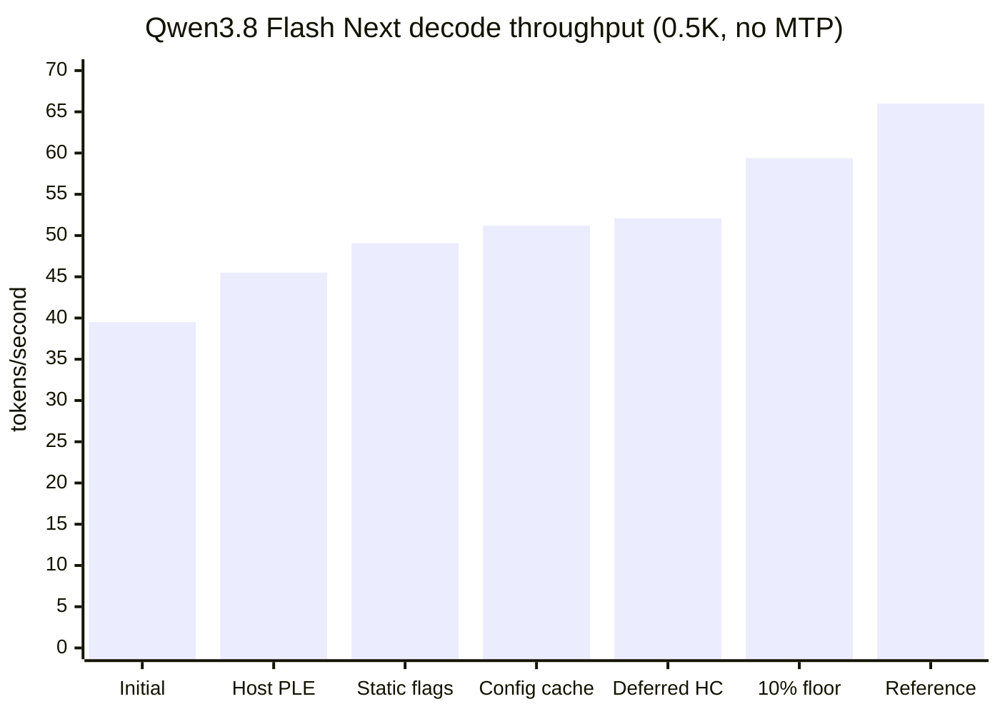
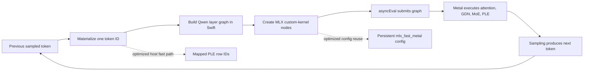
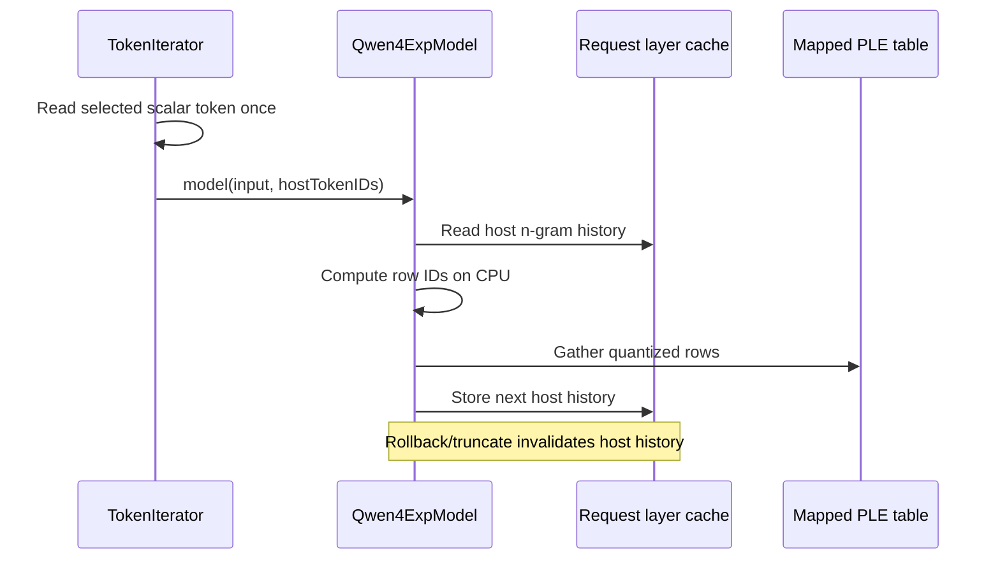
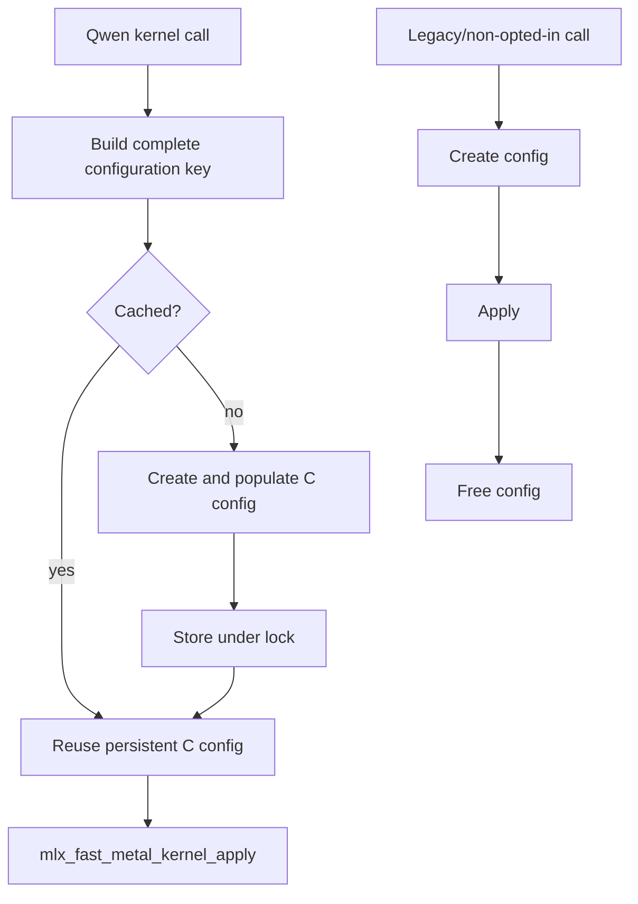
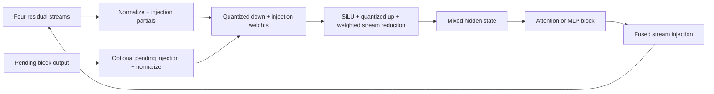
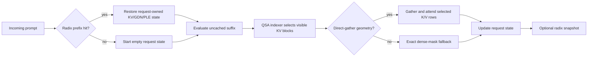
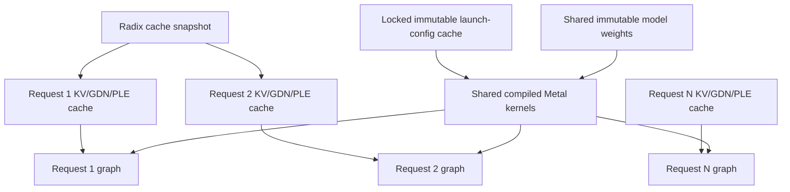
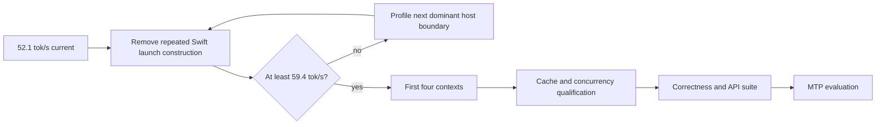

# Qwen3.8 Flash Next performance investigation

Status: active engineering investigation, updated 2026-09-01. The implementation on
`perf/qwen-next-qsa-gather` is experimental until its numerical, cache,
concurrency, and full-context qualification gates pass.

This document records why Qwen3.8 Flash Next initially decoded much more slowly
through AFMKit than through the reproduced reference engine, what has been
measured, which changes helped, and what remains before the work can ship. It is
intended to prevent future work from repeating plausible but unproductive
optimizations without measurement.

## Executive summary

The performance gap is real, reproducible, and now localized.

- The same checkpoint on the same M3 Ultra reached **65.99 decode tok/s** and
  **844.79 prefill tok/s** through the reference engine.
- AFMKit's initial comparable no-MTP run reached approximately **39.5 decode
  tok/s** and **850 prefill tok/s**.
- The best current experimental AFMKit path reaches **52.10 decode tok/s** and
  **867.46 prefill tok/s** with deferred inter-layer hyper-connection writes.
- Prefill is already within the 10% target. Decode improved by approximately
  31.9%, but remains 21.1% below the reproduced reference and 12.3% below the
  minimum acceptable 59.4 tok/s target.
- Profiling shows that the remaining gap is primarily per-token Swift lazy-graph
  construction and dispatch preparation, not a lack of GPU arithmetic
  throughput. The GPU portion of the measured token loop is already close to
  the reference's complete token time.

At 52.10 tok/s, AFMKit spends 19.20 ms per generated token. The reproduced
reference spends 15.15 ms. Meeting the 10% threshold requires no more than
16.84 ms/token, so approximately 2.36 ms/token still must be removed from the
current path.

## Qualification boundary

All figures in this document use:

- Apple M3 Ultra, 512 GB unified memory, 80 GPU cores.
- The exact checkpoint
  `/Volumes/edata2/models/ddalcu/Qwen3.8-Flash-Next-MLX-Serve-4bit`.
- Greedy decoding with temperature 0.
- Prefix caching disabled, so the prompt is evaluated cold on every run.
- MTP disabled. MTP is a separate optimization and must not conceal a slow
  single-token decoder.
- The upstream `llm_context_benchmarks` OpenAI-compatible context benchmark.
- A 0.5K context and 128 generated tokens for the fast iteration loop.
- One GPU workload at a time.

The current comparison command is:

```bash
uv run openai-benchmark \
  --model /Volumes/edata2/models/ddalcu/Qwen3.8-Flash-Next-MLX-Serve-4bit \
  --base-url http://127.0.0.1:9998/v1 \
  --contexts 0.5 \
  --max-tokens 128 \
  --runs 3 \
  --temperature 0 \
  --no-batch
```

The short 0.5K test is an iteration gate, not final qualification. Once decode
crosses 59.4 tok/s, the first four context sizes must be rerun. Correctness,
radix/prefix-cache behavior, streaming, continuous batching, and concurrent
requests remain mandatory gates.

## Reproduced results

The table uses the best recorded run for each milestone because the acceptance
target is defined against the reproduced reference peak under the same
three-run method. Full CSV files are retained outside the Git checkout under
`/Volumes/edata/afm-release-artifacts/qwen-next-afm-current/`.

| Milestone | Prefill tok/s | Decode tok/s | Decode ms/token | Change from initial |
| --- | ---: | ---: | ---: | ---: |
| Initial comparable AFMKit path | ~850 | 39.5 | 25.32 | baseline |
| Host-token/PLE fast path | 850.77 | 45.51 | 21.97 | +15.2% |
| Process feature flags cached | 839.23 | 49.09 | 20.37 | +24.3% |
| Metal launch configs cached | 851.03 | 51.20 | 19.53 | +29.6% |
| Compiled layer-tail A/B | 864.74 warm | 51.31 | 19.49 | no material gain |
| PLE worker spin-wait A/B | 841.82 | 50.78 | 19.69 | rejected (-0.8% vs current) |
| Stack-built MLX handle vectors | 867.98 | 51.12 | 19.56 | rejected (no decode gain) |
| Borrowed `mlx-c` config descriptor | 721.52 warm | 50.63 | 19.75 | rejected (decode and prefill regression) |
| Prepared Swift HC launch plans | 739.24 | 51.56 | 19.39 | rejected (+0.7% decode; prefill below floor) |
| Reused immutable Qwen epsilon scalars | 755.04 | 50.91 | 19.64 | rejected (no decode gain; prefill below floor) |
| Deferred inter-layer HC write | 867.46 | 52.10 | 19.20 | +31.9% |
| Fused shared-expert merge | 715.74 | 49.55 | 20.18 | rejected (decode and prefill regression) |
| Strided attention-gate tail, decode only | 772.83 | 53.17 | 18.81 | rejected (flag-off control reached 53.44) |
| Reproduced reference | 844.79 | 65.99 | 15.15 | +67.1% over initial |
| AFMKit 10% acceptance floor | 760.31 | 59.39 | 16.84 | required |

The compiled-tail result is not considered an improvement: its decode result is
within ordinary run variance, while its first cold prefill fell to 738.9 tok/s.
That path is therefore not a candidate for default activation in its present
form.

The current-build hyper-connection control is especially important because it
isolates one optimization rather than comparing different development eras:

| Current-build control | Prefill tok/s | Decode tok/s | Decode ms/token |
| --- | ---: | ---: | ---: |
| Fused hyper-connection enabled (default) | 867.98 | 51.12 | 19.56 |
| Fused hyper-connection disabled | 859.68 | 38.15 | 26.21 |

The fused path therefore improves decode by **34.0%** in a same-binary A/B,
while prefill remains within ordinary run variation. It is a required part of
the current result, not an optional optimization to remove while investigating
the remaining gap.



## What the token loop is doing

MLX is lazy. Swift model operations construct an MLX graph; evaluation submits
that graph to Metal; reading the selected token establishes the dependency
needed for the next autoregressive iteration. Wall-time labels must therefore
be interpreted as pipeline boundaries, not as independent CPU and GPU totals.



The current 128-token diagnostic split is approximately:

| Instrumented region | Time per token | Interpretation |
| --- | ---: | --- |
| Swift `model()` graph construction | 4.61-4.83 ms | Real host-side graph and custom-call construction |
| `asyncEval()` boundary | 13.05-13.72 ms | Submission plus waiting on previously queued GPU dependencies |
| Iterator overhead | 1.91-2.04 ms | Remaining host/runtime loop work |
| Duplicate `.item()` read | 0 ms | Removed by the host-token fast path |

The `asyncEval()` region must not be added to a separate “GPU time” estimate as
though it were independent of the graph pipeline. A one-shot synchronization at
token 100 still found approximately 2 ms of queued GPU work, confirming that
the host and GPU overlap. The actionable difference is that AFMKit constructs
roughly 4.6 ms of Swift graph per token, while the reference uses a lower-level,
more persistent launch path.

## Root causes found

### 1. Mapped PLE forced an avoidable stream synchronization

Qwen's prediction-layer embedding (PLE) hashes recent token IDs into a large,
memory-mapped n-gram table. The earlier Swift path called `MLXArray.asArray`
inside model evaluation to obtain those IDs. That materialized an MLX array on
the host and synchronized the stream while the next graph was being assembled.

The experimental path now:

1. Materializes the already-selected scalar token exactly once in the generation
   iterator.
2. Passes it through the generic `LanguageModel` call as optional host token
   metadata.
3. Maintains request-owned host n-gram history in `Qwen4ExpLayerCache`.
4. Invalidates that history when cache state is rolled back or truncated.
5. Retains the MLX-array fallback for callers that cannot supply host IDs.



This change produced the largest confirmed improvement, from roughly 39.5 to
45.5 tok/s.

### 2. Environment variables were read in hot layer calls

Several experimental feature predicates queried
`ProcessInfo.processInfo.environment` on every invocation. Qwen executes these
predicates across many layers for every token, so a configuration lookup became
a decode-loop cost. Immutable process-level switches are now captured as
`static let` values. This raised the measured result to 49.09 tok/s.

Runtime-mutable flags must not use this optimization. These switches describe
process-start configuration and are intentionally immutable after startup.

### 3. MLX Swift rebuilt Metal launch configurations per call

`MLXFastKernel` retains the compiled Metal kernel object, but its Swift call path
previously allocated and populated a new `mlx_fast_metal_kernel_config` for
every layer invocation. The configuration includes template arguments, grid,
threadgroup dimensions, output shapes, output dtypes, initialization, and
verbosity. Those values are normally stable for single-token decode.

The experimental MLX Swift layer adds opt-in configuration caching keyed by all
of those values. Only the Qwen hot kernels request it; the generic default is
still disabled, limiting compatibility risk for legacy models. Access is
locked because a single loaded model may serve concurrent requests. Cached C
objects are freed with the owning `MLXFastKernel`.



This raised decode from 49.09 to 51.20 tok/s. It proves that launch preparation
is material. A post-change host profile then showed only a few samples in the
dictionary lookup and cached-template code; most sampled cost below
`MLXFastKernel.callAsFunction` remained in `mlx_fast_metal_kernel_apply`, MLX
graph-node creation, signature construction, and C/Swift value conversion. A
prepared immutable configuration handle by itself is therefore unlikely to
recover the remaining 2.36 ms/token. The next candidate must remove a larger
repeated graph-construction boundary, not merely replace the cache key lookup.

### 4. The unfused hyper-connection graph dominated decode

Qwen3.8 Flash Next carries four residual streams through its hyper-connection
blocks. The stock MLX graph expresses each mix as a sequence of normalization,
quantized down projection, activation, quantized up projection, sigmoid,
stream-weighted reduction, and block-injection operations. Repeating that graph
across 48 layers creates both extra lazy nodes and extra GPU dispatches at
single-token width.

AFMKit's decode-width path fuses the stable geometry into four focused Metal
kernels:



The fusion is fail-closed. It runs only on the GPU for supported FP16/BF16,
affine-quantized, decode/small-batch geometry (at most 16 rows), compatible
hidden/rank/group sizes, and ordinary generation. Unsupported shapes and MTP
verification use the stock graph. Mutable residual and cache tensors remain
request-owned; only immutable kernels and fully keyed launch configurations are
shared.

The exact current-build A/B measured 51.12 tok/s with the fusion and 38.15 tok/s
with `AFM_QWEN_FUSED_HYPER_CONNECTION=0`. The instrumented `asyncEval()` region
increased from approximately 13.1 to 19.4 ms/token when the fusion was disabled,
while Swift `model()` construction rose from approximately 4.6 to 5.1 ms/token.
This locates most of the benefit in fewer/smaller graph execution boundaries,
with a secondary host-construction benefit. The fused path is enabled by
default; the environment switch remains a diagnostic escape hatch.

### 5. Deferring the final hyper-connection write removes one layer boundary

The reference carries a pending hyper-connection write into the next layer and
materializes it at the next read or before a PLE boundary. AFMKit now has an
opt-in equivalent scheduler for ordinary single-sequence decode. The pending
value is request-local and is always flushed before a PLE layer, so the change
does not move mutable state into a shared kernel or model object.

The exact-checkpoint A/B reached 867.46 prefill and 52.10 decode tok/s. Focused
tests cover both an ordinary two-layer boundary and the required PLE flush. The
path remains opt-in while full-model numerical tolerance, cache restoration,
batching, and concurrency are qualified: changing the graph's evaluation and
reduction boundaries can accumulate BF16 rounding differences even when each
local operation is numerically equivalent.

## Reference implementation mapping

The reference is `ddalcu/mlx-serve` at commit
`7d0120363c98e7daa9b9894b6fb71cc8d7e84c5e`. Its own code is MIT licensed. The
license notice is retained at `vendor/MLX/mlx-swift-lm/LICENSE-mlx-serve` for
adapted code.

The relevant kernels are embedded as source strings in Zig rather than stored
as standalone `.metal` files:

| Reference file | Relevant responsibility |
| --- | --- |
| `src/transformer.zig` | Gated Delta Net kernels, blocked prefill, quantized projection/MoE paths, verification kernels, QKV decode, persistent kernel/config setup |
| `src/qwen4_exp.zig` | Qwen4-exp model-specific PLE/n-gram storage, mapped row gathering, warmup and worker behavior |

In particular, `src/transformer.zig` creates and retains MLX C kernel objects
and, for important decode paths, persistent `mlx_fast_metal_kernel_config`
objects such as the QKV decode configuration. It calls MLX C directly, avoiding
some of the repeated Swift value conversion and lazy-node construction present
in the generic MLX Swift API.

AFMKit's corresponding self-contained implementation is spread across:

| AFMKit file | Responsibility |
| --- | --- |
| `Models/Qwen4Exp.swift` | Architecture, layer routing, caches, host PLE history, optional compiled tail |
| `Models/Qwen4ExpMappedNGramTable.swift` | Memory-mapped PLE table and row reads |
| `Models/Qwen4ExpQSAGather.swift` | QSA gather Metal path |
| `Models/Qwen4ExpGatedDeltaPrework.swift` | GDN prework fusion |
| `Models/Qwen4ExpGatedNormFusion.swift` | GDN normalization/gating fusion |
| `Models/Qwen4ExpQKNormRoPEFusion.swift` | Q/K normalization and rotary fusion |
| `Models/Qwen4ExpHyperConnectionFusion.swift` | Hyper-connection operations |
| `MLXLMCommon/QwenAffineMoEKernels.swift` | Quantized affine MoE projections; adapted with attribution to the reference |
| `MLXLMCommon/QwenMoERouterKernel.swift` | Fused MoE routing |
| `MLX/MLXFastKernel.swift` | Generic Metal kernel wrapper and opt-in launch-config cache |
| `MLXLMCommon/Evaluate.swift` | Host token handoff and performance instrumentation |

These changes belong to AFMKit's owned, self-contained MLX Swift provider. They
are not runtime source patches in the maclocal-api consumer and must not be
duplicated there.

## Approaches tested but not accepted

Optimizations are retained only when an A/B benchmark shows a benefit and
correctness remains defensible.

| Experiment | Finding | Decision |
| --- | --- | --- |
| Compile a broad per-layer tail | 51.31 versus 51.20 tok/s after other fixes; cold prefill regressed | Do not enable |
| Shared SwiGLU fusion | Approximately 36.8 versus 37.2 tok/s in its contemporaneous A/B | Reject |
| GDN norm/gate fusion alone | Results were neutral or negative in contemporaneous runs | Keep experimental/off unless a later combined profile proves value |
| BF16 GDN state | Approximately 39.5 tok/s; no meaningful decode gain | Do not treat as a speed solution |
| Spin before parking PLE workers | 50.78 versus 51.20 tok/s; prefill 841.82 tok/s | Reject; scheduling wake-up is not the missing decode time |
| Replace `new_mlx_vector_array`'s temporary mapped handle array with scoped stack storage | 51.12 versus 51.20 tok/s; best prefill 867.98 tok/s | Reject and revert; eliminating this Swift allocation does not remove the decode bottleneck |
| Borrow the retained `mlx-c` config descriptor instead of copying it at apply | 50.63 versus 51.20 tok/s; warm prefill fell to 721.52 tok/s | Reject and revert; the value copy is not the remaining bottleneck and changing its call semantics regresses both paths |
| Retain immutable, shape-keyed HC launch plans in Swift and call them with typed `MLXArray` inputs | 51.56 versus 51.20 tok/s; best prefill fell to 739.24 tok/s | Reject and revert; bypassing the Swift config-key lock and `ScalarOrArray` conversion is noise-level for decode and regresses prefill below the acceptance floor |
| Reuse one immutable epsilon `MLXArray` across HC, Q/K norm-RoPE, and GDN norm/gate calls | 50.91 versus 51.20 tok/s; best prefill reached 755.04 tok/s | Reject and revert; eliminating approximately 144 scalar-array constructions per token did not reduce the dominant GPU-evaluation or graph-submission cost |
| Fuse `routed + sigmoid(shared_gate) * shared` into one decode-width Metal call | 49.55 versus the 52.10 deferred-HC base; best prefill fell to 715.74 tok/s | Reject and revert; two fewer elementwise graph nodes per layer did not repay the custom-call overhead and regressed both acceptance metrics |
| Keep attention output and its gate as 4-D strided views until after their decode-width multiply | Feature-on reached 53.17 tok/s decode and 772.83 tok/s prefill; the immediate same-binary feature-off control reached 53.44 tok/s decode and 725.46 tok/s prefill | Reject and revert; the feature did not cause the decode result, and restructuring the gate graph produced unstable, substantially lower prefill than the retained 867.46 tok/s path |
| Larger structural compilation without ownership analysis | Can hide cache mutation or serialize requests | Rejected as unsafe |

Older A/B values are not directly comparable with the current 51.2 tok/s path
because later host and launch-config fixes changed the base. They remain useful
for rejecting large regressions, but any candidate reconsidered now must be
rerun against the current base.

## How QSA relates to radix and prefix caching

QSA (Qwen's block-selection attention path) and AFMKit's radix cache solve
different problems and compose rather than replace one another.

- The radix cache decides whether an exact prefix's model state can be restored
  instead of recomputed. That state includes the attention KV cache and the
  non-attention recurrent/cache state required by the hybrid architecture.
- QSA decides which already-available KV blocks a query should attend to. The
  block selection is derived for the current forward call.
- `Qwen4ExpQSAGather` consumes selected block indices directly, avoiding a dense
  boolean attention mask and avoiding work over unselected K/V rows.
- The direct gather is currently restricted to long BF16 GPU prefill geometry:
  at least 16 query tokens, at least 8,192 key tokens, head dimension 256, and
  supported grouped-query head ratios. Unsupported geometry uses the exact
  dense-mask fallback.

Consequently, the 0.5K decode iteration benchmark in this document does **not**
exercise the direct QSA gather. It cannot explain either the original decode
gap or the 39.5-to-51.2 tok/s improvement. QSA matters when the first four
context tests reach long prefill ranges, while the current decode bottleneck is
the repeated per-token graph/launch construction around other model kernels.



Radix entries must never retain request identity or mutable QSA scratch storage.
The restored model state defines the correct positions; QSA selection is then
recomputed for the current query. Prefix reuse changes how much prefill is
needed, not the mathematical attention result.

## Cache, batching, and concurrency requirements

A fast single request is insufficient. Any accepted optimization must preserve:

- The per-request KV, GDN, convolution, PLE, and host n-gram cache state.
- Rollback and truncation used by speculative verification.
- Radix/prefix-cache snapshot and restore without cross-request host state.
- Left-padded continuous batches and changing batch membership.
- Concurrent requests sharing immutable model weights and compiled kernels.
- Streaming and non-streaming output equivalence.



Configuration objects may be shared only when every launch-defining value is
part of the key. Mutable generation state must remain request-owned. A compiled
closure that captures one request's cache is incorrect even if it benchmarks
well in isolation.

## Remaining work

The next work should attack the measured 4.6 ms/token host construction cost,
not add more speculative model-wide fusion blindly. The PLE wait experiment
also rules out replacing `NSCondition` with a bounded atomic spin as a useful
decode optimization on this machine. Likewise, replacing the transient C-handle
array in the generic MLX Swift vector bridge with stack storage produced no
decode gain. Borrowing the `mlx-c` configuration descriptor at apply time also
regressed both decode and prefill. The remaining cost is therefore deeper than
those collection/configuration copies: it is associated with repeated
custom-call/lazy-node construction, signature handling, and graph submission
boundaries. A direct prepared-launch A/B now also rules out the Swift
configuration-key lock and `ScalarOrArray` conversion as material contributors:
that path reached 51.56 tok/s decode but only 739.24 tok/s prefill and was
reverted. The reference also retains immutable epsilon arrays, but copying that
detail into all three AFM Qwen fusions reached only 50.91 tok/s decode and
755.04 tok/s prefill. That experiment was reverted too: host-side scalar-node
creation is not the missing 2.69 ms/token.

The MLX reclaimable-buffer-pool cap is not the missing decode performance
either. A same-binary, same-checkpoint A/B compared AFMKit's normal 1 GiB cap
with the reference engine's 8 GiB cap on the 512 GiB M3 Ultra. The best 0.5K
no-MTP results were 850.0 prefill / 51.12 decode tok/s at 1 GiB and 878.59
prefill / 51.14 decode tok/s at 8 GiB. The 0.04% decode difference is noise,
while the larger pool increased observed peak host memory. The override seam was
therefore removed and the existing automatic memory policy retained. A later
shared-expert merge experiment reached only 715.74 prefill / 49.55 decode
tok/s, showing that replacing three inexpensive elementwise nodes with another
custom Metal boundary is also counterproductive on this path. Keeping the
attention output and gate as strided 4-D views was rejected as well: its
decode-only A/B was 53.17 tok/s with the feature on versus 53.44 tok/s off, and
both source-layout runs showed materially worse prefill than the retained
867.46 tok/s graph. That reference implementation detail does not transfer as a
standalone optimization through the current MLX Swift graph builder.

1. Profile the current 52.1 tok/s build without sampling the GPU throughput
   result itself. Use samples to identify host call counts, then benchmark
   separately without the profiler.
2. Compare graph-node counts and calls per token with the reference's direct MLX
   C path, beginning with affine MoE and QKV decode. Port only the smallest
   proven boundary that removes repeated construction.
3. Do not repeat the rejected config-only prepared-call or scalar-cache
   experiments. If a
   reusable custom-call abstraction is revisited, require it to remove lazy
   nodes or graph-submission boundaries—not merely the already-small config
   lookup and Swift input type erasure—and prove the reduction with call counts.
4. Preserve model-generic applicability: reusable MLX Swift launch preparation
   belongs in `MLXFastKernel`; Qwen-specific geometry and kernels belong in the
   Qwen implementation.
5. Add numerical parity and concurrent-call tests for cached/prepared configs,
   plus host PLE history rollback tests.
6. Rerun the 0.5K no-MTP gate. Proceed only after decode is at least 59.4 tok/s
   with no prefill regression below 760 tok/s.
7. Run the first four context sizes, then radix cache, batching, concurrency,
   streaming, tool-calling, and full model qualification.
8. Evaluate MTP only after the no-MTP decoder is qualified. Report MTP and
   no-MTP separately.



## Reproduction and diagnostics

Run AFM with performance instrumentation only during diagnosis:

```bash
AFM_QWEN_FUSED_MOE_ROUTER=1 \
AFM_QWEN_FUSED_AFFINE_MOE=1 \
AFM_QWEN_FUSED_QK_NORM_ROPE=1 \
AFM_QWEN_FUSED_GDN_NORM_GATE=1 \
AFM_PERF=1 \
afm mlx \
  -m /Volumes/edata2/models/ddalcu/Qwen3.8-Flash-Next-MLX-Serve-4bit \
  --no-think \
  --max-tokens 20000 \
  --port 9998
```

`AFM_PERF=1` adds timing probes and is not a production optimization.
`AFM_DEBUG=1` enables diagnostic logging and likewise should not be used for
published throughput. Environment feature switches are experimental until the
qualified combination becomes a stable model policy.

Build maclocal-api against this AFMKit worktree only through the consumer's
reliable wrapper:

```bash
MACLOCAL_AFMKIT_PATH=/Volumes/edata/dev/git/CODEX/AFMKit-batch-teardown \
  Scripts/swiftpm-reliable.sh build -c release --product afm
```

Do not patch SwiftPM's resolved checkout. Provider changes are made and tested
in AFMKit, then consumed by maclocal-api through one exact AFMKit version bump.

## Interpretation guardrails

- Do not compare different checkpoints, quantization layouts, prompts, output
  lengths, or MTP settings as though they were engine-only measurements.
- Do not use sampled/profiled throughput as the benchmark result; sampling
  perturbs this workload significantly.
- Do not infer GPU idleness from host stack samples. Use GPU utilization/power
  evidence and explicit stream probes.
- Do not accept a faster result without output parity and cache-state tests.
- Do not report prefill and decode as one combined throughput number.
- Do not let MTP acceptance rate hide the base decoder's performance.

The central finding is therefore narrower than “Swift is slow” or “the kernels
are slow.” AFMKit already drives the GPU effectively for this checkpoint. The
remaining task is to make the Swift/MLX boundary retain and reuse more of the
stable decode launch plan while keeping all mutable inference state isolated per
request.
