# Qwen3.8 Flash Next performance investigation

Status: performance gate passed, compatibility qualification in progress,
updated 2026-09-03. The implementation on `perf/qwen-gdn-blocked-prefill` now meets
the four-context, no-MTP throughput target without feature environment variables.
Native concurrency and radix-prefix-cache qualification now pass through eight
simultaneous requests. Model-lifecycle, full API, and MTP qualification remain
before release; further prefill optimization is deliberately deferred.

This document records why Qwen3.8 Flash Next initially decoded much more slowly
through AFMKit than through the reproduced reference engine, what has been
measured, which changes helped, and what remains before the work can ship. It is
intended to prevent future work from repeating plausible but unproductive
optimizations without measurement.

## Executive summary

The original performance gap was real and reproducible. The default AFMKit path
now meets the agreed requirement of staying within 10% of the reproduced
reference at every measured prefill and decode point.

- The same checkpoint on the same M3 Ultra produced the reference curve shown
  below: **898-1246 prefill tok/s** and **63.8-54.1 decode tok/s** from 0.5K to
  4K context.
- AFMKit's initial comparable no-MTP run reached approximately **39.5 decode
  tok/s** and **850 prefill tok/s**.
- The current default path reaches median client-observed throughput of
  **883.2/68.22 tok/s** at 0.5K and **1284.2/59.88 tok/s** at 4K across six
  same-checkpoint trials. It passes all eight prefill/decode floors and its
  saved responses are coherent.
- The decisive fix gives every Swift `CompiledFunction` an explicitly owned MLX
  compile cache. This makes compiled Qwen GDN, attention, and layer-tail regions
  safe across Swift executor threads and across model destruction/reload.
- On Apple GPU family 9 and newer, those model-owned compiled regions are now the
  default. Environment variables remain diagnostic kill switches, not required
  performance configuration.
- The current native-cache scheduler reaches **180.4 aggregate end-to-end
  tok/s at eight-way concurrency**, versus **154.1 tok/s** for the reproduced
  same-checkpoint reference. Eight simultaneous radix-cache hits reached
  **196.6 aggregate tok/s**, with 43 of 44 prompt tokens restored per request.
- Decode is now 1.2-2.8% faster than the latest reproduced reference across the
  first-four context curve. Further QSA work is optional headroom rather than a
  parity blocker.

## Qualification boundary

All figures in this document use:

- Apple M3 Ultra, 512 GB unified memory, 80 GPU cores.
- The exact checkpoint
  `/Volumes/edata2/models/ddalcu/Qwen3.8-Flash-Next-MLX-Serve-4bit`.
- Greedy decoding with temperature 0.
- Prefix caching disabled, so the prompt is evaluated cold on every run.
- MTP disabled. MTP is a separate optimization and must not conceal a slow
  single-token decoder.
- The upstream `llm_context_benchmarks` OpenAI-compatible context benchmark.
- A 0.5K context and 128 generated tokens for the fast iteration loop.
- One GPU workload at a time.

The current comparison command is:

```bash
uv run openai-benchmark \
  --model /Volumes/edata2/models/ddalcu/Qwen3.8-Flash-Next-MLX-Serve-4bit \
  --base-url http://127.0.0.1:9998/v1 \
  --contexts 0.5 \
  --max-tokens 128 \
  --runs 3 \
  --temperature 0 \
  --no-batch
```

The short 0.5K test is an iteration gate, not final qualification. The first
four context sizes have now been rerun and pass these 10% floors:

| Context | Reference prefill | AFMKit floor | Reference decode | AFMKit floor |
| --- | ---: | ---: | ---: | ---: |
| 0.5K | 898.0 | 808.2 | 63.8 | 57.42 |
| 1K | 1045.0 | 940.5 | 63.4 | 57.06 |
| 2K | 1185.0 | 1066.5 | 56.9 | 51.21 |
| 4K | 1246.0 | 1121.4 | 54.1 | 48.69 |

Correctness, radix/prefix-cache behavior, and fixed admission-cohort concurrency
now pass through eight simultaneous requests. Per-slot continuous admission and
changing batch membership remain follow-up work tracked by issue #76. Model
lifecycle, complete API behavior, and MTP remain mandatory release gates.

## Reproduced results

### Final causal-attention qualification (2026-09-03)

The final reviewed build at `aa06c899` was measured in six independent trials
per configuration. The table reports medians from the benchmark client's
endpoint-latency-adjusted prefill timer and its decode timer. Prefix caching
and MTP were disabled for both AFMKit and the saved same-checkpoint reference.

| Context | Reference prefill | AFMKit prefill | Difference | Reference decode | AFMKit decode | Difference |
| --- | ---: | ---: | ---: | ---: | ---: | ---: |
| 0.5K | 859.9 | 883.2 | +2.7% | 66.83 | 68.22 | +2.1% |
| 1K | 1052.6 | 1031.2 | -2.03% | 66.37 | 67.58 | +1.8% |
| 2K | 1200.2 | 1176.4 | -2.0% | 59.81 | 61.47 | +2.8% |
| 4K | 1273.4 | 1284.2 | +0.8% | 59.15 | 59.88 | +1.2% |

AFMKit's server-side prefill medians were 898.8, 1039.2, 1183.9, and
1291.8 tok/s. The fused causal-attention A/B changed client-observed prefill by
+1.14%, +0.55%, +0.17%, and -0.14% respectively; the final point is within
run noise. Decode was unchanged, as expected. All 24 saved AFM responses were
nonempty and coherent.

The same binary then passed radix-cache and concurrency checks: a repeated
request restored 50 of 51 prompt tokens, and four simultaneous cached requests
each restored 50 of 51 tokens, returned HTTP 200, and produced coherent output.
Three clean model load/run/shutdown cycles completed during the on/off and cache
qualification.

The historical acceptance-gate table below uses the best recorded run for each
milestone because that earlier target was defined against the reproduced
reference peak under the same three-run method. Full CSV files are retained
outside the Git checkout under
`/Volumes/edata/afm-release-artifacts/qwen-next-afm-current/`.

The earlier default, no-environment-variable three-run peak comparison was:

| Context | Reference prefill | AFMKit prefill | Difference | Reference decode | AFMKit decode | Difference |
| --- | ---: | ---: | ---: | ---: | ---: | ---: |
| 0.5K | 898.0 | 909.8 | +1.3% | 63.8 | 61.7 | -3.3% |
| 1K | 1045.0 | 990.8 | -5.2% | 63.4 | 61.1 | -3.6% |
| 2K | 1185.0 | 1150.2 | -2.9% | 56.9 | 52.0 | -8.6% |
| 4K | 1246.0 | 1160.0 | -6.9% | 54.1 | 49.4 | -8.7% |

The benchmark saved every generated response; all four context sizes produced
coherent summaries of the supplied text. The unprofiled figures above are the
acceptance results. Extended profiling materially perturbed decode throughput,
but separately recorded sustained prefill GPU power of approximately 142-151 W,
confirming that AFMKit is driving the device rather than idling on the host.

| Milestone | Prefill tok/s | Decode tok/s | Decode ms/token | Change from initial |
| --- | ---: | ---: | ---: | ---: |
| Initial comparable AFMKit path | ~850 | 39.5 | 25.32 | baseline |
| Host-token/PLE fast path | 850.77 | 45.51 | 21.97 | +15.2% |
| Process feature flags cached | 839.23 | 49.09 | 20.37 | +24.3% |
| Metal launch configs cached | 851.03 | 51.20 | 19.53 | +29.6% |
| Compiled layer-tail A/B | 864.74 warm | 51.31 | 19.49 | no material gain |
| PLE worker spin-wait A/B | 841.82 | 50.78 | 19.69 | rejected (-0.8% vs current) |
| Stack-built MLX handle vectors | 867.98 | 51.12 | 19.56 | rejected (no decode gain) |
| Borrowed `mlx-c` config descriptor | 721.52 warm | 50.63 | 19.75 | rejected (decode and prefill regression) |
| Prepared Swift HC launch plans | 739.24 | 51.56 | 19.39 | rejected (+0.7% decode; prefill below floor) |
| Reused immutable Qwen epsilon scalars | 755.04 | 50.91 | 19.64 | rejected (no decode gain; prefill below floor) |
| Deferred inter-layer HC write | 867.46 | 52.10 | 19.20 | +31.9% |
| Model-owned compiled GDN, attention, and layer tail (default) | 909.8 | 61.7 | 16.21 | +56.2% |
| Fused shared-expert merge | 715.74 | 49.55 | 20.18 | rejected (decode and prefill regression) |
| Strided attention-gate tail, decode only | 772.83 | 53.17 | 18.81 | rejected (flag-off control reached 53.44) |
| Reproduced reference | 844.79 | 65.99 | 15.15 | +67.1% over initial |
| AFMKit 10% acceptance floor | 760.31 | 59.39 | 16.84 | required |

The compiled-tail result is not considered an improvement: its decode result is
within ordinary run variance, while its first cold prefill fell to 738.9 tok/s.
That path is therefore not a candidate for default activation in its present
form.

The current-build hyper-connection control is especially important because it
isolates one optimization rather than comparing different development eras:

| Current-build control | Prefill tok/s | Decode tok/s | Decode ms/token |
| --- | ---: | ---: | ---: |
| Fused hyper-connection enabled (default) | 867.98 | 51.12 | 19.56 |
| Fused hyper-connection disabled | 859.68 | 38.15 | 26.21 |

The fused path therefore improves decode by **34.0%** in a same-binary A/B,
while prefill remains within ordinary run variation. It is a required part of
the current result, not an optional optimization to remove while investigating
the remaining gap.

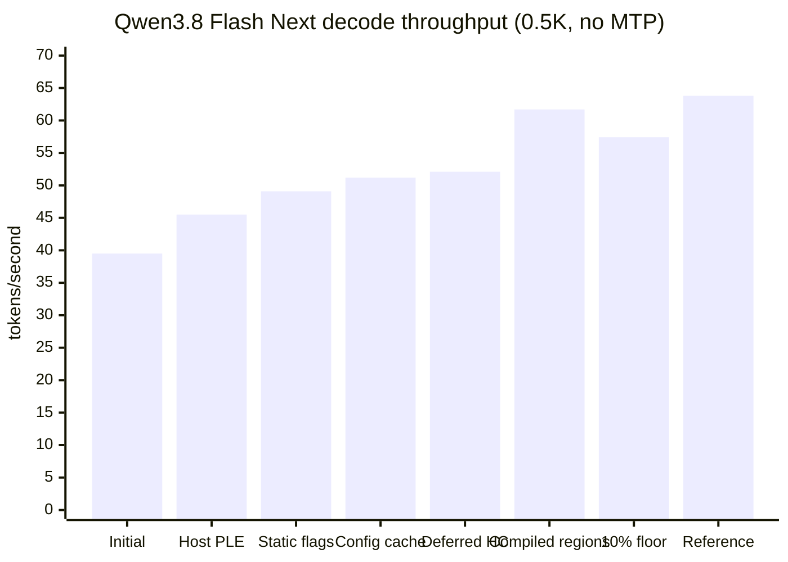

## What the token loop is doing

MLX is lazy. Swift model operations construct an MLX graph; evaluation submits
that graph to Metal; reading the selected token establishes the dependency
needed for the next autoregressive iteration. Wall-time labels must therefore
be interpreted as pipeline boundaries, not as independent CPU and GPU totals.

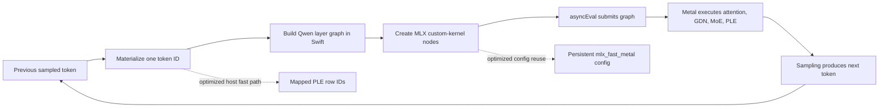

The current 128-token diagnostic split is approximately:

| Instrumented region | Time per token | Interpretation |
| --- | ---: | --- |
| Swift `model()` graph construction | 4.61-4.83 ms | Real host-side graph and custom-call construction |
| `asyncEval()` boundary | 13.05-13.72 ms | Submission plus waiting on previously queued GPU dependencies |
| Iterator overhead | 1.91-2.04 ms | Remaining host/runtime loop work |
| Duplicate `.item()` read | 0 ms | Removed by the host-token fast path |

The `asyncEval()` region must not be added to a separate “GPU time” estimate as
though it were independent of the graph pipeline. A one-shot synchronization at
token 100 still found approximately 2 ms of queued GPU work, confirming that
the host and GPU overlap. The actionable difference is that AFMKit constructs
roughly 4.6 ms of Swift graph per token, while the reference uses a lower-level,
more persistent launch path.

## Root causes found

### 1. Mapped PLE forced an avoidable stream synchronization

Qwen's prediction-layer embedding (PLE) hashes recent token IDs into a large,
memory-mapped n-gram table. The earlier Swift path called `MLXArray.asArray`
inside model evaluation to obtain those IDs. That materialized an MLX array on
the host and synchronized the stream while the next graph was being assembled.

The experimental path now:

1. Materializes the already-selected scalar token exactly once in the generation
   iterator.
2. Passes it through the generic `LanguageModel` call as optional host token
   metadata.
3. Maintains request-owned host n-gram history in `Qwen4ExpLayerCache`.
4. Invalidates that history when cache state is rolled back or truncated.
5. Retains the MLX-array fallback for callers that cannot supply host IDs.

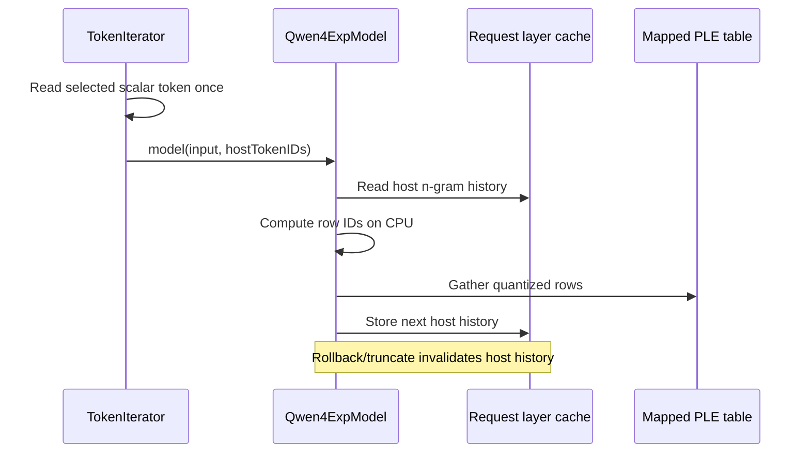

This change produced the largest confirmed improvement, from roughly 39.5 to
45.5 tok/s.

### 2. Environment variables were read in hot layer calls

Several experimental feature predicates queried
`ProcessInfo.processInfo.environment` on every invocation. Qwen executes these
predicates across many layers for every token, so a configuration lookup became
a decode-loop cost. Immutable process-level switches are now captured as
`static let` values. This raised the measured result to 49.09 tok/s.

Runtime-mutable flags must not use this optimization. These switches describe
process-start configuration and are intentionally immutable after startup.

### 3. MLX Swift rebuilt Metal launch configurations per call

`MLXFastKernel` retains the compiled Metal kernel object, but its Swift call path
previously allocated and populated a new `mlx_fast_metal_kernel_config` for
every layer invocation. The configuration includes template arguments, grid,
threadgroup dimensions, output shapes, output dtypes, initialization, and
verbosity. Those values are normally stable for single-token decode.

The experimental MLX Swift layer adds opt-in configuration caching keyed by all
of those values. Only the Qwen hot kernels request it; the generic default is
still disabled, limiting compatibility risk for legacy models. Access is
locked because a single loaded model may serve concurrent requests. Cached C
objects are freed with the owning `MLXFastKernel`.

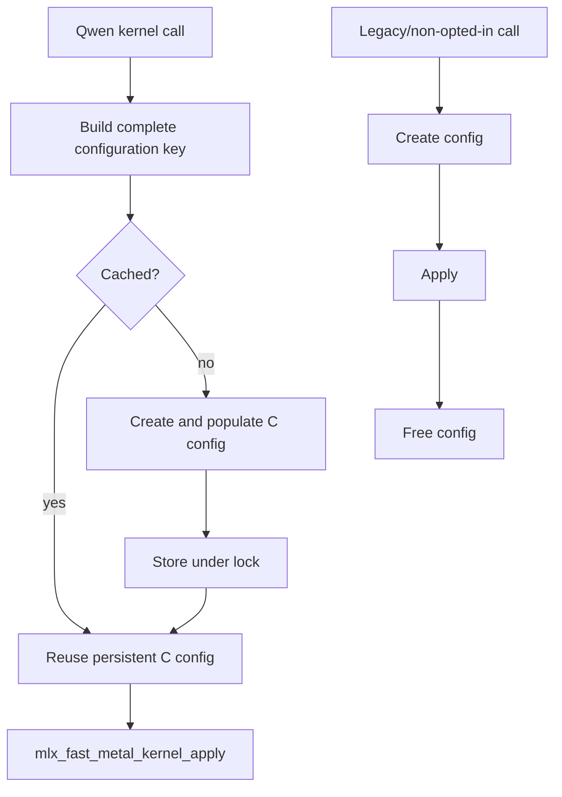

This raised decode from 49.09 to 51.20 tok/s. It proves that launch preparation
is material. A post-change host profile then showed only a few samples in the
dictionary lookup and cached-template code; most sampled cost below
`MLXFastKernel.callAsFunction` remained in `mlx_fast_metal_kernel_apply`, MLX
graph-node creation, signature construction, and C/Swift value conversion. A
prepared immutable configuration handle by itself is therefore unlikely to
recover the remaining 2.36 ms/token. The next candidate must remove a larger
repeated graph-construction boundary, not merely replace the cache key lookup.

### 4. The unfused hyper-connection graph dominated decode

Qwen3.8 Flash Next carries four residual streams through its hyper-connection
blocks. The stock MLX graph expresses each mix as a sequence of normalization,
quantized down projection, activation, quantized up projection, sigmoid,
stream-weighted reduction, and block-injection operations. Repeating that graph
across 48 layers creates both extra lazy nodes and extra GPU dispatches at
single-token width.

AFMKit's decode-width path fuses the stable geometry into four focused Metal
kernels:

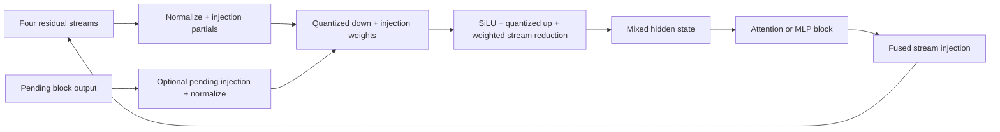

The fusion is fail-closed. It runs only on the GPU for supported FP16/BF16,
affine-quantized, decode/small-batch geometry (at most 16 rows), compatible
hidden/rank/group sizes, and ordinary generation. Unsupported shapes and MTP
verification use the stock graph. Mutable residual and cache tensors remain
request-owned; only immutable kernels and fully keyed launch configurations are
shared.

The exact current-build A/B measured 51.12 tok/s with the fusion and 38.15 tok/s
with `AFM_QWEN_FUSED_HYPER_CONNECTION=0`. The instrumented `asyncEval()` region
increased from approximately 13.1 to 19.4 ms/token when the fusion was disabled,
while Swift `model()` construction rose from approximately 4.6 to 5.1 ms/token.
This locates most of the benefit in fewer/smaller graph execution boundaries,
with a secondary host-construction benefit. The fused path is enabled by
default; the environment switch remains a diagnostic escape hatch.

### 5. Deferring the final hyper-connection write removes one layer boundary

The reference carries a pending hyper-connection write into the next layer and
materializes it at the next read or before a PLE boundary. AFMKit now has an
opt-in equivalent scheduler for ordinary single-sequence decode. The pending
value is request-local and is always flushed before a PLE layer, so the change
does not move mutable state into a shared kernel or model object.

The exact-checkpoint A/B reached 867.46 prefill and 52.10 decode tok/s. Focused
tests cover both an ordinary two-layer boundary and the required PLE flush. The
path is now part of the qualified Qwen default and retains an explicit diagnostic
kill switch. Changing graph evaluation and reduction boundaries can accumulate
BF16 rounding differences even when each local operation is numerically
equivalent, so cache, batching, and concurrency coverage remains mandatory.

### 6. Compiled graphs were owned by executor threads instead of models

The remaining breakthrough did not require another model-specific Metal kernel.
MLX's default C++ compile cache was thread-local, while Swift tasks are free to
resume on a different executor thread. A compiled closure could therefore trace
on one thread, execute or destruct on another, and leave a cached graph behind.
The identifier supplied by MLX Swift was also derived from the Swift object's
heap address. After model destruction, allocator reuse could give a later model
the same identifier and collide with the stale graph. Besides model-switch
corruption, the cache retained graph-captured weights after the Swift model was
released.

AFMKit's self-contained MLX Swift layer now gives each `CompiledFunction`:

1. A monotonically allocated, process-unique identifier.
2. An explicit opaque MLX compile cache owned by the Swift object.
3. A C/C++ compile entry point that uses that cache regardless of executor
   thread.
4. Deterministic cache destruction when the compiled function/model is released.

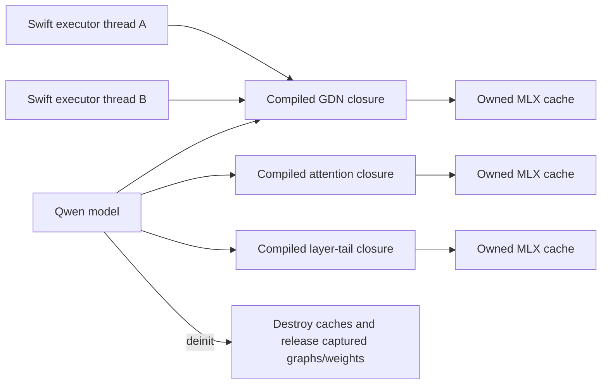

Mutable KV, GDN, convolution, PLE, and hyper-connection state remains explicit
request input/output; compiled closures capture only immutable model parameters.
This makes compilation a model-lifetime optimization rather than hidden
thread-lifetime state.

The Qwen GDN, attention, and layer-tail compiled regions are enabled by default
on Apple GPU family 9 and newer (M3 and newer). Older families retain the
explicit diagnostic opt-in because of separate reported Tahoe Metal JIT
failures. Each Qwen region also has a `=0` diagnostic kill switch. With no
feature environment variables, the exact checkpoint reached 909.8 prefill and
61.7 decode tok/s at 0.5K and passed the complete four-context 10% curve.

## Reference implementation mapping

The reference is `ddalcu/mlx-serve` at commit
`7d0120363c98e7daa9b9894b6fb71cc8d7e84c5e`. Its own code is MIT licensed. The
license notice is retained at `vendor/MLX/mlx-swift-lm/LICENSE-mlx-serve` for
adapted code.

The relevant kernels are embedded as source strings in Zig rather than stored
as standalone `.metal` files:

| Reference file | Relevant responsibility |
| --- | --- |
| `src/transformer.zig` | Gated Delta Net kernels, blocked prefill, quantized projection/MoE paths, verification kernels, QKV decode, persistent kernel/config setup |
| `src/qwen4_exp.zig` | Qwen4-exp model-specific PLE/n-gram storage, mapped row gathering, warmup and worker behavior |

In particular, `src/transformer.zig` creates and retains MLX C kernel objects
and, for important decode paths, persistent `mlx_fast_metal_kernel_config`
objects such as the QKV decode configuration. It calls MLX C directly, avoiding
some of the repeated Swift value conversion and lazy-node construction present
in the generic MLX Swift API.

AFMKit's corresponding self-contained implementation is spread across:

| AFMKit file | Responsibility |
| --- | --- |
| `Models/Qwen4Exp.swift` | Architecture, layer routing, caches, host PLE history, optional compiled tail |
| `Models/Qwen4ExpMappedNGramTable.swift` | Memory-mapped PLE table and row reads |
| `Models/Qwen4ExpQSAGather.swift` | QSA gather Metal path |
| `Models/Qwen4ExpGatedDeltaPrework.swift` | GDN prework fusion |
| `Models/Qwen4ExpGatedNormFusion.swift` | GDN normalization/gating fusion |
| `Models/Qwen4ExpQKNormRoPEFusion.swift` | Q/K normalization and rotary fusion |
| `Models/Qwen4ExpHyperConnectionFusion.swift` | Hyper-connection operations |
| `MLXLMCommon/QwenAffineMoEKernels.swift` | Quantized affine MoE projections; adapted with attribution to the reference |
| `MLXLMCommon/QwenMoERouterKernel.swift` | Fused MoE routing |
| `MLX/MLXFastKernel.swift` | Generic Metal kernel wrapper and opt-in launch-config cache |
| `MLXLMCommon/Evaluate.swift` | Host token handoff and performance instrumentation |

These changes belong to AFMKit's owned, self-contained MLX Swift provider. They
are not runtime source patches in the maclocal-api consumer and must not be
duplicated there.

## Approaches tested but not accepted

Optimizations are retained only when an A/B benchmark shows a benefit and
correctness remains defensible.

| Experiment | Finding | Decision |
| --- | --- | --- |
| Compile a broad per-layer tail | 51.31 versus 51.20 tok/s after other fixes; cold prefill regressed | Do not enable |
| Shared SwiGLU fusion | Approximately 36.8 versus 37.2 tok/s in its contemporaneous A/B | Reject |
| GDN norm/gate fusion alone | Results were neutral or negative in contemporaneous runs | Keep experimental/off unless a later combined profile proves value |
| BF16 GDN state | On the current retained stack, 53.57 versus 52.96 tok/s decode and 879.01 versus 877.29 tok/s prefill; only a 1.15% decode gain, while BF16 storage changes multi-token MTP verification rounding relative to repeated singleton decode | Reject; retain FP32 recurrent state for schedule-equivalent verification |
| Spin before parking PLE workers | 50.78 versus 51.20 tok/s; prefill 841.82 tok/s | Reject; scheduling wake-up is not the missing decode time |
| Replace `new_mlx_vector_array`'s temporary mapped handle array with scoped stack storage | 51.12 versus 51.20 tok/s; best prefill 867.98 tok/s | Reject and revert; eliminating this Swift allocation does not remove the decode bottleneck |
| Borrow the retained `mlx-c` config descriptor instead of copying it at apply | 50.63 versus 51.20 tok/s; warm prefill fell to 721.52 tok/s | Reject and revert; the value copy is not the remaining bottleneck and changing its call semantics regresses both paths |
| Retain immutable, shape-keyed HC launch plans in Swift and call them with typed `MLXArray` inputs | 51.56 versus 51.20 tok/s; best prefill fell to 739.24 tok/s | Reject and revert; bypassing the Swift config-key lock and `ScalarOrArray` conversion is noise-level for decode and regresses prefill below the acceptance floor |
| Reuse one immutable epsilon `MLXArray` across HC, Q/K norm-RoPE, and GDN norm/gate calls | 50.91 versus 51.20 tok/s; best prefill reached 755.04 tok/s | Reject and revert; eliminating approximately 144 scalar-array constructions per token did not reduce the dominant GPU-evaluation or graph-submission cost |
| Fuse `routed + sigmoid(shared_gate) * shared` into one decode-width Metal call | 49.55 versus the 52.10 deferred-HC base; best prefill fell to 715.74 tok/s | Reject and revert; two fewer elementwise graph nodes per layer did not repay the custom-call overhead and regressed both acceptance metrics |
| Keep attention output and its gate as 4-D strided views until after their decode-width multiply | Feature-on reached 53.17 tok/s decode and 772.83 tok/s prefill; the immediate same-binary feature-off control reached 53.44 tok/s decode and 725.46 tok/s prefill | Reject and revert; the feature did not cause the decode result, and restructuring the gate graph produced unstable, substantially lower prefill than the retained 867.46 tok/s path |
| Port the reference engine's exact BF16 shared-expert SwiGLU lookup kernel | The focused 8192-wide bit-for-bit test passed, but the current-stack A/B reached 52.92 versus 52.96 tok/s decode and 864.32 versus 877.29 tok/s prefill | Reject and revert; Swift's lazy graph already fuses the expression, while the custom call adds a dispatch boundary |
| Enable the generic `MLXFastKernel` configuration cache for both GatedDelta kernels | Focused sequential, fused-prework, and legacy-state tests passed; the current-stack A/B reached 52.91 versus 52.96 tok/s decode and 877.75 versus 877.29 tok/s prefill | Reject and revert; the underlying configuration is already reused effectively enough that this wrapper cache is noise-level |
| Join the quantized attention Q/K/V banks and issue one `quantizedMM` per full-attention layer | Exact singleton and short-sequence parity passed, but the same-binary A/B reached 51.66 versus 52.67 tok/s decode; peak host memory rose from 122.36 to 125.96 GB, while warm prefill was effectively neutral at 747.28 versus 738.99 tok/s | Reject and revert; materializing a second joined quantized weight bank costs about 3.6 GB at host peak and the larger projection dispatch regresses decode by 1.9% |
| Replace per-token K/V concatenation with the generic capacity-managed `KVCacheSimple` storage | Focused restore/trim tests passed, but the same-binary A/B reached 50.95 versus 51.58 tok/s decode and 755.29 versus 767.58 tok/s prefill; peak host memory fell from 127.95 to 126.63 GB | Reject and revert; the approximately 1.3 GB memory saving does not justify a 1.2% decode and 1.6% prefill regression at this short-context gate |
| Larger structural compilation without ownership analysis | Can hide cache mutation or serialize requests | Rejected as unsafe |

Older A/B values are not directly comparable with the current 52.96 tok/s path
because later host and launch-config fixes changed the base. They remain useful
for rejecting large regressions, but any candidate reconsidered now must be
rerun against the current base.

## How QSA relates to radix and prefix caching

QSA (Qwen's block-selection attention path) and AFMKit's radix cache solve
different problems and compose rather than replace one another.

- The radix cache decides whether an exact prefix's model state can be restored
  instead of recomputed. That state includes the attention KV cache and the
  non-attention recurrent/cache state required by the hybrid architecture.
- QSA decides which already-available KV blocks a query should attend to. The
  block selection is derived for the current forward call.
- `Qwen4ExpQSAGather` consumes selected block indices directly, avoiding a dense
  boolean attention mask and avoiding work over unselected K/V rows.
- The direct gather is currently restricted to long BF16 GPU prefill geometry:
  at least 16 query tokens, at least 8,192 key tokens, head dimension 256, and
  supported grouped-query head ratios. Unsupported geometry uses the exact
  dense-mask fallback.

Consequently, the 0.5K decode iteration benchmark in this document does **not**
exercise the direct QSA gather. It cannot explain either the original decode
gap or the 39.5-to-51.2 tok/s improvement. QSA matters when the first four
context tests reach long prefill ranges, while the current decode bottleneck is
the repeated per-token graph/launch construction around other model kernels.

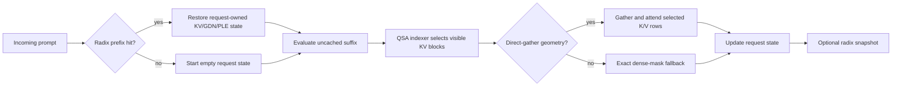

Radix entries must never retain request identity or mutable QSA scratch storage.
The restored model state defines the correct positions; QSA selection is then
recomputed for the current query. Prefix reuse changes how much prefill is
needed, not the mathematical attention result.

## Cache, batching, and concurrency requirements

A fast single request is insufficient. Any accepted optimization must preserve:

- The per-request KV, GDN, convolution, PLE, and host n-gram cache state.
- Rollback and truncation used by speculative verification.
- Radix/prefix-cache snapshot and restore without cross-request host state.
- Left-padded fixed cohorts with stable membership today; future per-slot
  membership changes must preserve the same request-local state guarantees.
- Concurrent requests sharing immutable model weights and compiled kernels.
- Streaming and non-streaming output equivalence.

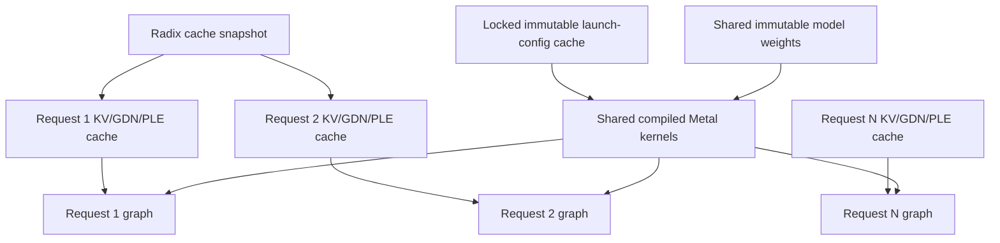

Configuration objects may be shared only when every launch-defining value is
part of the key. Mutable generation state must remain request-owned. A compiled
closure that captures one request's cache is incorrect even if it benchmarks
well in isolation.

## Decode submission ladder result

The remaining decode gap was graph submission, not slower layer arithmetic.
During ordinary one-token decode, AFMKit now submits the completed graph prefix
after every eight transformer layers with `asyncEval`. Swift continues building
the later layers while Metal begins executing the dependency-ready prefix.
There is no extra numerical operation, model state remains request-owned, and
MTP verification keeps the original synchronous schedule.

The scheduling technique follows `Transformer.ladderStep` in
`ddalcu/mlx-serve` (MIT). The stride is an AFMKit-owned Qwen Next default, so the
normal launch command needs no tuning environment variable. The diagnostic
`AFM_QWEN_DECODE_ASYNC_LADDER=0` kill switch remains available for comparison.

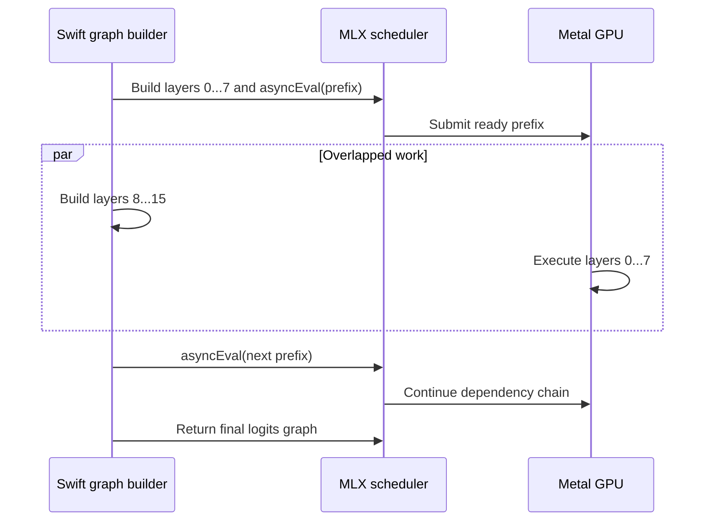

Fresh same-machine, same-checkpoint, three-run peak measurements on 2026-09-02
used 128 generated tokens, cold prefill, no MTP, no prefix cache, and no tuning
variables:

| Context | Reference prefill | AFM prefill | Difference | Reference decode | AFM decode | Difference |
|---:|---:|---:|---:|---:|---:|---:|
| 0.5K | 903.2 | 893.2 | -1.1% | 65.57 | 67.44 | +2.9% |
| 1K | 1049.5 | 1048.0 | -0.1% | 65.14 | 66.91 | +2.7% |
| 2K | 1193.2 | 1172.3 | -1.8% | 58.65 | 60.57 | +3.3% |
| 4K | 1262.7 | 1178.1 | -6.7% | 58.42 | 59.10 | +1.2% |

Decode therefore meets the parity target across the complete first-four curve.
Prefill is within two percent through 2K; the remaining performance target is
the 4K prefill row, not decode.

## Continuous concurrency and radix-cache result

Qwen Next cannot safely enter the generic padded-KV batching path: its cache
contains attention, GDN convolution/recurrent state, PLE history, QSA index
state, and host n-gram metadata. AFMKit now exposes an explicit
`UniformBatchKVCache` contract. Equal-offset text requests merge those native
caches along batch dimension zero. Mixed offsets and multimodal positions keep
one concrete cache per request; their lazy graphs are still submitted together
so every request progresses without a blocking serial fallback.

The compiled GDN decode closure remains active at B=1. MLX currently traces
that closure for the singleton recurrent shape, so B>1 uses the equivalent
eager GDN graph rather than reusing a shape-unsafe compiled closure. This split
preserves the qualified single-request latency while preventing the prior B=2
process termination.

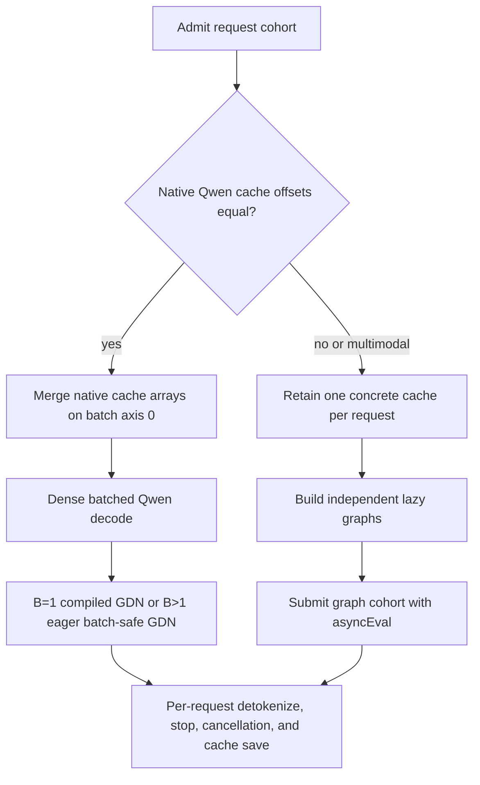

Fresh same-checkpoint measurements used a 44-token prompt, 256 generated
tokens per request, temperature 0, no MTP or prompt-lookup speculation, and no
prefix cache. Each width received an unmeasured same-width warmup. Aggregate
end-to-end throughput is total completed tokens divided by cohort wall time;
aggregate decode throughput divides the same token total by the slowest
API-reported decode window.

| Concurrency | Reference e2e tok/s | AFM e2e tok/s | Difference | Reference decode tok/s | AFM decode tok/s | Difference |
|---:|---:|---:|---:|---:|---:|---:|
| 1 | 54.990 | 57.957 | +5.4% | 63.941 | 67.930 | +6.2% |
| 2 | 75.296 | 79.767 | +5.9% | 85.451 | 88.458 | +3.5% |
| 4 | 114.951 | 125.659 | +9.3% | 131.305 | 136.151 | +3.7% |
| 8 | 154.081 | 180.408 | +17.1% | 177.459 | 191.283 | +7.8% |

All 30 measured engine responses reached the 256-token cap and retained
coherent, request-appropriate content. In a separate AFM cache qualification,
all eight simultaneous requests restored 43/44 prompt tokens, prompt
processing reached 1,722-2,446 tok/s per request, and aggregate end-to-end
throughput reached 196.552 tok/s. Raw response JSON, curl timings, launch
commands, commit IDs, and binary hashes are retained under
`/Volumes/edata/afm-release-artifacts/qwen-next-afm-current/concurrency-throughput-20260902/`.

## PLE and n-gram lookup findings

Qwen Next checkpoints declare the table through `ngram_table.file` in
`config.json`. New or converted checkpoints should name this sidecar
`*.ngram`, which distinguishes the model-specific table from generic binary
assets. Existing published `*.bin` tables remain fully supported. AFMKit
downloads both extensions, requires the declared non-empty sidecar for cache
completeness, and resolves its canonical path within the model directory so a
checkpoint symlink cannot escape that boundary. The filename does not select a
different lookup implementation and therefore has no decode-performance
effect.

Both engines synchronize the sampled token at Qwen Next's PLE boundary, hash a
short EOS-aware history into 16 row IDs, gather 48 quantized rows from the
roughly 30 GB mapped table, dequantize them, and construct the 2,560-element
BF16 embedding. The raw AFM gather is already faster in steady state, so lookup
micro-tuning cannot explain or close a millisecond-scale decode deficit.

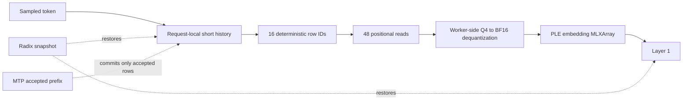

The reference uses a 48-worker `pread` pool for decode and small verification
widths, direct mmap access for large prefill, and an optional sequential
background sidecar warm. AFMKit already has the 48-worker positional-read path
and improves it by performing dequantization on the worker that completes a
row's third read. Any future PLE work should instead focus on an owned
zero-copy BF16 output buffer and safe overlap of the request-local gather with
other graph construction. It must commit history only when the PLE result is
consumed so cancellation, radix restore, and MTP rollback remain exact.

## Remaining work

The no-MTP decode, saved-response coherence, native concurrency, radix reuse,
client-disconnect recovery, and strict MTP execution gates are complete.
Remaining release work is:

1. Exercise repeated model construction/destruction and independently compiled
   closures to prove that graphs do not cross model lifetimes or executors.
2. Run the complete streaming, tool-calling, structured-output, and evaluation
   suites with the ladder enabled by default.
3. Keep MTP throughput and acceptance separate from base decode. Strict MTP is
   functionally correct but materially slower than autoregressive decode and
   needs its own optimization workstream.
4. Transfer only the generic cache-safety and scheduler changes to other model
   families, with same-checkpoint throughput measurements before enabling any
   architecture-specific batching policy.
5. Keep the qualified architecture-owned 4,096-token prefill step. It avoids
   unnecessary full-sequence vocabulary projection while preserving the
   first-four-context throughput curve.
6. Later, evaluate owned zero-copy PLE output buffers for hot prefill. Do not expose
   the entire 30 GB mmap as an MLX array, and do not repeat the already-ported
   worker pool.

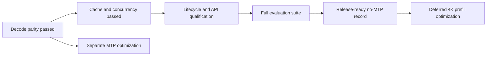

## Reproduction and diagnostics

The qualified path requires no performance feature variables:

```bash
afm mlx \
  -m /Volumes/edata2/models/ddalcu/Qwen3.8-Flash-Next-MLX-Serve-4bit \
  --no-think \
  --max-tokens 20000 \
  --port 9998
```

`AFM_PERF=1` adds timing probes and is not a production optimization.
`AFM_DEBUG=1` enables diagnostic logging and likewise should not be used for
published throughput. `AFM_QWEN_COMPILE_ATTN_DECODE=0`,
`AFM_QWEN_COMPILE_GDN_DECODE=0`, and `AFM_QWEN_COMPILE_LAYER_TAIL=0` are
diagnostic kill switches; they are not required in ordinary launch commands.
`AFM_QWEN_DECODE_ASYNC_LADDER=0` similarly restores the pre-parity decode
schedule for controlled comparison only.

Build maclocal-api against this AFMKit worktree only through the consumer's
reliable wrapper:

```bash
MACLOCAL_AFMKIT_PATH=/Volumes/edata/dev/git/CODEX/AFMKit-batch-teardown \
  Scripts/swiftpm-reliable.sh build -c release --product afm
```

Do not patch SwiftPM's resolved checkout. Provider changes are made and tested
in AFMKit, then consumed by maclocal-api through one exact AFMKit version bump.

## Interpretation guardrails

- Do not compare different checkpoints, quantization layouts, prompts, output
  lengths, or MTP settings as though they were engine-only measurements.
- Do not use sampled/profiled throughput as the benchmark result; sampling
  perturbs this workload significantly.
- Do not infer GPU idleness from host stack samples. Use GPU utilization/power
  evidence and explicit stream probes.
- Do not accept a faster result without output parity and cache-state tests.
- Do not report prefill and decode as one combined throughput number.
- Do not let MTP acceptance rate hide the base decoder's performance.

The central finding is therefore narrower than “Swift is slow” or “the kernels
are slow.” AFMKit drives the GPU effectively for this checkpoint, and the
eight-layer submission ladder closes the decode gap without moving mutable
inference state out of the request. Release parity now depends on the remaining
4K prefill gap and lifecycle/API qualification; MTP remains a separate
correctness-and-performance track.
