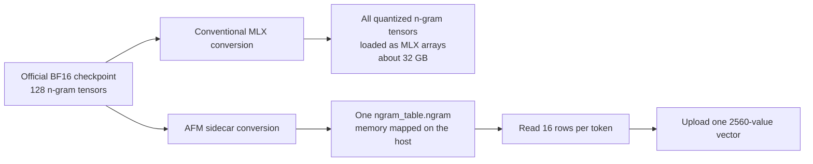

# Qwen3.8 Flash Next checkpoint layout

This note records the checkpoint-layout differences that materially affect
Qwen3.8 Flash Next inference in AFMKit. It distinguishes model architecture
work from packaging choices so future benchmarks do not compare unlike
checkpoints.

## Finding

The fast `ddalcu/Qwen3.8-Flash-Next-MLX-Serve-4bit` checkpoint is an
execution-oriented conversion of the official
`Qwen/Qwen3.8-Flash-Next` checkpoint. Its decisive difference is the treatment
of the 51-billion-parameter prediction-layer n-gram embedding:

The conventional layout makes the n-gram table part of the MLX parameter
graph and working set. The sidecar layout leaves it under the operating
system's mapped-file page cache and materializes only the rows required for a
token. On the M3 Ultra test host, AFM loads approximately 66 GB for the sidecar
checkpoint versus approximately 96 GB for the conventional all-tensor
checkpoint. This working-set and graph-path difference is the leading
explanation for the observed roughly twofold decode difference. It is not a
claim that the same 4-bit arithmetic became twice as fast.

## Conversion contract

The AFM-oriented profile preserves the model's semantics while producing the
layout already consumed by AFMKit:

| Component | Output representation |
| --- | --- |
| Routed experts | 4-bit affine, group size 64 |
| Attention, GDN, hyper-connections, indexer, shared experts | 4-bit affine, group size 64 |
| LM head | 8-bit affine, group size 64 |
| Token embedding | 4-bit affine, group size 64 |
| N-gram embedding | 4-bit affine, group size 32, merged mapped sidecar |
| Small routers, gates, norms, convolutions, state | BF16 |
| Vision tower | BF16 |

Conversion also performs architecture-required layout changes:

1. Rename the official text and MTP prefixes to AFMKit's model hierarchy.
2. Split each fused expert `gate_up_proj` into gate and up projections.
3. Transpose depthwise convolution weights from `[C, 1, K]` to `[C, K, 1]`.
4. Fold the `1 + weight` convention into Qwen RMSNorm weights.
5. Merge the 128 n-gram shards into one SafeTensor-format file named
   `ngram_table.ngram`. The non-`.safetensors` extension intentionally keeps the
   ordinary MLX directory loader from loading it as model parameters.
   Existing checkpoint-declared `.bin` sidecars remain supported for
   compatibility.
6. Preserve tokenizer, chat-template, generation, license, and multimodal
   processor assets.

## Attribution and provenance

The conversion layout and mapped-sidecar design were derived from David
Dalcu's MIT-licensed `ddalcu/mlx-serve` implementation, specifically
`tests/convert_qwen38_flash_next.py` at commit
`805807669565d359188b329c659f9f45d6358cd7`. AFMKit implements the contract in
Swift using its own conversion and SafeTensor primitives. The source model is
the Qwen Community License checkpoint published by Qwen.

- Reference implementation: <https://github.com/ddalcu/mlx-serve>
- Published converted checkpoint: <https://huggingface.co/ddalcu/Qwen3.8-Flash-Next-MLX-Serve-4bit>
- Official source checkpoint: <https://huggingface.co/Qwen/Qwen3.8-Flash-Next>

## Benchmark rule

Performance comparisons must record both the source revision and conversion
profile. The sidecar result must not be attributed to the runtime alone, and a
conventional checkpoint must not be used as a same-checkpoint control for the
sidecar layout. Correctness, first-four-context prefill/decode, resident memory,
prefix/radix cache, batching, concurrency, and MTP are separate qualification
gates.
