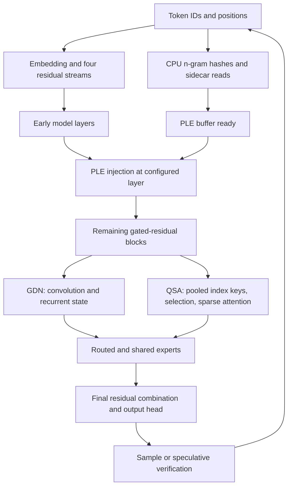
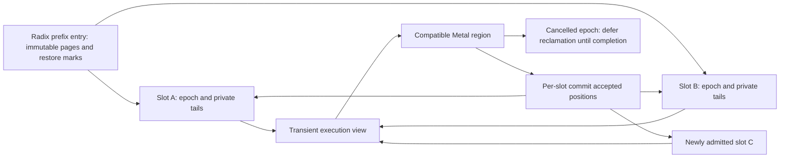

# Qwen Next execution architecture for Apple Metal

## Recommendation

AFMKit should pursue two tracks: bring its exact-checkpoint execution paths up to the current reference, then test a new combination of **transactional per-request state, bounded CPU/GPU PLE handoff, and certified QSA work elimination**. The first track provides a defensible performance baseline. The second offers a route beyond implementation parity without changing the model's weights or silently weakening its attention algorithm.

This is a research and design proposal, not a benchmark result or an implemented runtime. No new performance measurements accompany it. The objective is to lead on both decode and prefill while retaining prefix reuse, concurrent serving, cancellation, and output quality. A single high tokens/second figure is insufficient: latency, aggregate throughput, memory, and correctness must all be reported.

The September 3 comparison is historical. As of September 9, `mlx-serve` main is 38 commits ahead of the reference used in that comparison. Its v26.9.2 release reports further speed improvements, including an M4 Max headline of 93 tokens/second. That is an upstream claim on different hardware/configuration, **not a measured M3 Ultra target**. The current reference must be rerun on the same machine and checkpoint before claiming equality again.[^1]

## Evidence and reproducibility boundary

| Component | Examined identity | Meaning |
|---|---|---|
| AFMKit | `f1febd6c2afbd2a9eb25c9d31bb281cf761bc661` | Source baseline for this proposal |
| Historical reference | `805807669565d359188b329c659f9f45d6358cd7` | September comparison only |
| Current reference main | `1ec580a8b7f5f051daef892310660bb62b2ece6c` | September 9 source snapshot |
| Current reference release | v26.9.2; code commit `cfb0a3a8ae8f1b881076177583bdd15d9542f942` | Preferred fresh installed/build baseline |
| MTPLX | `21be78b3f51820eecef020e5e4855c0715eaf9a5` | Additional implementation prior art |
| Primary comparison machine | M3 Ultra, 512 GB, 80 GPU cores | Do not substitute M4/M5 marketing measurements |

The historical same-checkpoint directory was `/Volumes/edata2/models/ddalcu/Qwen3.8-Flash-Next-MLX-Serve-4bit`. Its identity must be revalidated, not inferred from the directory name. Record hashes for config, tokenizer, template, weight index, all shards, MTP weights, and PLE sidecar before a fresh comparison. Preserve the AFM-converted checkpoint as a second lane; establish tensor/layout equivalence before mixing its results with the first lane.

The [historical performance report](QWEN38_FLASH_NEXT_PERFORMANCE.md) contains a six-trial median comparison with AR decode spanning approximately 68.2 to 59.9 tokens/second for AFM at 0.5K–4K. It does not establish parity with today's reference. Peak-of-three measurements in the same report are a different statistic and must not be substituted for medians.

Evidence labels throughout this proposal are deliberate:

- **Existing:** found in the pinned implementation, not a proposed invention.
- **Candidate:** a mechanism with a rationale but no measured AFM benefit yet.
- **Gate:** an experiment or correctness condition required before adoption.

## Architecture and the work that cannot be removed

Qwen3.8 Flash Next combines a 125B-parameter backbone, roughly 6B activated parameters per token, and about 51B n-gram embedding parameters. Its 48 layers alternate three Gated DeltaNet layers with one QSA layer. Four residual branches are read and written through gated residual operations. These are not interchangeable with DeepSeek's residual mixing rules.[^2]

The implementation adds constraints beyond a generic transformer. GDN carries recurrent state and convolution history. QSA maintains compressed index keys as well as attention KV. PLE depends on the current token and recent token history. MTP needs state for both the target and its prediction head. The local implementation is the authority for exact tensor layouts, precision, and routing.[^3]



The diagram expands dependencies, not parallel independent evaluation of every block. Within one request, later layers depend on earlier layers. Offloading a lookup cannot remove that dependency; it can overlap only with independent host construction, earlier GPU work, or other requests.

At the examined configuration, the indexer uses four 128-wide query heads, pooled blocks of four tokens, and a budget of 512 complete blocks, followed by the incomplete causal tail. Short contexts may require no block selection. The existing selector also adjusts scores by block identity; changing that adjustment to a superficially cleaner tie rule can change results. Preserve the actual ranking contract.[^3]

The [checkpoint layout notes](QWEN_NEXT_CHECKPOINT_LAYOUT.md) describe a separate Q4, group-32 PLE table and mixed precision elsewhere, including a higher-precision output head. “4-bit” alone is not an adequate checkpoint identity. Loading the sidecar into the ordinary MLX parameter graph reverses an important memory optimization.

## What has changed in the reference

The new reference is more than a faster attention kernel. It changes graph construction order, speculative round economics, retained state, and prefix-cache ownership. These mechanisms are existing prior art; they must not be presented as novel AFM ideas.

| Mechanism | Current reference evidence | AFM investigation |
|---|---|---|
| Deferred PLE fill | Build a decode graph before synchronizing token IDs, then fill its PLE leaf | Compare with AFM's host-token gather and array construction; preserve buffer ownership |
| QSA-selected KV | Gather selected rows for decode and multi-token verification; split-K variants | Measure the currently selected AFM kernel, not an old generic masked-SDPA arm |
| Cheaper draft head | Coarse shortlist followed by reranking for the draft | Target verification must remain authoritative |
| Adaptive speculation | Measured emitted tokens and wall time per round, context bucket, and serial alternative | Include target repair, head replay, and scheduler delay in AFM's cost model |
| Reduced QSA snapshots | Retain pooled history; bound raw index-key tails and avoid repeated full copies | Audit every restore/rollback consumer before changing representation |
| Prefix persistence | Store shared QSA history once per entry, explicit restore/miss handling | Fit AFM's radix ownership and disk format, not a parallel cache |
| Grammar work | Avoid repeatedly scanning the entire vocabulary | Include constrained output as a performance lane, not just plain text |

Specific commits and implementation files are pinned in the source inventory.[^4][^5][^6][^7] A source-level similarity is not proof that the same kernel is dispatched for a particular AFM request; each benchmark must record its actual route.

The raw-key ring is particularly relevant to memory growth: the reference now distinguishes the history needed for selection from the short tail needed to complete pools and undo speculation. The safe ring size follows verified rollback and pooling requirements, not a universal constant. Adopting its literal size without AFM's maximum verification width and restore semantics would be unsafe.[^6]

MTPLX provides additional Qwen Next-specific prior art: native sparse attention, device draft preparation, and a distinction between invalid installation contracts and request shapes that need another execution path. Its block-verification experiment changes speculative acceptance logic; that needs a separate probability argument, not just a speed test. None of these source features establishes a measured win on the primary AFM machine.[^8]

oMLX's Qwen optimization work is also relevant for exact index scoring, sparse attention, residual fusion, and restore behavior. Its published configurations are not automatically equivalent to the ddalcu checkpoint or to AR decoding. Compare implementation mechanisms first, then reproduce compatible configurations locally.[^9]

## Existing AFM investments to preserve

The historical work already established model-owned compiled graphs, host-token PLE hashing, fused residual operations, and carefully chosen asynchronous evaluation boundaries. Repeating rejected experiments without new evidence wastes time. In particular, busy-waiting for PLE, changing recurrent-state precision, or fusing isolated cheap operations must not be assumed to yield an end-to-end improvement.

Two concrete source boundaries deserve attention:

1. `Qwen4ExpMappedNGramTable.gather` allocates an output buffer, constructs `Data(bytes:count:)`, then an MLX array. The explicit `Data` construction copies the gathered bytes. Removing it may reduce allocation and handoff costs, but the payload is small; a large speedup cannot be assumed.[^10]
2. Qwen MTP verification trims speculative prediction-head rows and reconstructs committed head state from target residual streams. Keeping draft head state instead would avoid work but may be semantically wrong. Any replacement must prove the committed head inputs are the correct target inputs.[^3]

The provider currently distinguishes speculative eligibility from loading an MTP head. Unsupported speculative combinations can still use AR and concurrent execution. A new fast path must preserve that distinction; it must not accidentally serialize every request merely because MTP weights are present.[^11]

## Proposed execution architecture

### Transactional state belongs to a slot, not a batch

The central design is a request slot with a monotonic execution epoch. A slot owns KV page references, GDN state, convolution tails, QSA pooled history and unpooled tails, PLE token history, sampler state, prediction-head state, and lifecycle metadata. A batch is a temporary view over compatible slots for one region of execution.

Immutable prefix pages can be shared through radix entries. Mutable tails are private or copy-on-write. A speculative round stages changes against a committed position and exposes only its accepted prefix. Cancellation marks an epoch dead immediately but reclaims its GPU-visible buffers only after completion of the commands that reference them.



This extends the direction in [issue #76](https://github.com/scouzi1966/AFMKit/issues/76); it is not a competing batching implementation. The additional research question is whether a single state contract can support low-copy PLE handoff, bounded speculation, and native execution regions without duplicating rollback machinery.

Proposed operations are `beginEpoch`, `prepareRegion`, `submit`, `commitThrough`, `abort`, and `retireAfterCompletion`. They need not become public Swift APIs. Each operation must name a slot generation, logical token range, and model identity. Reusing a numeric slot ID must not allow a delayed completion to mutate its next occupant.

### Candidate: bounded PLE handoff

Replace copy-based handoff with a small pool of explicitly owned shared buffers, provided the native backend can expose their lifetime safely. CPU gather publishes a ready event for `(model, slot, epoch, token range)`. The dependent GPU region cannot execute before publication. Its buffers cannot be refilled until GPU completion.

```text
Host:  build independent region ─ hash/read/dequantize PLE ─ publish ─ build next work
GPU:   previous/early region ──────────────── wait if needed ─ PLE consumer ─ remaining layers
Pool:  free → CPU-writing → ready → GPU-reading → completed → free
```

Unified memory removes the need for a discrete-device transfer, not synchronization or ownership. A zero-filled MLX array mutated after graph construction is not, by itself, a safe reusable mailbox. Either express the dependency as a supported primitive or place the bounded region behind a native API that owns its buffers and events.[^12]

For prefill, token IDs are known in advance: compute hashes per bounded chunk, deduplicate repeated rows, and coalesce nearby file reads where profitable. Bound the dequantized-row cache by bytes and include it in admission accounting. For decode, speculative future lookups may warm immutable weight pages, but rejected predictions must not advance committed PLE history.

**Gate:** measure CPU gather duration, blocked GPU time, allocation count, page faults, and end-to-end token latency separately. Reject the change if synchronization overhead absorbs the copy reduction, or if warm-sidecar speed improves only by materially increasing memory. Mapped remains the normal policy; resident warming is a separate declared benchmark condition.

### Candidate: certified QSA tile pruning

QSA already sparsifies attention, but its indexer still scores the eligible pooled history. A potential improvement is to avoid scoring entire tiles when a conservative upper bound proves that no key in them can enter the top set. This is exact work elimination, not approximate nearest-neighbor retrieval.

For pooled key `k` and query heads `q_h`, the inspected AFM score has the form:

```text
s(k) = Σ_h max(0, dot(q_h, k))
r(k, j) = s(k) - j * tieBreakScale
```

For a tile with center `c` and radius `R` such that `||k-c||₂ ≤ R` for every stored key:

```text
U(q, tile) = Σ_h max(0, dot(q_h, c) + ||q_h||₂ * R)
```

In real arithmetic, Cauchy–Schwarz gives `s(k) ≤ U`. A ranking upper bound must additionally account for the tile's eligible block IDs and the implementation's score adjustment. Skip a tile only when its conservative ranking bound is strictly below the current Kth retained ranking score. Equality does not justify skipping.

This is related to established maximum-inner-product branch-and-bound methods, not a claim to have invented score bounding.[^13] The candidate contribution is applying a conservative multihead bound to causal QSA, with incrementally retained summaries in radix-owned pooled history and a Metal-friendly tile scan.

Proposed algorithm:

```text
if visible complete blocks <= K: use the existing no-selection path
score at least K eligible seed blocks exactly
set threshold from the current retained top-K ranking
for each tile of eligible pooled keys:
    calculate a conservative upper bound using stored-key summaries
    if the bound is trustworthy and strictly below threshold: skip
    otherwise run the existing exact score kernel on that tile
    update retained candidates and threshold
include the incomplete causal tail using the existing rule
run the established attention kernel over the selected rows
```

Previous selected blocks may seed a lower threshold, but are never the sole candidates. A rejected speculative branch must not publish summaries as committed history. Summaries are layer-specific and derived from the actual stored, position-transformed keys, not from pre-RoPE vectors assumed equivalent across positions.

Floating-point certification is the hardest part. A real-arithmetic inequality plus an arbitrary epsilon is insufficient: bounds must include stored-summary rounding, dot-product/reduction error, and ranking adjustment error relative to the actual kernel. Uncertain, non-finite, boundary, or unsupported-precision cases scan the tile normally. Exact equality tests alone do not establish a universal error bound.

Two engineering variants merit comparison: contiguous history tiles with cheap incremental summaries, and tighter bounding boxes with more metadata. Avoid a GPU priority queue initially; compute tile bounds in parallel, compact survivors, and apply the existing scorer. At prefill, the survivor mask is query-dependent and causality-dependent, so bound its temporary storage by query tiles.

**Gate:** first prove the bound against scalar and adversarial cases; then compare selected IDs and logits on captured real query/key tensors. Measure skipped work and total indexer time. High-dimensional keys may make every bound loose. If metadata reads, compaction, or loss of dense matrix efficiency erase the benefit, abandon this candidate. No numerical speedup is asserted here.

This cannot improve a context that takes the no-selection path. Even at longer contexts, Amdahl's law limits its value: if indexing occupies fraction `f` of total latency and becomes `a` times faster, the maximum whole-step speedup is `1 / (1 - f + f/a)`, before new overhead. The first experiment must measure `f`; this candidate must not displace short-context work merely because its algorithm is interesting.

### Prefill and residual/GDN regions

Prefill should not simply run the decode recurrence token by token. Inspect the blocked GDN algorithm, its triangular/scan work, intermediate storage, and Metal matrix shapes. The published FlashQLA work is a useful algorithmic reference, but NVIDIA execution details are not drop-in Apple kernels.[^14]

A promising native region would combine adjacent residual read/normalization/projection operations where dependencies allow it, and retain temporary residual state across a bounded set of kernels. Preserve all four residual branches. Do not commute a gate or normalization through a projection without algebraic justification, and do not reduce GDN state precision as an undisclosed optimization.

For routed experts, prefill can group token/expert pairs to reuse weight tiles. Decode at small batch sizes may instead favor low-overhead matrix-vector paths. Compare grouping cost, padding waste, expert skew, and shared-expert overlap. A larger fused kernel can lose occupancy through register pressure; instruction count alone is not the objective.

**Gate:** use event timings and GPU captures to find a region that is actually critical. Test strict singleton, verification widths, prefill chunks, and ragged batches. A fast prefill kernel that changes recurrent states enough to alter later verification decisions does not qualify merely because its immediate output looks coherent.

### Joint MTP and scheduling policy

MTP depth is not a universal model constant. A useful estimate is:

```text
speculative throughput = E[committed tokens per round] /
    (draft + target verification + state repair + head replay + scheduling time)
```

Compare this with measured AR throughput at the same context and service conditions. The reference already measures round costs; the proposed extension jointly selects compatible slot groups, speculative width, and bounded prefill work under latency and memory constraints.[^5] This is an integration hypothesis, not novel adaptive speculation in isolation.

Under load, a wider verification block may reduce one request's latency while delaying many others. The controller should optimize committed tokens per unit time subject to p95 latency and admission limits, with an AR fallback. Keep cold-start calibration bounded and identify persisted cost data by hardware, software, checkpoint, precision, and execution policy.

Greedy verification and stochastic verification require different contracts. For standard exact speculative sampling, acceptance uses the target/draft probability ratio and a corrected residual distribution after rejection. Penalties and grammar constraints must be applied consistently. Greedy token agreement does not prove distributional correctness for temperature greater than zero.[^15]

Shortlisted or quantized draft heads are acceptable research arms only when the verifier retains the required target distribution. Shortlisting the target vocabulary, pruning residual branches, or replacing the target with a distilled architecture changes quality and belongs in a separately approved experiment.

## Where native Metal belongs

```text
maclocal-api: HTTP, CLI and user-facing options
    ↓ provider contract
AFMKit runtime: admission, radix cache, slot state, scheduling
    ↓ internal execution interface
Self-contained MLX Swift model / C API shim
    ↓
MLX C++ primitive + Metal kernels, or bounded native Metal region
    ↓
One device/resource ownership domain with completion-aware lifetimes
```

The C API called `mlx-c` is a bridge; placing a function there alone does not replace MLX graph scheduling. Kernel and primitive work belongs in the underlying C++/Metal backend, exposed through a narrow C interface and Swift wrapper where needed. MLX documents custom primitive/extension support.[^16]

Prefer three escalation levels: existing custom Metal kernels; a C++ primitive owning a larger operation; then an optional native execution region if measured graph overhead remains material. A full alternative runtime is not the first experiment. Do not link a second incompatible MLX copy or pass buffers across allocators without an ownership contract.

Metal command allocation/reuse and residency facilities may reduce overhead, but they do not create a general cross-threadgroup barrier or permit arbitrary replay of commands whose resources have changed. Reset command allocators only after their work completes. Feature-test APIs and hardware rather than assuming M5-specific capabilities apply to M3 Ultra.[^17]

A single persistent kernel spanning all model layers is not recommended initially: global synchronization, expert imbalance, register pressure, cancellation, and watchdog risk are substantial. Smaller reusable regions retain debuggability and fallbacks. CPU work should initially cover hashing, file reads, dequantization, and scheduling. CPU expert matmuls contend for shared bandwidth and require a separate measured case; unified memory does not make them free.

## Compatibility and failure contracts

| Area | Required behavior |
|---|---|
| Radix hit/fork | Same restored positions and all recurrent/PLE/QSA state; shared pages immutable |
| Continuous batching | Late arrivals enter compatible future regions; no fixed-cohort ownership of state |
| MTP rejection | Commit target-consistent accepted state; repair head state correctly |
| Cancellation | Stop publication immediately; retire referenced resources after GPU completion |
| Model switch | Drain outstanding epochs before releasing weights, compiled graphs, or sidecar mappings |
| Sampling/tools/stops/JSON/logprobs | Preserve existing behavior; report when the optimized lane is ineligible |
| Vision/media | Preserve position semantics or take the qualified fallback; no text-only shortcut applied silently |
| Memory pressure | Bound scratch, summaries, snapshots, row caches and pending retirements; fail admission safely |
| Other architectures | Shared infrastructure opt-in after model-specific correctness/performance qualification |

A cache miss must remain explicit when compatible state cannot be restored. Returning a partially initialized state is not a performance optimization. The recurrent raw-tail representation should be tested across pooling boundaries and all accepted speculative lengths before disk-cache format changes are considered.

## Experiment and qualification plan

All numbers below are **decision criteria**, not projected gains. Execute one GPU workload at a time. Preserve the installed nightly and existing raw reports; use a separate development binary and report directory.

| Experiment | Comparison and decisive evidence | Stop condition |
|---|---|---|
| E0: refreshed reference | Current pinned reference versus AFM, identical checkpoint and four initial contexts | No parity claim until receipts and output validation exist |
| E1: reference mechanisms | Current dispatch audit; QSA gather/verification, PLE order, snapshot volume | Do not port a mechanism already equivalently active |
| E2: PLE handoff | Current gather versus owned shared buffers; warm and mapped-cold conditions | No end-to-end win or unacceptable memory/lifetime cost |
| E3: certified QSA | Full scorer versus bounded scorer; exact selections and measured survivor fraction | Bounds unsafe or total indexer time worse |
| E4: native regions | Current compiled path versus bounded GDN/residual/expert regions | Numerical failure, spills, or hidden compile costs erase gain |
| E5: slot execution | Fixed/staged grouping versus late-join per-slot execution, radix off/on | Isolation, cancellation, restore, or tail-latency regression |
| E6: joint MTP policy | AR, fixed supported depths, adaptive policy under multiple loads | More draft acceptance without more committed tokens/second |

### Measurement protocol

Start with 0.5K, 1K, 2K, and 4K contexts, as in the earlier early-indication protocol. Then qualify 8K, 16K, and 32K, including repeated requests at the largest size. Larger contexts are a subsequent, admitted-memory experiment rather than an automatic stress run.

Use exact prompt token IDs where possible, fixed template/reasoning settings, fixed output budgets, and declared KV precision. Separate AR, MTP, and other speculation. Separate prefix-cache disabled, cold miss, warm append, divergent fork, and disk restore. “Warm” model compilation, OS file pages, and prefix state are three different conditions.

Run at least six paired, alternating-order trials after a separately recorded warmup. Report all samples, median and dispersion, not the best run. If variability spans the intended gain, extend the paired experiment rather than choosing the favorable number. Capture prefill tokens/second, decode tokens/second, TTFT, output count, wall time, peak memory, page faults, and generated text. Record the counters' definitions; a server's internal decode rate is not necessarily end-to-end streamed throughput.

For concurrency, use 1, 2, 4, 8, 16, and 32 admitted clients with equal-length and mixed-length requests, staggered arrivals, early EOS, and cancellation. Report aggregate **visible committed** tokens/second plus p50/p95 TTFT and inter-token latency. Tokens drafted and then discarded do not count as delivered throughput.

A fresh exact-checkpoint comparison is the primary gate. A second “best supported configuration per engine” lane is useful for product targets, but must disclose different quantization, drafters, sidecar policies, and cache settings. It cannot establish a same-model kernel speedup.

### Correctness and memory

Run tensor-level oracles for GDN state, pooled keys, selected blocks, residual output, and logits. Test awkward lengths around compression/chunk boundaries, maximum supported verification width, rejection at every position, prefix forks, and alternating serial/batched execution. Preserve strict greedy checks where promised; qualify any changed numerical policy separately.

Validate saved output for coherence and task correctness in addition to comparing token streams. Run native protocol tests and comprehensive judging, keeping engine conformance separate from model behavior and forced-parser experiments. Sampling extensions additionally require probability tests and a written correctness argument; matching a small set of seeds is not sufficient.

Repeat 32K tests and mixed-context cycles while tracking live buffers, allocator pool, pending command resources, page-cache effects, and logical cache bytes separately. Memory that never returns across equivalent cycles needs investigation even if smaller tests avoid OOM. Admission estimates must include speculative scratch and deferred reclamation. Do not raise system wiring limits or suppress guards to obtain a benchmark.

## Novelty, risk, and implementation sequence

| Proposal | Established prior art | Potential contribution still to validate |
|---|---|---|
| PLE overlap | Host prefetch and the current reference's deferred graph fill | Completion-safe, bounded handoff integrated with AFM slot epochs |
| QSA pruning | MIPS bounds and QSA sparse selection | Conservative causal tile bounds with radix-persistent summaries |
| Slot execution | Paged caches, continuous batching, issue #76 | One transaction contract across recurrent state, PLE and speculation |
| Joint planner | Adaptive MTP and chunked-prefill scheduling | Joint width/group/prefill decisions with measured repair and memory cost |
| Native regions | Custom primitives and fused kernels | Region choices and buffer contracts tailored to this model on Apple GPUs |

No claim of global originality or guaranteed speedup is made. The strongest algorithmic candidate is certified QSA pruning; it also has the clearest risk of failing because its bounds are too loose. The strongest architectural candidate is unified slot/epoch ownership; it enables performance work but must justify its own scheduling overhead. Paged-cache and mixed-prefill/decode research are useful prior art, not proof of suitability for this recurrent model.[^18]

Suggested PR sequence:

1. This research/design PR, with no runtime defaults changed.
2. Fresh benchmark receipts and narrowly scoped dispatch/cost instrumentation.
3. Any missing current-reference mechanisms, with before/after measurements and attribution.
4. PLE handoff proof of concept and certified-QSA experiment as independent, removable arms.
5. Per-slot state and late-join execution under issue #76, before enabling concurrent Qwen MTP.
6. Joint scheduling policy and native regions only where profiling and earlier gates justify them.

Keep experimental controls in the benchmark/development surface initially; do not introduce another permanent set of undocumented environment variables. Production defaults should change only after same-checkpoint performance, correctness, and memory gates pass. A quality, compatibility, or significant memory tradeoff requires explicit discussion before implementation. Retraining, alternate target architectures, lower target precision, and private accelerator APIs are not implied by approval of this runtime design.

Provider implementation stays in AFMKit's self-contained MLX sources and patch ownership. maclocal-api consumes a pinned AFMKit release; it must not gain shadow provider implementations. Ported code must retain applicable copyright/license notices and source attribution. The reference's own code is MIT-licensed, but bundled third-party portions have their own licenses; inspect the specific files before copying them.[^19]

## Sources

Sources were examined against the September 9, 2026 snapshot. Mutable documentation links should be accompanied by commit/version receipts in implementation experiments.

[^1]: David Dalcu, [mlx-serve v26.9.2 release](https://github.com/ddalcu/mlx-serve/releases/tag/v26.9.2), September 9, 2026; [changes since the historical reference](https://github.com/ddalcu/mlx-serve/compare/805807669565d359188b329c659f9f45d6358cd7...1ec580a8b7f5f051daef892310660bb62b2ece6c). Release claims, dates, and source delta only; not locally reproduced measurements.
[^2]: Qwen Team, [On the Design of Qwen3.8-Next Architecture: Evaluation, Efficiency, and Training Stability](https://arxiv.org/html/2608.30320v1), August 31, 2026. Architecture and distinction between gated residual and other residual schemes.
[^3]: AFMKit, [Qwen4Exp.swift at the examined revision](https://github.com/scouzi1966/AFMKit/blob/f1febd6c2afbd2a9eb25c9d31bb281cf761bc661/vendor/MLX/mlx-swift-lm/Libraries/MLXLLM/Models/Qwen4Exp.swift). Configuration, selector arithmetic, forward scheduling, and MTP state handling; particularly `selectDecodeScores`, `selectBlocks`, `forwardStream`, and `Qwen4ExpMTPGenerator`.
[^4]: mlx-serve, [deferred PLE graph construction](https://github.com/ddalcu/mlx-serve/commit/92313e01a7d182a06b19290dbdb050a80cc4dbef), [cheaper MTP rounds, PR #350](https://github.com/ddalcu/mlx-serve/pull/350), [gathered verification, PR #352](https://github.com/ddalcu/mlx-serve/pull/352), and [long-context kernels, PR #363](https://github.com/ddalcu/mlx-serve/pull/363). Existing mechanisms; reported gains require reproduction.
[^5]: mlx-serve, [round_cost.zig](https://github.com/ddalcu/mlx-serve/blob/1ec580a8b7f5f051daef892310660bb62b2ece6c/src/round_cost.zig), September 9 snapshot. Measured round economics, serial alternative, context buckets, and persisted table compatibility.
[^6]: mlx-serve, [QSA raw-key ring, PR #381](https://github.com/ddalcu/mlx-serve/pull/381), [rollback ownership, PR #370](https://github.com/ddalcu/mlx-serve/pull/370), and [single-copy disk history, PR #377](https://github.com/ddalcu/mlx-serve/pull/377). State representation and restore requirements.
[^7]: mlx-serve, [grammar vocabulary indexing, PR #380](https://github.com/ddalcu/mlx-serve/pull/380), September 2026. Constrained generation performance mechanism.
[^8]: MTPLX, [Qwen Next model](https://github.com/youssofal/MTPLX/blob/21be78b3f51820eecef020e5e4855c0715eaf9a5/mtplx/models/qwen4_exp.py), [request eligibility contracts](https://github.com/youssofal/MTPLX/blob/21be78b3f51820eecef020e5e4855c0715eaf9a5/mtplx/qwen4_claim_contract.py), and [block verification](https://github.com/youssofal/MTPLX/blob/21be78b3f51820eecef020e5e4855c0715eaf9a5/mtplx/qwen4_block_verify.py), September 6 snapshot. Implementation prior art, not an AFM performance result.
[^9]: oMLX, [Qwen Next optimization PR #3244](https://github.com/jundot/omlx/pull/3244) and [v0.6.4 release](https://github.com/jundot/omlx/releases/tag/v0.6.4), August 2026. Additional implementation and configuration evidence; this release predates the September 3 AFM comparison.
[^10]: AFMKit, [Qwen4ExpMappedNGramTable.swift](https://github.com/scouzi1966/AFMKit/blob/f1febd6c2afbd2a9eb25c9d31bb281cf761bc661/vendor/MLX/mlx-swift-lm/Libraries/MLXLLM/Models/Qwen4ExpMappedNGramTable.swift). Host row gather, native positional reads, mapped fallback, and `Data` handoff.
[^11]: AFMKit, [MLXModelService.swift](https://github.com/scouzi1966/AFMKit/blob/f1febd6c2afbd2a9eb25c9d31bb281cf761bc661/Packages/AFMKitMLX/Sources/AFMKitMLX/Models/MLXModelService.swift). Speculative eligibility and concurrent execution routing.
[^12]: Apple, [Synchronizing CPU and GPU work](https://developer.apple.com/documentation/metal/synchronizing-cpu-and-gpu-work). Shared-resource synchronization requirements; accessed September 9, 2026.
[^13]: Ram and Gray, [Maximum Inner-Product Search using Tree Data-structures](https://arxiv.org/abs/1202.6101), 2012. Search-bound prior art, not a proof of the proposed floating-point QSA implementation.
[^14]: QwenLM, [FlashQLA](https://github.com/QwenLM/FlashQLA); MLX, [gated delta update PR #4020](https://github.com/ml-explore/mlx/pull/4020), still open at examination, head `c7e1a2aa2d97c7529cf9881c9358e198f0a984f0`. Algorithm/kernel research; an open PR is not a shipped dependency.
[^15]: Leviathan, Kalman, and Matias, [Fast Inference from Transformers via Speculative Decoding](https://proceedings.mlr.press/v202/leviathan23a.html), ICML 2023. Standard exact speculative-sampling acceptance and correction framework.
[^16]: MLX, [Custom Extensions](https://ml-explore.github.io/mlx/build/html/dev/extensions.html), accessed September 9, 2026. Extension/primitive integration boundary.
[^17]: Apple, [Metal 4 core API](https://developer.apple.com/documentation/metal/understanding-the-metal-4-core-api), [GPU residency sets](https://developer.apple.com/documentation/metal/simplifying-gpu-resource-management-with-residency-sets), and [Metal capabilities](https://developer.apple.com/metal/capabilities/), accessed September 9, 2026. Command/resource facilities and hardware qualification.
[^18]: Kwon et al., [Efficient Memory Management for Large Language Model Serving with PagedAttention](https://arxiv.org/abs/2309.06180), 2023; Holmes et al., [DeepSpeed-FastGen: High-throughput Text Generation for LLMs via MII and DeepSpeed-Inference](https://arxiv.org/abs/2401.08671), 2024. Page ownership and mixed scheduling prior art.
[^19]: mlx-serve, [LICENSE at the examined revision](https://github.com/ddalcu/mlx-serve/blob/1ec580a8b7f5f051daef892310660bb62b2ece6c/LICENSE). MIT terms for original code and separate notices for included third-party components.
